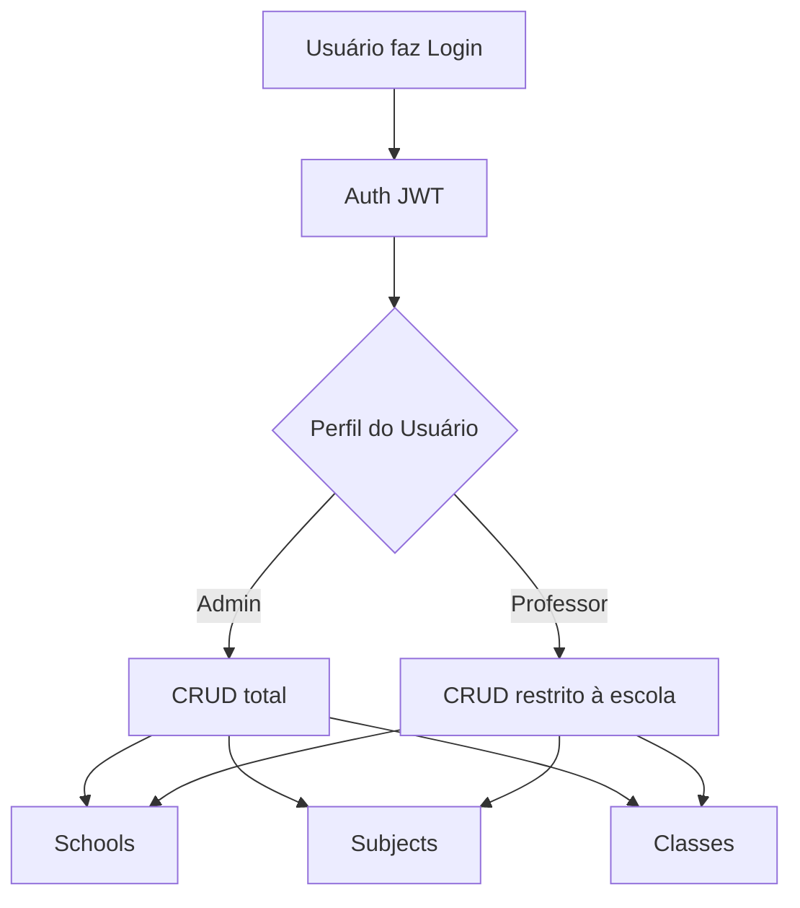
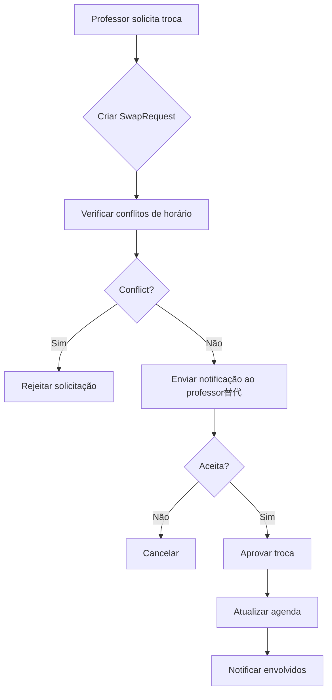

# Troca Aula Constitution

## Core Principles

### I. Simplicity First
Cada funcionalidade deve ser implementada da forma mais simples possível. Evitar over-engineering - este é um projeto de faculdade. YAGNI: não implementar funcionalidades que "podem ser úteis no futuro".

### II. Clean Architecture (Básico)
Estrutura de módulos organizada com separação clara entre:
- **Controller**: Recebe requisições e retorna respostas
- **Service**: Lógica de negócio
- **Repository**: Acesso a dados
- **Entity**: Definição de modelos de dados
Manter dependências unaidirecionais: Controller → Service → Repository.

### III. REST API Conventions
Seguir convenções REST básicas:
- GET: Listar/consultar recursos
- POST: Criar recursos
- PATCH: Atualizar parcialmente
- DELETE: Remover recursos
- Retornar códigos HTTP apropriados (200, 201, 400, 401, 404, 500)
- Nomes de recursos em plurais (ex: /classes, /schools)

### IV. Security Essentials (NÃO NEGOCIÁVEL)
- Nunca expor senhas em respostas API
- Senhas devem ser hasheadas com bcrypt
- JWT para autenticação
- Validação de dados com class-validator
- Proteger rotas sensíveis com guards

### V. Git Workflow
- Conventional Commits para mensagens (padrão commitlint)
- Commits validados automaticamente pelo commitlint (husky pre-commit)
- Feature branches para novas funcionalidades
- PRs com descrição clara antes de merge
- Não commitar secrets (usar .env.example)

### VI. Package Manager & Node Version
- **Gerenciador de pacotes**: pnpm (obrigatório)
- **Versão do Node**: Gerenciada via nvm (.nvmrc na raiz do projeto)
-Sempre usar `pnpm install`, `pnpm add`, `pnpm remove`

## Technology Stack

**Frameworks e Bibliotecas**:
- NestJS (framework principal)
- TypeScript (linguagem)
- Prisma (ORM)
- PostgreSQL (banco de dados)
- JWT (autenticação)
- Docker (containerização)

**Padrões Requeridos**:
- DTOs para transferência de dados
- Class Validator para validação
- Entity definitions para tipos
- Repository pattern para acesso a dados

## Business Domain

### Domínio: Troca Aula (Substituição de Professores)

**Entidades Principais**:
- **User**: Professores e administradores
- **School**: Escolas/instituições
- **Subject**: Disciplinas/matérias
- **Class**: Aula/agendamento (entidade central)
- **Profile**: Tipo de usuário (admin, professor, diretor)
- **UsersProfilesSchools**: Vínculo usuário-escola-perfil

### Fluxo de Negócio Atual (IMPLEMENTADO)


### Fluxo de Negócio Proposto (FALTANTE)


## Development Workflow

### Estrutura de Modules
Cada módulo deve seguir:
```
src/modules/
├── nome-modulo/
│   ├── dto/
│   │   ├── create-modulo.dto.ts
│   │   ├── update-modulo.dto.ts
│   │   └── get-modulo.dto.ts
│   ├── entities/
│   │   └── modulo.entity.ts
│   ├── modulo.repository.ts
│   ├── modulo.service.ts
│   ├── modulo.controller.ts
│   └── modulo.module.ts
```

### Testes
- Testes unitários para services (básico,覆盖率 > 70%)
- Testes de integração para fluxo críticos
- Usar Jest (já configurado no projeto)

### Commits
Padrão: conventional-commits
- feat: nova funcionalidade
- fix: correção de bug
- docs: documentação
- refactor: refatoração
- test: testes

## Governance

**Regras de Emenda**:
- Qualquer mudança na constituição deve ser documentada
- Mudanças maiores (adição de princípios) requeremjustificação clara
- Versão segue semantic versioning (MAJOR.MINOR.PATCH)

**Padrões de Qualidade**:
- Lint passando (`pnpm lint`)
- Testes passando (`pnpm test`)
- Build funcionando (`pnpm build`)
- Commits passando no commitlint (`pnpm commit`)
- Sem console.log em código de produção
- Usar sempre pnpm (nunca npm ou yarn)

**Version**: 1.0.0 | **Ratified**: 2026-05-14 | **Last Amended**: 2026-05-16