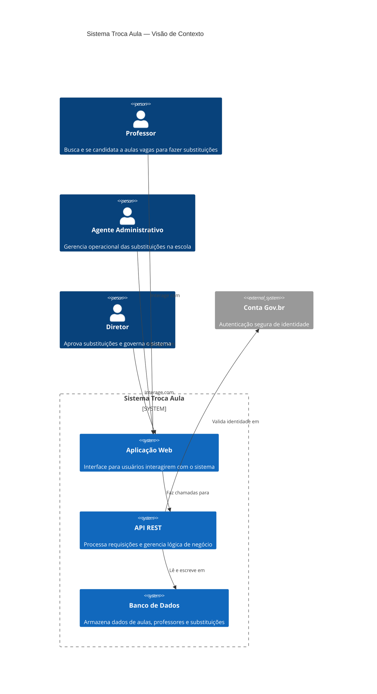
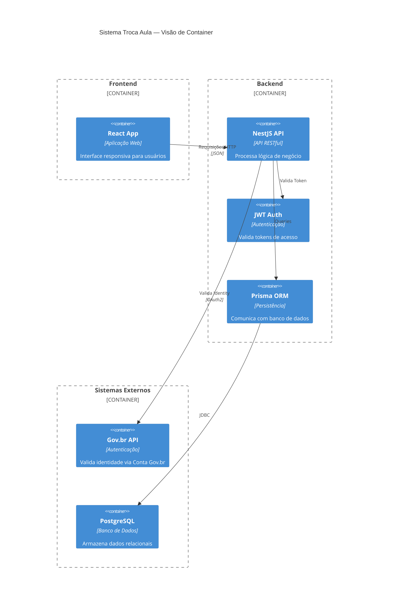
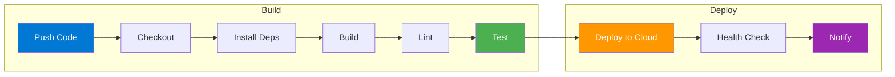
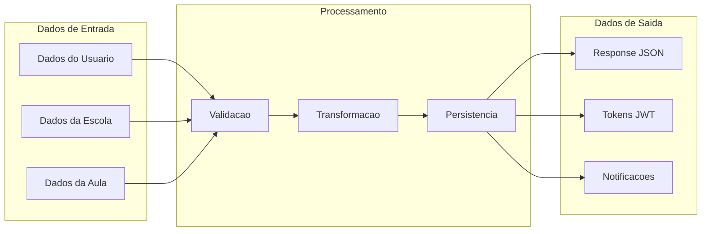
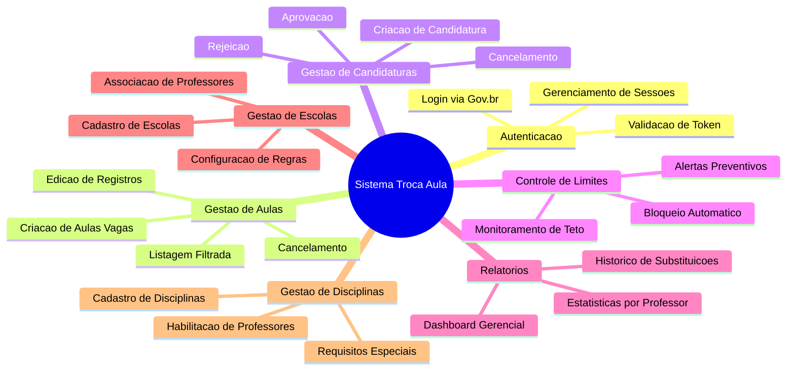
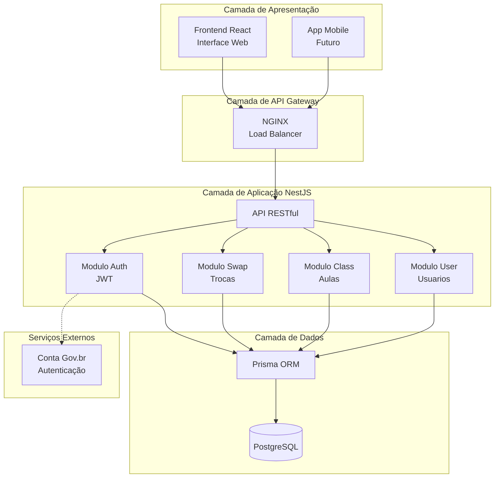
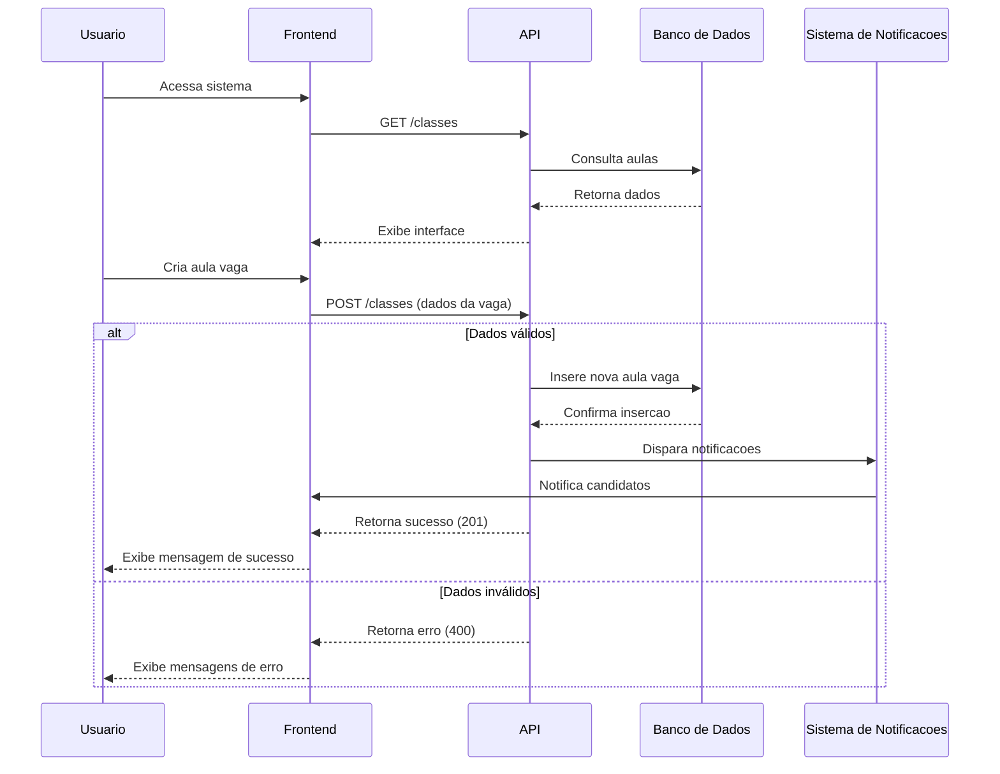
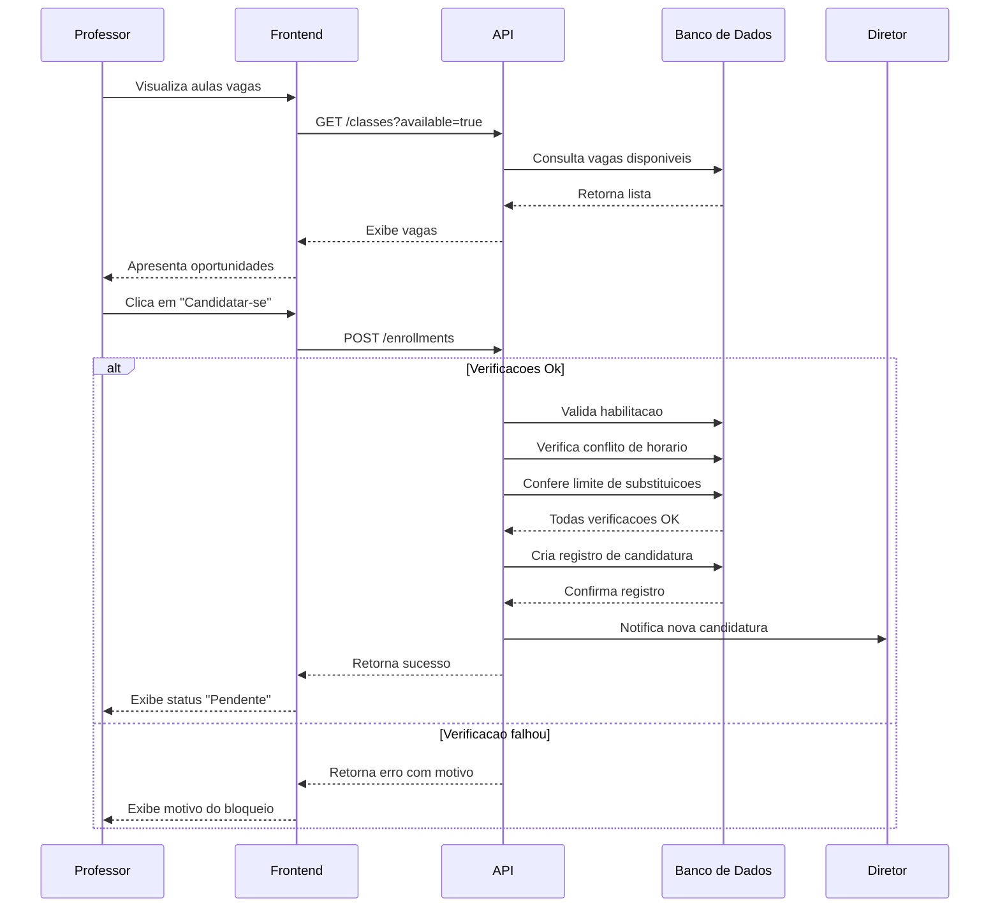
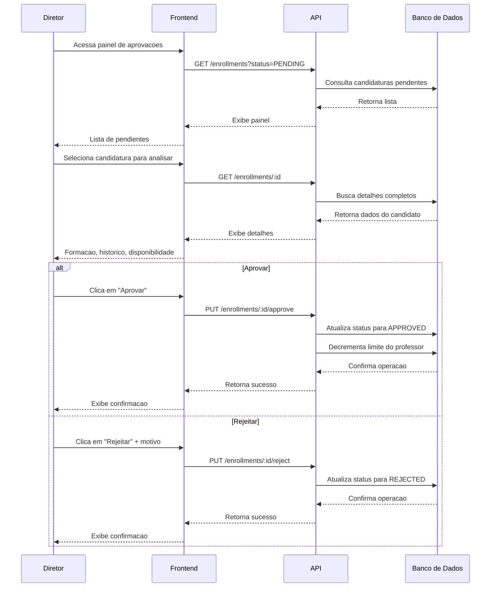

# Visao Geral do Projeto

## Nome do Projeto

**Troca Aula** - Sistema de Gerenciamento de Substituicao de Professores

## Proposito do Projeto

O sistema **Troca Aula** tem como objetivo principal facilitar e gerenciar o processo de substituicao de professores em instituicoes de ensino, evitando que aulas fiquem vazias quando um professor precisa se ausentar.

## Problema que Resolve

- **Aulas vagas**: Quando um professor falta, a aula fica sem docente
- **Processo manual**: Trocar professores e trabalhoso e pode gerar erros
- **Falta de controle**: Dificuldade em rastrear quem esta替代 em qual aula

## Objetivos do Sistema

1. **Automatizar solicitacoes**: Professores/diretores podem solicitar trocas de forma digital
2. **Verificar conflitos**: Sistema verifica automaticamente conflitos de horario
3. **Controlar permissoes**: Apenas pessoas autorizadas podem criar/aceitar trocas
4. **Rastrear historico**: Todas as trocas sao registradas para consulta futura

## Escopo do Projeto

### Escopo Principal (MVP)
- Autenticacao de usuarios
- Gerenciamento de escolas, disciplinas e turmas
- Sistema de solicitacao de trocas de aulas
- Sistema de inscricao em aulas

### Escopo Futuro (roadmap)
- Notificacoes por email/push
- Relatorios e estatisticas
- App mobile
- Integracao com calendarios

## Tipo de Projeto

Este e um projeto academico desenvolvido em **TypeScript** com **NestJS**, utilizando **PostgreSQL** como banco de dados e **Docker** para containerizacao.

## Publico Alvo

- **Diretores**: Podem criar solicitacoes de troca
- **Professores**: Podem aceitar/rejeitar trocas e se increver em aulas
- **Administradores**: Gestao geral do sistema

---

## Arquitetura Geral

### Diagrama C4 — Visão de Contexto

### Diagrama C4 — Visão de Container

### Pipeline CI/CD — GitHub Actions

### Fluxo de Dados no Sistema

### mind Map — Funcionalidades do Sistema

### Fluxo de Arquitetura — Componentes

### Diagrama de Sequência — Fluxo de Criação de Aula Vaga

### Diagrama de Sequência — Fluxo de Candidatura

### Diagrama de Sequência — Fluxo de Aprovação

---

## Stack Tecnologico

| Componente | Tecnologia |
|------------|------------|
| Linguagem | TypeScript |
| Framework | NestJS |
| ORM | Prisma |
| Banco de Dados | PostgreSQL |
| Autenticacao | JWT + bcrypt |
| Containerizacao | Docker |
| Package Manager | pnpm |

---

## Definicoes de Negocio

Para garantir que todos os envolvidos no projeto compreendam claramente o proposito e o funcionamento do Sistema Troca Aula, apresentamos abaixo as definicoes fundamentais de negocio.

### O Que E

O Sistema Troca Aula e uma plataforma digital destinada a gerenciar o processo de substituicao de professores em instituicoes de ensino. Seu objetivo principal e evitar que aulas fiquem vagas quando um professor precisa se ausentar, conectando de forma automatizada e organizada quem precisa de substituicao com profissionais disponiveis para realizar o trabalho.

O sistema funciona como um mercado digital de aulas vagas, onde professores podem visualizar oportunidades de substituicao e se candidatar a elas, enquanto gestores escolares podem criar, gerenciar e approves as substituicoes de forma centralizada. A plataforma nao se destina a controle de frequencia regular, lancamento de notas ou diario de classe, funcoes estas que continuem a ser realizadas por outros sistemas especificos.

A solucao foi desarrollada utilizando tecnologias modernas de desenvolvimento web, incluindo NestJS como framework backend, TypeScript como linguagem de programacao e PostgreSQL como banco de dados relacional. A arquitetura foi projetada para oferecer escalabilidade, manutenibilidade e disponibilidade continua, com suporte a integracao via API RESTful e autenticacao segura por meio da Conta Gov.br.

### O Que Faz

O Sistema Troca Aula realiza um conjunto de funcoes essenciais para a gestao eficiente de substituicoes docentes. A seguir, detalhamos cada uma delas de forma clara e acessivel.

A criacao de aulas vagas permite que professores ou agentes administrativos cadastrem ausencias no sistema, informando detalhes como disciplina, dia da semana, horario, serie dos alunos e requisitos específicos para a substituicao. Esse cadastro cria uma "vaga" no sistema que fica disponivel para que outros professores possam visualiza-la e se candidatar.

A busca e candidatura de professores e outra funcao importante. Professores que desejam realizar substituicoes podem acessar o sistema a qualquer momento para visualizar todas as aulas vagas disponiveis na sua instituicao. O sistema oferece filtros por disciplina, dia, horario e outros criterios, facilitando a busca por oportunidades que se encaixem na disponibilidade de cada profissional. A candidatura e registrada automaticamente no sistema.

O controle automatico de limite de substituicoes garante que cada professor respeite o teto maximo de aulas que pode substituir por periodo, definido pelas normas da instituicao. O sistema monitora esse limite em tempo real e bloqueia novas candidaturas quando o limite e atingido, alem de emitir alertas preventivos quando o professor esta proximo de atingir o maximo permitido.

A aprovacao de candidaturas e uma funcao destinada ao corpo diretivo. Nem toda candidatura e automaticamente aceita; os diretores precisam validar cada substituicao para garantir que apenas profissionais habilitados sejam aprovados. O sistema oferece um painel especifico para essa funcao, permitindo visualizacao das candidaturas pendentes e decisao de aprovacao ou rejeicao.

O controle de acesso seguro e implementado por meio da integracao com a Conta Gov.br, o sistema de login do governo federal brasileiro. Essa integracao garante que apenas pessoas com identidade verificada possam acessar o sistema, elevando o nivel de seguranca e confiabilidade.

O registro de historico completo armazena todas as informacoes sobre cada substituicao realizada, incluindo dados do professor substituto, professor titular, disciplina, horario, data e status da aprovacao. Esse historico serve para fins de transparencia, auditoria e consulta futura.

### Como Faz

Para compreender melhor o funcionamento do sistema no dia a dia, apresentamos um exemplo pratico de como uma substituicao ocorre do inicio ao fim.

Imagine que a professora Maria precise se ausentar por motivo de doenca. Antes do sistema, ela ou alguém da secretaria teria que ligar para varios professores para encontrar um substituto, um processo demorado e frequentemente frustrante. Com o Sistema Troca Aula, o processo funciona de forma digital e organizada.

Primeiro, a professora Maria ou um agente administrativo acessa o sistema, cadastra a ausencia e cria uma aula vaga para o horario especifico. O sistema registra essa informacao e a torna visivel para todos os professores autorizados da instituicao.

O professor João, que leciona a mesma disciplina e esta disponivel para fazer substituicoes, acessa o sistema pelo computador ou celular, visualiza a lista de aulas vagas, encontra a oportunidade da professora Maria e se candidata com apenas alguns cliques. O sistema registra automaticamente a candidatura e notifica os responsables sobre a nova solicitacao.

O diretor da escola recebe a notificacao, acessa o sistema, verifica os dados do professor João (como formacao e habilitacao para a disciplina), e aprova a substituicao. A partir desse momento, o professor João fica oficialmente designado para substituir a professora Maria no horario combinado.

Tudo isso acontece de forma rapida, organizada e sem necessidade de ligações telefonicas, papel ou risco de esquecimento. O sistema automatiza todo o processo, garantindo transparencia e eficiencia.

### Personas do Sistema

Para desenvolver um produto que atenda as reais necessidades dos usuarios, e fundamental entender quem sao essas pessoas e como interagem com a plataforma. Apresentamos abaixo as tres personas principais do Sistema Troca Aula.

O professor substituto e o profissional que busca oportunidades de aulas extras. Ele acessa o sistema principalmente pelo celular, durante o intervalo das aulas ou a noite em casa, para visualizar vagas disponiveis, filtrar por disciplina e se candidatar. Ele quer acompanhar seu historico de substituicoes e saber quantas aulas ainda pode fazer dentro do limite permitido.

A agente administrativa e a profissional responsavel por coordenar toda a parte operacional das substituicoes na escola. Ela acessa o sistema diariamente pelo computador na secretaria, precisa de uma visao clara de todas as aulas vagas, precisa cadastrar novas ausencias rapidamente e verificar se os candidatos estao habilitados. Sua maior necessidade e organizar o fluxo de substituicoes de forma eficiente.

O diretor e o responsavel pela governanca geral da escola, garantindo que todas as substituicoes estejam dentro das normas institucionais. Ele acessa o sistema principalmente no inicio da manha e no final do dia para verificar substituicoes pendentes e approvals. Ele precisa de relatorios claros e garantias de que apenas profissionais habilitados sejam aprovados.

### Glossario de Termos

Para facilitar o entendimento de todos os termos utilizados, apresentamos um glossario resumido com as definicoes mais importantes.

Aula vaga e a aula que ficou sem professor porque o titular precisa se ausentar, funcionando como uma "vaga temporaria" que precisa ser preenchida.

Candidatura e o ato de um professor se voluntariar para preencher uma aula vaga, semelhante a se candidatar a um emprego temporario.

Teto de substituicoes e o numero maximo de aulas que um professor pode substituir em um periodo, definido para evitar sobrecarga de trabalho.

Aprovacao e o ato do diretor validar e confirmar que uma substituicao pode ocorrer, sendo obrigatoria para que a substituicao seja oficializada.

Habilitacao e a condicao de um professor estar qualificado para ensinar determinada disciplina, verificada pela formacao academica e pelo cadastro previo na instituicao.

Backend e a parte do sistema que processa dados, salva informacoes no banco de dados e realiza toda a logica de funcionamento, ficando "nos bastidores".

Frontend e a parte do sistema que o usuario видит e interage, incluindo botoes, telas e formularios.

API e o conjunto de regras que permite que o sistema converse com outros sistemas ou com o aplicativo do usuario.

Banco de dados e o local onde todas as informacoes do sistema sao armazenadas de forma organizada, como uma grande planilha digital.

Autenticacao e o processo de verificar se a pessoa que esta acessando o sistema e realmente quem diz ser, garantindo seguranca.

---

## Diferenciais e Beneficios

O Sistema Troca Aula traz diversos beneficios para a comunidade escolar que o utiliza. O principal beneficio e a reducao drastica do numero de aulas que ficam sem professor, ao conectar de forma rapida e eficiente quem precisa de substituicao com quem pode substitui-lo.

A transparencia e organizacao e outro diferencial importante, pois todas as informacoes sobre substituicoes ficam centralizadas no sistema, acessiveis para todos os perfis autorizados, eliminando a falta de informacao e a desorganizacao que existia com processos manuais.

A economia de tempo e significativa, pois o tempo que antes era gasto com ligacoes telefonicas, verificacao de disponibilidade e organizacao de planilhas agora e dedicado a atividades mais produtivas.

A inclusao e acessibilidade tambem sao diferenciais relevantes, uma vez que o sistema foi desarrollado seguindo diretrizes internacionais de acessibilidade, permitindo que pessoas com deficiencia visual ou motora possam utiliza-lo plenamente.

A seguranca da informacao e garantida pela integracao com a Conta Gov.br, protegendo dados sensiveis e garantindo a integridade das informacoes.

A escalabilidade permite que o sistema atenda a multiplas escolas simultaneamente, crescendo conforme a demanda sem necessidade de investimentos em infraestrutura local, graças a hospedagem em ambiente de nuvem.

---

## Detalhamento das Definicoes de Negocio

Para garantir uma compreensao ainda mais profunda do Sistema Troca Aula, apresentamos a seguir um detalhamento.expandido de cada definicao de negocio, abordando aspectos que vao alem da explicacao basica e fornecendo contexto sobre a importancia de cada funcao para o ecossistema escolar.

### O Que E o Sistema Troca Aula — Uma Explicacao Aprofundada

O Sistema Troca Aula representa uma evolucao significativa na forma como as instituicoes de ensino gerenciam suas substituicoes docentes. Antes da existencia desta plataforma, o processo era entirely dependent de metodos manuais e frequentemente ineficiente, envolvendo ligações telefonicas, anotações em cadernos, planilhas de papel e uma comunicacao descentralizada que consumia tempo consideravel da secretaría escolar.

Esta plataforma digital surge como resposta a uma necessidade real das escolas: garantir que nenhuma aula fique vazia por falta de organizacao. O sistema atua como um intermediario inteligente entre professores que precisam se ausentar e colegas disponiveis para substituir, criando um ecossistema organizado onde informacoes fluem de forma clara e transparente.

E importante destacar que o Sistema Troca Aula nao compete com sistemas de gestao escolar ja existentes, mas sim complementa o trabalho ja realizado pelas instituicoes. O foco exclusivo em substituicoes permite que o sistema seja especializado e otimizado para esta funcao especifica, sem tentativa de substituir diario de classe, controle de frequencia ou lancamento de notas.

A arquitectura do sistema foi desenvolvida pensando em escalabilidade, o que significa que uma mesma instancia pode atender desde uma pequena escola com poucos professores ate uma rede completa de educacao com dezenas de unidades. Isso e possivel gracias a hospedagem em ambiente de nuvem, que permite adicionar recursos conforme a demanda aumenta, sem necessidade de alteracoes na infraestrutura física.

### Funcionalidades Principais — O Que o Sistema Realmente Faz

Cada funcao do sistema foi pensada para resolver problemas especificos encontrados no dia a dia da gestao escolar. Vamos detalhar cada uma delas para que qualquer pessoa possa compreender completamente o valor entregue pela plataforma.

A criacao de aulas vagas e o ponto de partida de todo o processo. Quando um professor precisa faltar, seja por motivo de doenca, licenca, participacao em evento educacional ou qualquer outra razao, ele ou um agente administrativo registra essa ausencia no sistema. O cadastro inclui informacoes essenciais como qual disciplina sera afetada, em qual dia da semana, em qual horario, para qual serie ou turma e se existem requisitos especiais para a substituicao. Esta informacao fica imediatamente disponivel para todos os professores autorizados da instituicao.

A visualizacao e busca de vagas e uma funcao diseñada para facilitar a vida dos professores que desejam fazer substituicoes. O sistema apresenta uma lista organizada de todas as aulas vagas disponíveis, com opcoes de filtro por disciplina, dia da semana, turno e outros criterios relevantes. Esta organizacao permite que cada professor encontre rapidamente oportunidades que se encaixem na sua disponibilidade de horario.

A candidatura a vagas e o ato pelo qual um professor manifesta interesse em realizar uma substituicao especifica. Ao candidatar-se, o professor indica que esta disponivel e qualificado para ocupar aquela vaga. O sistema registra automaticamente essa candidatura e notifica os responsables sobre a nova solicitacao, iniciando o processo de avaliacao.

O controle de limite de substituicoes e uma funcionalidade essencial para garantir que nenhum professor seja sobrecarregado com excesso de trabalho. Cada instituicao define um teto maximo de aulas que um professor pode substituir em um determinado periodo, seja por semestre ou por ano. O sistema monitora esse limite automaticamente, impedindo novas candidaturas quando o teto e atingido e emitindo alertas quando o professor esta proximo do limite.

A aprovacao de candidaturas e o momento em que o corpo diretivo valida ou rejeita cada solicitacao de substituicao. Esta etapa e fundamental para garantir que apenas profissionais devidamente habilitados e qualificados sejam aprovados para cada disciplina. O sistema apresenta ao diretor todas as informações relevantes sobre o candidato, incluindo sua formacao academica e historico de substituicoes anteriores.

A autenticacao via Conta Gov.br representa um marco de seguranca e integracao com o ecosistema governamental brasileiro. Ao utilizar a mesma conta utilizada para serviços como declaracao de imposto de renda e CPF digital, o sistema garante que apenas pessoas com identidade verificada possam acessar a plataforma, eliminando o risco de acessos nao autorizados.

O historico de substituicoes e um registro completo de todas as acoes realizadas no sistema. Cada substituicao e registrada com detalhes completos, permitindo auditoria, consulta futura e analise de dados para melhorias continuas no processo.

### Como o Sistema Funciona na Pratica — Um Passo a Passo Completo

Para que pessoas sem conhecimento tecnico possam entender exatamente como o sistema opera, apresentamos a seguir um exemplo detalhado do fluxo completo de uma substituicao, desde o momento em que o professor precisa se ausentar ate a conclusao do processo.

O primeiro passo acontece quando a professora Maria, que ensina matematica na quinta serie, verifica que estara doente no dia seguinte e nao podera ir a escola. Antes do sistema, ela teria que ligar para varios colegas perguntando se algguem poderia substituí-la, frequentemente sem sucesso e gerando estresse. Agora, Maria acessa o sistema pelo seu computador ou celular, seleciona a opcao de criar aula vaga e preenche as informacoes necessarias: disciplina matematica, dia terca-feira, horario das 10h as 11h, quinta serie A, sem requisitos especiais. Ao confirmar o cadastro, a aula vaga fica imediatamente visivel para todos os professores da escola.

O segundo passo acontece quando o professor Joao, que tambem ensina matematica e esta buscando oportunidades de aulas extras para complementar sua renda, acessa o sistema e verifica a lista de aulas vagas disponiveis. Ele encontra a vaga da professora Maria e, como leciona a mesma disciplina e tem disponibilidade no horario, decide se candidatar. Com apenas alguns cliques, o professor Joao envia sua candidatura, que e registrada automaticamente no sistema.

O terceiro passo e a notificacao recebida pelo diretor da escola, informando sobre a nova candidatura pendente de aprovacao. O diretor acessa o sistema, visualiza os dados do professor Joao, verifica que ele possui formacao adequada em matematica e que nao esta proximo do limite de substituicoes permitidas. Apos essa verificacao, o diretor aprova a substituicao, formalizando o processo.

O quarto passo e a confirmacao automatica enviada a todos os envolvidos: a professora Maria e informada que sua ausencia foi coberta, o professor Joao e notificado que esta oficialmente designado para a substituicao, e o sistema registra todos os detalhes para fins de historico e auditoria.

Todo esse processo, que antes poderia levar horas ou ate dias de trabalho manual, agora e realizado em questao de minutos, com transparencia total e registro completo de todas as etapas.

### Personas — Quem Sao os Usuarios do Sistema

Compreender quem sao os usuarios do sistema e fundamental para garantir que a plataforma atenda as suas necessidades reais. Para isso, desenvolvemos tres personas detalhadas que representam os principais perfis de usuarios.

O professor substituto representa o profissional que busca oportunidades de aulas extras dentro da instituicao. Este professor geralmente trabalha em tempo parcial ou deseja complementar sua renda, e utiliza o sistema principalmente pelo celular, acessando durante o intervalo das aulas ou a noite em casa. Suas principais necessidades incluem encontrar vagas rapidamente, filtrar por disciplinas que ensina, acompanhar quantas substituicoes ja realizou e verificar quanto ainda pode fazer dentro do limite permitido. Suas frustracoes com metodos antigos incluíam nao saber quando haviam vagas disponiveis, aceitar aulas sem detalhes completos e nao ter registro claro das substituicoes realizadas.

A agente administrativa representa a profissional que coordena toda a parte operacional das substituicoes na escola. Geralmente trabalha na secretaría ha varios anos e esta acostumada com a rotina de organizar as ausencias dos professores. Acessa o sistema diariamente pelo computador, geralmente no inicio da manha, para verificar as aulas vagas do dia. Precisa de uma visao clara e organizada de todas as ausencias, capacidade de cadastrar novas ausencias rapidamente, editar ou cancelar registros quando necessario e verificar se os professores candidatos estao habilitados para as disciplinas. Sua maior frustracao era o tempo desperdicado com ligacoes telefonicas, planilhas e cadernos, alem do risco de erros e esquecimentos.

O diretor representa o responsavel pela governanca geral da escola e pela qualidade do ensino oferecido aos alunos. Acessa o sistema principalmente no inicio da manha e no final do dia, para verificar substituicoes pendientes e realizar approvals. Precisa de relatorios claros sobre o numero de substituicoes realizadas, quais professores estao haciendo mais substituicoes e se algum limite institucional esta sendo descumprido. Tambem precisa garantir que apenas professores habilitados sejam aprovados para cada disciplina, verificando formacao academica e cadastro previo. Sua visao estrategica permite analizar dados e tomar decisoes sobre a politica de substituicoes da escola.

### Glossario de Termos — Compreendendo a Linguagem do Sistema

Para garantir que todos os usuarios compreendam os termos utilizados tanto na documentacao quanto na interface do sistema, apresentamos um glossario completo com definicoes acessiveis e exemplos praticos.

Uma aula vaga e uma aula que ficou sem professor porque o titular precisa se ausentar. Funciona como uma "vaga de emprego" temporaria que precisa ser preenchida por outro professor.

Uma candidatura e o ato de um professor se voluntariar para preencher uma aula vaga. E semelhante a se candidatar a um emprego, mas para uma substituicao temporaria.

O teto de substituicoes e o numero maximo de aulas que um professor pode substituir em um determinado periodo, definido pelas normas da escola para evitar sobrecarga de trabalho.

A aprovacao e o ato do diretor validar e confirmar que uma substituicao pode ocorrer. Sem aprovacao, a substituicao nao e oficialmente registrada.

A habilitacao e a condicao de um professor estar qualificado para ensinar determinada disciplina, verificada pela formacao academica e pelo cadastro previo na instituicao.

O backend e a parte do sistema que fica "nos bastidores", processando dados, salvando informacoes no banco de dados e realizando toda a logica de funcionamento.

O frontend e a parte do sistema que o usuario vÊ e interage, incluindo botoes, telas e formularios.

Uma API e o conjunto de regras que permite que o sistema converse com outros sistemas ou com o aplicativo do usuario.

O banco de dados e o local onde todas as informacoes do sistema sao armazenadas de forma organizada.

A autenticacao e o processo de verificar se a pessoa que esta acessando o sistema e realmente quem diz ser, garantindo seguranca.

O deploy e o termo tecnico para publicar o sistema em ambiente de producao, tornando-o disponivel para uso real.

Testes automatizados sao programas que verificam automaticamente se o sistema esta funcionando corretamente, como robos que testam todas as funcionalidades antes de cada actualizacao.

---

## Informacoes Adicionais

O Sistema Troca Aula foi desarrollado como parte do Projeto Integrador da Universidade Virtual do Estado de Sao Paulo (UNIVESP), polo Jaboticabal, com a participacao de oito estudantes que trabalham juntos para criar uma solucao tecnologica aplicada a realidade da gestao educacional brasileira.

O projeto utiliza tecnologias modernas de desenvolvimento web, incluindo NestJS como framework backend, TypeScript como linguagem de programacao, PostgreSQL como banco de dados relacional e React para o frontend. A arquitetura foi projetada para oferecer escalabilidade, manutenibilidade e disponibilidade continua.

Para mais informacoes sobre o projeto, consulte o repositorio no GitHub ou entre em contato com a equipe responsavel.

---

## Secao Complementar de Definicoes de Negocio

Esta secao apresenta definicoes adicionais que complementam o entendimentodo Sistema Troca Aula, abordando aspectos que foram identificados como relevantes durante a analise do arquivo base.MD e que ajudam a enriquecer a documentacao para que qualquer pessoa, incluindo o Product Owner e novos-integrantes da equipe, consigam compreender completamente o produto.

### O Que Nao E o Sistema Troca Aula

Para evitar misunderstandings e garantir que todos compreendam exatamente o escopo do sistema, e importante clarificar o que o Sistema Troca Aula NAO e. O sistema NAO e um diario de classe eletronico, ou seja, nao e utilizado para registrar presenca diaria dos alunos, lancamento de notas ou anotacoes sobre o desenvolvimento pedagogico. Essas funcionalidades sao realizadas por sistemas separados que ja existem nas escolas.

O sistema tambem NAO e um controle de frequencia regular dos professores. Embora o sistema registre informacoes sobre substituicoes, ele nao monitora a presenca cotidiana dos docentes em suas aulas normais. Essa e uma funcao de outros sistemas de gestao escolar.

O sistema NAO e uma rede social, pois nao possui funcionalidades de interacao social, chat, fóruns ou compartilhamento de conteudo entre usuarios. O foco e exclusivamente na gestao de substituicoes, sem distrações ou funcionalidades desnecessarias.

O sistema NAO e um sistema de Rh completo, pois nao gerencia contratar, demissões, folha de pagamento ou beneficios de funcionarios. As informacoes de professores que o sistema manipula estao exclusivamente relacionadas ao processo de substituicoes.

Finalmente, o sistema NAO e um aplicativo de mensagens, pois nao possui funcionalidade de chat ou troca de mensagens entre usuarios. Toda a comunicacao ocorre por meio de notificacoes automaticas sobre eventos específicos.

### O Que o Sistema Faz — Ampliacao de Detalhes

Além das funcionalidades principais ja descritas, o sistema realiza diversas outras acoes que garantem seu funcionamento correto e a qualidade do servico oferecido as instituicoes de ensino.

O sistema realiza verificacao automatica de conflitos de horario. Quando um professor se candidata a uma aula vaga, o sistema verifica automaticamente se esse professor ja possui outra aula agendada no mesmo horario. Caso haja conflito, o sistema impede a candidatura e informa o professor sobre o conflito, evitando sobreposicoes de aulas que causariam problemas na grade horaria.

O sistema gerencia permissões de acesso de forma granular. Cada usuario possui um perfil específico que determina quais acoes ele pode realizar no sistema. Um professor nao pode criar aulas vagas, apenas se candidatar a elas. Um agente administrativo pode criar e gerenciar aulas vagas, mas nao pode aprobar substituicoes. Um diretor possui acesso completo a todas as funcionalidades. Essa separacao de permissões garante que cada usuario faca apenas o que lhe e permitido.

O sistema mantém logs completos de todas as acoes realizadas. Cada operacao, desde o login de um usuario ate a aprovacao de uma substituicao, e registrada com detalhes como data, hora, usuario responsavel e natureza da acao. Esses logs servem para auditoria, diagnostico de problemas e garantia de transparencia.

O sistema permite a edicao e cancelamento de registros. Quando uma situacao muda, como um professor que pensava que estivesse doente mas conseguiu recuperar, o sistema permite que a aula vaga seja cancelada ou editada, mantendo a consistencia dos dados.

O sistema gera indicadores e estatisticas sobre o uso da plataforma. Embora essa funcionalidade ainda esteja em desenvolvimento para versoes futuras, a arquitetura ja suporta a coleta de dados que permitirao analisar padroes de ausencia, professores mais ativos em substituicoes e outros indicadores relevantes para a gestao escolar.

### Como o Sistema Faz — Detalhes Tecnicos Explicados de Forma Simples

Para aqueles que desejam entender um pouco mais sobre como o sistema opera internamente, mas sem entrar em detalhes tecnicos complexos, apresentamos a seguir uma explicacao simplificada dos principais processos.

Quando um professor acessa o sistema, ele precisa primeiro fazer login, que e o processo de se identificar para ter acesso. O sistema verifica a identidade do professor por meio da Conta Gov.br, que e o mesmo sistema usado para serviços governamentais como declaracao de imposto de renda. Isso garante que apenas pessoas com identidade verificada possam acessar o sistema.

Apos o login, o sistema mostra ao professor apenas as informacoes que ele tem permissao de ver. Um professor ve apenas as aulas vagas da sua escola e as suas proprias substituicoes. Um diretor ve todas as aulas vagas de todas as escolas que ele administra, alem de todas as candidaturas pendientes de aprovacao.

Quando uma nova aula vaga e criada, o sistema verifica se os dados estao completos e validos. Se tudo estiver correto, a vaga e armazenada no banco de dados, que e como um grande arquivo digital onde todas as informacoes do sistema ficam guardadas de forma organizada.

Quando um professor se candidat a uma aula vaga, o sistema verifica varios pontos antes de aceitar a candidatura. Verifica se o professor esta habilitado para a disciplina, se nao tem conflito de horario, se nao atingiu o limite de substituicoes permitidas e se a vaga ainda esta disponivel. Apenas se todas essas verificacoes forem positivas, a candidatura e registrada.

Apos a candidatura, o diretor recebe uma notificacao e pode visualizar todos os detalhes do candidato. Ele pode Approvar ou rejeitar a solicitacao. Quando aprova, o sistema registra a substituicao como finalized e atualiza os contadores de limite de substituicoes do professor.

Todo esse processo acontece em questao de segundos, graças a tecnologia moderna e bem projetada que processa todas essas verificacoes de forma automatica e rapida.

### Contextualizacao do Problema que o Sistema Resolve

Para compreender completamente o valor do Sistema Troca Aula, e importante entender o contexto do problema que ele resolve. Nas escolas brasileiras, quando um professor precisa faltar por qualquer motivo, a tradicional era resolver a substituicao manualmente. A secretaría ou o propio professor precisava ligar para varios colegas para encontrar algum que pudesse substituir. Esse processo era demorado, estressante e frequentemente resultava em aulas vagas quando nao se encontrava nenhum professor disponivel.

O impacto dessa realidade era significativo. Alunos ficavam sem aula, o plano de ensino era interrompido, e a qualidade do ensino era comprometida. Secretarias dedicavam horas preciosas a essa tarefa operacional, tempo que poderia ser dedicado a funcoes mais estrategicas. Professores que poderiam querer fazer substituicoes simplesmente nao sabiam quando havia oportunidades disponiveis.

O Sistema Troca Aula surge como solucao digital para esse problema. Ao centralizar todas as informacoes sobre aulas vagas e substituicoes em um unico lugar, o sistema elimina a necessidade de ligacoes telefonicas, anotações em papel e comunicacao desestruturada. Agora, qualquer professor pode ver todas as oportunidades disponiveis a qualquer momento, e qualquer diretor pode gerenciar todas as solicitacoes de forma organizada.

---

## Conclusao das Definicoes

O Sistema Troca Aula e, resumidamente, uma plataforma digital que conecta professores que precisam de substituicao com colegas disponiveis para realizar o trabalho, de forma automatizada, organizada e segura. O sistema resolve o problema real de aulas vagas nas escolas brasileiras, oferecendo uma solucao tecnologica moderna que beneficia alunos, professores, secretarios e diretores.

As definicoes apresentadas nesta documentacao foram desenvolvidas para que qualquer pessoa, independentemente do seu conhecimento tecnico, possa compreender o proposito, o funcionamento e os beneficios do sistema. seja voce um Product Owner definindo prioridades, um novo membro da equipe desenvolvendo funcionalidades, ou um gestor escolar utilizando a ferramenta no dia a dia, estas informacoes servem como base solida para o entendimento do produto.

---

## Secao de Contexto e Historico do Projeto

Esta secao fornece informacoes sobre a origem e o contexto do Sistema Troca Aula, permitindo que leitores compreendam melhor as razoes que motivaram o desenvolvimento do sistema e o caminho percorrido ate a versao atual.

### Origem e Contexto do Desenvolvimento

O Sistema Troca Aula surgiu como projeto academico do curso de Computacao da Universidade Virtual do Estado de Sao Paulo (UNIVESP), especificamente no ambito da disciplina de Projeto Integrador. Esta disciplina，要求 que os estudantes desenvolvam um projeto completo que aplicando conhecimentos adquiridos ao longo do curso a um problema real da sociedade.

O problema identificado foi exatamente a dificuldade das escolas brasileiras em gerenciar substituicoes de professores. Ao longo de pesquisas e entrevistas com profissionais da area educacional, ficou evidente que essa era uma dor real e recorrente, afetando a qualidade do ensino e consumindo tempo valioso das secretarias escolares.

A equipe desenvolveu o projeto ao longo de varios meses, seguindo metodologias ageis de desenvolvimento de software e incorporando praticas de engenharia de software profissional. O resultado e um sistema completo, com funcionalidades robustas, interface acessivel e arquitetura tecnica solida.

### Participantes e Responsabilidades

O projeto foi desenvolvido por uma equipe de oito estudantes da UNIVESP, cada um contribuindo com habilidades e conhecimentos especificos para as diferentes areas do sistema. Os principais perfis de participantes incluíram desenvolvedores backend, desenvolvedores frontend, especialistas em banco de dados e profissionais de qualidade que implementaram testes automatizados.

O projeto tambem contou com a orientacao de tutores e professores da universidade, que forneceram direcionamento tecnico e academico durante todas as etapas do desenvolvimento. Essa estrutura de supervisao garante que o projeto siga padroes academicos elevados e atenda aos requisitos daFormacao superior.

### Tecnologias Selecionadas e Justificativas

A escolha das tecnologias utilizadas no Sistema Troca Aula foi baseada em criterios de modernidade, popularidade no mercado, facilidade de manutencao e suporte a comunidade de desenvolvedores.

O NestJS foi escolhido como framework principal por ser uma plataforma moderna para construcao de aplicacoes backend em Node.js, oferecendo estrutura solida e suporte a boas praticas de programacao. O TypeScript foi adicionado para garantir tipagem statica, reduzindo erros e facilitando a manutencao do codigo.

O PostgreSQL foi selecionado como banco de dados relacional por ser uma opcao robusta, gratuita e amplamente utilizada em projetos de entreprise. Sua capacidade de lidar com grandes volumes de dados e garantir integridade das informacoes foi determinante para a escolha.

O React foi escolhido para o frontend por ser a biblioteca mais popular para desenvolvimento de interfaces web modernas, com grande comunidade de suporte e vasta gama de componentes prontos para uso.

A escolha da Conta Gov.br para autenticacao foi baseada na necessidade de seguranca e na facilidade de integracao com a infraestrutura governamental ja existente no Brasil. Essa escolha tambem reduz a necessidade de gerenciamento de senhas e credenciais por parte das escolas.

### Futuro e Evolucoes Previstas

O Sistema Troca Aula foi progetado para continuar evoluindo ao longo do tempo. Algumas evolucoes previstas incluem o desenvolvimento de um aplicativo mobile para permitir que professores recebam notificacoes em tempo real sobre novas vagas disponiveis, facilitando ainda mais o processo de candidatura.

Tambem esta prevista a integracao com dispositivos de Internet das Coisas (IoT) para validacao automatica de presenca do professor substituto na sala de aula, eliminando a necessidade de registro manual e aumentando a transparencia do processo.

Relatorios avanzados e dashboards analiticos estao no roadmap para permitir que gestores escolares tenham visao estrategica sobre padroes de ausencia, custos com substituicoes e indicadores de qualidade da gestao.

A integracao com sistemas de calendario tambem e uma evolucao planejada, permitindo que as substituicoes sejam sincronizadas automaticamente com calendarios pessoais e profissionais dos professores.

Essas evolucoes garantindo que o sistema continue relevante e util para as instituicoes de ensino por muitos anos, acompanhando as mudancas tecnologicas e as necessidades do mercado educacional.

---

## Glossario Teknikos e de Negocio Expandido

Este glossario apresenta definicoes detalhadas de todos os termos tecnicos e de negocio utilizados ao longo da documentacao, serve como referencia rapida para consulta quando surgir duvida sobre o significado de alguma expressao ou conceito.

### Termos de Negocio Expandidos

Aula vaga representa uma aula que ficou sem professor porque o candidato titular precisou se ausentar. Funciona como uma vaga temporaria que precisa ser preenchida por outro professor, e o elemento central ao redor do qual todo o sistema opera.

Candidatura representa o ato de um professor se voluntaria para preencher uma aula vaga. Este processo envolve o professor manifestando interesse e passando por verificacoes automaticas de habilitacao antes de ter sua solicitacao enviada para aprovacao do diretor.

Teto de substituicoes representa o limite maximo de aulas que um professor pode substituir em um determinado periodo. Este limite e definido pelas normas da instituicao para evitar sobrecarga de trabalho e garantir que os professores nao se dediquem exclusivamente a substituicoes em detrimento de suas propriasturmas.

Aprovacao representa o ato do diretor validar e confirmar que uma substituicao pode ocorrer. Esta etapa e obrigatoria para que a substituicao seja considerada oficial, garantindo que apenas profissionais qualificados sejam designados as aulas.

Habilitacao representa a condicao de um professor estar qualificado para ensinar determinada disciplina. Esta condicao e verificada atraves da formacao academica declarada no cadastro e do cadastro previo na instituicao.

Substituicao representa o ato de um professor assumir temporariamente a aula de outro professor que esta ausente. E o resultado final de todo o processo gerenciado pelo sistema.

Escola representa a instituicao de ensino que utiliza o sistema para gerenciar suas substituicoes. Cada escola possui seu proprio cadastro de professores, turmas e regras especificas.

Turma representa um grupo de alunos que assiste a uma determinada serie ou nivel de ensino. As turmas estao associadas as aulas e as substituicoes.

Disciplina representa a materia ou area de conhecimento ensinada por um professor. As disciplinas definem quais aulas sao compativeis com a formacao de cada professor.

Perfil representa o tipo de usuario do sistema, determines quais acoes cada pessoa pode realizar. Os principais perfis sao professor, agente administrativo e diretor.

### Termos Tecnicos Expandidos

Backend representa a parte do sistema que processa dados, salva informacoes no banco de dados e realiza toda a logica de funcionamento. Fica "nos bastidores" e nao e visivel diretamente pelo usuario.

Frontend representa a parte do sistema que o usuario vÊ e interage diretamente, incluindo botoes, telas, formularios e todos os elementos visuais da interface.

API representa o conjunto de regras que permite que o sistema converse com outros sistemas ou com o aplicativo do usuario. E como um menu de opcoes que outro sistema pode usar para interagir com o sistema.

Banco de dados representa o local onde todas as informacoes do sistema sao armazenadas de forma organizada. Funciona como um grande arquivo digital com pastas e subpastas bem estruturadas.

Autenticacao representa o processo de verificar se a pessoa que esta acessando o sistema e realmente quem diz ser. E como apresentar um documento de identidade na portaria de um edificio.

Autorizacao representa o processo de verificar o que uma pessoa pode fazer no sistema, depois que ela ja foi autenticada. E como a credencial que determina quais areas de um edificio a pessoa pode acessar.

Deploy representa o termo tecnico para publicar o sistema em ambiente de producao, tornando-o disponivel para uso real. E como entregar as chaves de um apartamento novo ao morador.

Testes automatizados representam programas que verificam automaticamente se o sistema esta funcionando corretamente. Funcionam como robos que simulam o uso do sistema para garantir que tudo esta funcionando como deveria.

Containerizacao representa a tecnica de agrupar todas as partes necessarias do sistema em um unico pacote, facilitando a instalacao eexecucao em diferentes ambientes. E como uma mala de viagem que contem tudo o que voce precisa para sua viagem.

Nuvem representa a hospedagem do sistema em servidores externos acessiveis pela internet, em vez de servidores fisicos dentro da escola. Permite que o sistema esteja disponivel a qualquer momento, de qualquer lugar.

Token representa um documento digital que prova que o usuario esta logado no sistema. E como uma pulseira de identificacao que voce recebe ao entrar em um evento.

Framework representa um conjunto de ferramentas e regras predefinidas que facilitam o desenvolvimento de software. E como um kit de construcao que ja vem com as pecas e instrucoes basicas.

ORM representa uma ferramenta que facilita a comunicacao entre o codigo do sistema e o banco de dados. E como um tradutor que converte instrucoes em linguagem de programacao para instrucoes que o banco de dados entende.

---

## Consideracoes Finais sobre a Documentacao

Esta documentacao foi elaborada com o objetivo de fornecer uma compreensao completa e acessivel do Sistema Troca Aula para todos os envolvidos no projeto, desde usuarios finais ate desenvolvedores e gestores.

O conteudo apresentado cobre os aspectos fundamentais do sistema, incluindo sua natureza, funcionalidades, maneira de operar, usuarios principais e termos relevantes. As definicoes foram estruturadas para atender diferentes niveis de conhecimento tecnico, garantindo que tanto pessoas leigas quanto profissionais da area de tecnologia consigam compreender o produto.

A documentacao deve ser mantida atualizada conforme o sistema evolui e novas funcionalidades sao implementadas. Recomenda-se revisar este documento sempre que houver mudancas significativas no comportamento ou na arquitetura do sistema.

Para duvidas adicionais sobre o projeto, recomenda-se consultar a documentacao tecnica detallada disponivel nos demais arquivos da pasta docs/, ou entrar em contato com a equipe responsavel pelo desenvolvimento do sistema.

---

## Cenarios de Uso do Sistema

Esta secao apresenta exemplos detalhados de como o Sistema Troca Aula opera em diferentes situacoes reais do cotidiano escolar.

### Cenario de Licenca Medica

A professora Cristina leciona Matematica na oitava serie e precisara se submeter a uma cirurgia, com periodo de recuperacao de tres semanas. Ao informar a secretaria sobre a licenca medica, o agente administrativo acessa o sistema e cadastra todas as aulas que ficarao vagas durante o periodo. O sistema registra cada aula vaga individualmente, permitindo que diferentes professores substituam a professora em diferentes dias. O diretor aprova todas as vagas de uma vez, e o sistema notifica os professores de Matematica sobre as oportunidades.

### Cenario de Evento Academico

O professor Ricardo recebeu convite para participar de um seminario de educacao durante o horario de aula. Com o sistema, ele acessa a plataforma com antecedencia, cria uma aula vaga para o dia do seminario e o sistema notifica automaticamente todos os professores da disciplina sobre a oportunidade.

### Cenario de Emergencia Familiar

O professor Paulo recebeu uma ligacao sobre um problema de saude na familia que exige presenca imediata em outra cidade. Acessando o sistema pelo celular, ele cria uma aula vaga de emergencia para a aula que comecaria em duas horas. O sistema, reconhecendo a urgencia, notifica imediatamente os professores da disciplina. Um professor visualiza a notificacao, verifica disponibilidade e se candidatura com sucesso.

### Cenario de Limite Atingido

A professora Amanda ja realizou oito substituicoes neste semestre, e o limite e dez. Ela deseja se candidatar a uma nova vaga, mas o sistema verifica que ultrapassaria o limite. O sistema bloqueia automaticamente a candidatura e exibe aviso indicando que o limite foi atingido.

### Cenario de Requisito Especial

O professor Fernando criou uma aula vaga para uma aula pratica de Quimica que requer experiencia com laboratorio. Ao criar a vaga, ele marca como requisito especial experiencia com laboratorio de Quimica. Quando outra professora tenta se candidatar sem esse requisito, o sistema bloqueia a candidatura.

### Cenario de Conflito de Horario

O professor Leandro encontra uma vaga interessante, mas o sistema identifica que ele ja tem uma aula no mesmo horario. O sistema bloqueia a candidatura e apresenta o conflito claramente.

---

## Fluxo de Informacoes no Sistema

Esta secao descreve como as informacoes fluem atraves do sistema.

### Fluxo de Criacao de Aula Vaga

O processo comeca quando um professor ou agente administrativo identifica a necessidade de criar uma ausencia. O usuario acessa o sistema e inicia o formulario, informando disciplina, dia, horario, turma e requisitos especiais. O sistema valida as informacoes e, se estiver tudo correto, armazena a aula vaga no banco de dados, gerando notificacoes para os professores habilitados.

### Fluxo de Candidatura

Quando um professor decide se candidatar a uma aula vaga, o sistema executa verificacoes automaticas: Confere habilitacao para a disciplina, verifica conflito de horario, confirma limite de substituicoes e assegura que a vaga ainda esta disponivel. Apenas se todas as verificacoes forem positivas a candidatura e registrada.

### Fluxo de Aprovacao

Apos o registro de uma candidatura, o sistema notifica o diretor sobre a solicitacao pendente. O diretor visualiza detalhes do candidato, incluindo formacao academica e historico. Ao Approvar, o sistema atualiza o status, decrementa o limite e registra no historico.

### Fluxo de Cancelamento

Quando uma aula vaga precisa ser cancelada, o responsavel pode solicitar o cancelamento. O sistema verifica se a vaga esta em status ativo e se nao ha substituicao ja aprobada. Se permitirem, o sistema cancela a vaga e notifica os candidatos.

---

## Seguranca e Protecao de Dados

### Autenticacao via Gov.br

O Sistema Troca Aula utiliza a Conta Gov.br como unico meio de autenticacao, proporcionando identidade verificada pelo governo federal e reducao do risco de acessos fraudulentos.

### Autorizacao e Permissoes

O sistema verifica quais acoes cada usuario pode realizar. Um professor nao pode Approvar substituiç, apenas se candidatar. Um agente administrativo pode criar vagas mas nao pode Approvar. Apenas o diretor possui permissao completa.

### Registro de Auditoria

Todas as operacoes sao registradas em logs detalhados, incluindo quem realizou, quando, quais dados foram afetados e o resultado.

### Protecao de Dados

O sistema segue as diretrizes da Lei Geral de Protecao de Dados (LGPD), protegendo dados pessoais por meio de criptografia e controles de acesso rigorosos.

---

## Perguntas Frequentes sobre o Sistema

Esta secao responde as perguntas mais comuns sobre o Sistema Troca Aula, organizadas para ajudar rapidamente usuarios com duvidas sobre aspectos especificos.

### Quem pode usar o sistema?

O sistema pode ser utilizado por professores, agentes administrativos e diretores de escolas que adotaram a plataforma. Cada perfil possui permissoes especificas dentro do sistema, determinadas pelo nivel de acesso de cada usuario.

### Como faco para obter acesso ao sistema?

O acesso ao sistema e concedido pela administracao da sua escola. A escola precisa estar cadastrada na plataforma e seu perfil precisa ser criado por um administrador. O login e realizado por meio da Conta Gov.br.

### Posso usar o sistema no meu celular?

Sim, o sistema possui uma interface responsiva que se adapta a diferentes tamanhos de tela, permitindo o uso tanto em computadores quanto em celulares e tablets.

### O que acontece se eu nao tiver Conta Gov.br?

A Conta Gov.br e obrigatoria para acesso ao sistema, pois garante a seguranca e a autenticidade da identidade de cada usuario. Para criar uma conta, visite o site gov.br e siga as instrucoes de cadastro.

### Posso candidatar-me a qualquer aula vaga?

Nao, existem restricoes. Voce precisa estar habilitado para a disciplina da aula vaga, nao pode ter conflito de horario e nao pode ter atingido o limite de substituicoes permitidas. O sistema verifica automaticamente todas essas condicoes.

### Quem aprova as substituicoes?

A aprovacao e realizada pelo diretor da escola ou por outro responsavel autorizado. Apenas com a aprovacao formal a substituicao e considerada valida e registrada oficialmente.

### Posso cancelar uma candidatura apos enviar?

Sim, enquanto a candidatura estiver com status pendente, voce pode cancela-la pelo proprio sistema. Apos a aprovacao do diretor, o cancelamento precisa ser solicitado diretamente a administracao da escola.

### O que acontece se minha candidatura for rejeitada?

Quando uma candidatura e rejeitada, o professor recebe uma notificacao com o motivo da rejeicao. A aula vaga permanece disponivel para que outros professores possam se candidatar.

### Como faco para saber quantas substituicoes ja fiz?

O sistema exibe informacoes sobre o numero de substituicoes realizadas e o limite permitido no perfil de cada professor. Voce pode verificar esses detalhes a qualquer momento acessando a area de historico do sistema.

### Minha escola pode personalizar as regras do sistema?

Sim, algumas funcionalidades permitem customizacao, como o limite de substituicoes por periodo e os requisitos de habilitacao para cada disciplina. Essas configuracoes sao definidas pela administracao da escola.

---

## Contato e Suporte

Para questoes, duvidas ou problemas relacionados ao Sistema Troca Aula, existem diferentes canais de atendimento.

### Para Usuarios Finais

Se voce e professor, agente administrativo ou diretor e tem duvidas sobre como usar o sistema, entre em contato com o administrador da sua escola. Ele possui acesso a recursos de suporte e pode responder a maioria das duvidas sobre o funcionamento diario da plataforma.

### Para Escolas Interessadas

Se sua escola deseja adotar o Sistema Troca Aula, entre em contato atraves do repositorio do projeto no GitHub. A equipe responsavel podera fornecer informacoes sobre o processo de implementacao e treinamento para a sua instituicao.

### Para Desenvolvedores

Desenvolvedores que desejam contribuir com o projeto ou precisam de documentacao tecnica detalhada podem acessar o repositorio no GitHub, onde encontram o codigo fonte, documentacao de API, guia de instalacao e informacoes sobre como contribuir para o projeto.

### Informacoes Academicas

Para questoes relacionadas ao projeto academico, incluindo detalhes sobre a metodologia de desenvolvimento e a equipe participante, consulte a documentacao completa disponivel no arquivo base.MD ou entre em contato com a Universidade Virtual do Estado de Sao Paulo.

---

## Conclusao e Proximos Passos

Esta documentacao representa um esfuerzo para garantir que todos os envolvidos no Sistema Troca Aula, desde usuarios finais ate novos membros da equipe de desenvolvimento, possam comprender completamente o proposito, o funcionamento e os beneficios da plataforma.

O conteudo apresentado foi desenvolvido para atender diferentes perfis de leitores, desde pessoas sem conhecimento tecnico que precisam entender o basico do sistema, ate profissionais de tecnologia que precisam de detalhes mais aprofundados sobre a arquitetura e implementacao.

A documentacao deve ser tratada como um documento vivo, que evolui junto com o sistema. Sempre que novas funcionalidades forem adicionadas ou mudancas significativas forem implementadas, esta documentacao deve ser atualizada para refletir o estado atual da plataforma.

Para novos membros da equipe que estao ingressando no projeto, esta documentacao serve como ponto de partida para compreensao do produto. Recomenda-se ler todos os arquivos da pasta docs/ para obter uma visao completa do sistema, desde a visao geral até os detalhes tecnicos de implementacao.

Para usuarios finais que estao aprendendo a usar o sistema, as secoes sobre definicoes de negocio, personas e cenarios de uso oferecem uma compreensao pratica de como o sistema funciona no dia a dia.

O Sistema Troca Aula representa um investimento significativo em tecnologia para melhoria da gestao educacional nas escolas brasileiras. Com esta documentacao, esperamos garantir que todos os envolvidos possam aproveitar ao máximo os beneficios que a plataforma oferece.

---

## Secao de Referencias e Recursos Adicionais

Esta secao apresenta referencias e recursos adicionais para aqueles que desejam aprofundar seu conhecimento sobre o Sistema Troca Aula e os conceitos relacionados ao projeto.

### Referencias Academicas

O Sistema Troca Aula foi desenvolvido como parte do Projeto Integrador da Universidade Virtual do Estado de Sao Paulo (UNIVESP), seguindo metodologias academicas rigorosas. O projeto Aplicou conceitos de engenharia de software, interface humano-computador e infraestrutura para sistemas de software, demonstrando a convergencia entre teoria e pratica no desenvolvimento de solucoes tecnologicas para a area educacional.

### Tecnologias Utilizadas

O sistema foi desenvolvido utilizando um conjunto de tecnologias modernas e consolidadas no mercado de desenvolvimento de software. O NestJS foi escolhido como framework principal para o backend, oferecendo estrutura solida para construcao de aplicacoes escalaveis. O TypeScript foi utilizado para adicionar tipagem estatica ao JavaScript, reduzindo erros e facilitando a manutencao do codigo. O PostgreSQL foi selecionado como banco de dados relacional, garantindo integridade e confiabilidade no armazenamento de dados. O React foi utilizado para o desenvolvimento do frontend, proporcionando uma interface rica e interativa para os usuarios.

### Recursos de Aprendizado

Para desenvolvedores que desejam entender melhor as tecnologias utilizadas no projeto, existem diversos recursos de aprendizado disponiveis online. A documentacao oficial do NestJS oferece guias detalhados sobre como construir aplicacoes backend robustas. A documentacao do TypeScript apresenta os conceitos de tipagem estatica e suas vantagens no desenvolvimento de software. O PostgreSQL possui extensa documentacao sobre bancos de dados relacionais e boas praticas de modelagem de dados.

### Contribuicoes para o Projeto

O Sistema Troca Aula e um projeto aberto a contribuicoes de desenvolvedores interessados em melhorar a plataforma. Para contribuir, os interessados devem acessar o repositorio no GitHub e seguir as diretrizes de contribuicao descritas no arquivo CONTRIBUTING.md. O projeto segue padroes de codificacao rigorosos e utiliza testes automatizados para garantir a qualidade do codigo.

### Licenca de Uso

O codigo fonte do Sistema Troca Aula esta disponivel sob licenca open source, permitindo que outras instituicoes de ensino adaptem a solucao para suas necessidades especificas. Para detalhes sobre a licenca, consulte o arquivo LICENSE no repositorio do projeto.

---

## Glossario Final de Termos Tecnicos

Este glossario apresenta termos tecnicos adicionais que podem ser encontrados na documentacao tecnica do sistema, proporcionando uma referencia rapida para desenvolvedores e usuarios tecnicos.

### Termos de Desenvolvimento

Clean Code representa um conjunto de praticas de programacao que visam produzir codigo legivel, manutenivel e eficiente. O projeto segue principios de Clean Code em todas as implementacoes.

SOLID representa cinco principios de design orientacao a objetos queAuxiliam na criacao de sistemas mais flexiveis e faceis de manter. Os principios SOLID foram aplicados na arquitetura do sistema.

Design Patterns representam solucoes recorrentes para problemas comuns de desenvolvimento de software. O sistema utiliza diversos padroes de projeto para garantir qualidade e escalabilidade.

CI/CD representa a pratica de Integracao Contínua e Entrega Contínua, automatizando o processo de construcao, teste e implantacao de software. O projeto utiliza GitHub Actions para implementacao de CI/CD.

### Termos de Infraestrutura

Docker representa uma plataforma de containerizacao que permite empacotar aplicacoes e suas dependencias em unidades padronizadas. O projeto utiliza Docker para facilitar a execucao do sistema em diferentes ambientes.

Cloud Computing representa o modelo de computacao em que recursos computacionais sao oferecidos como servico pela internet. O sistema esta hospedado em plataformas de nuvem para garantir disponibilidade e escalabilidade.

### Termos de Seguranca

OAuth2 representa um protocolo de autorizacao que permite acesso seguro a recursos protegidos. O sistema utiliza OAuth2 para integracao com a Conta Gov.br.

JWT representa um padrao de token seguro para autenticacao e autorizacao. O sistema utiliza JWT para gerenciar sessoes de usuarios.

Criptografia representa tecnicas matematicas para proteger informacoes, tornando-as illegiveis para pessoas nao autorizadas. O sistema utiliza criptografia para proteger dados sensiveis.

---

## Agradecimentos e Creditos

O Sistema Troca Aula foi desenvolvido por uma equipe dedicada de estudantes da Universidade Virtual do Estado de Sao Paulo, com orientacao de tutores e professores da instituicao. O projeto representa o esfuerzo conjunto de oito estudantes que trabalharam colaborativamente para criar uma solucao tecnologica inovadora para a gestao educacional.

Agradecemos a todos os profissionais da area educacional que participaram das entrevistas e validacoes que ajudaram a moldar o sistema de acordo com as necessidades reais das escolas brasileiras. Suas contribuicoes foram essenciais para o sucesso do projeto.

Tambem agradecemos a comunidade de desenvolvedores open source cujos projetos e ferramentas tornaram possivel a implementacao das funcionalidades do sistema. A ecossistema de software livre e fundamental para o desenvolvimento de solucoes tecnologicas modernas.

Finalmente, agradecemos a todos queutilizarao o Sistema Troca Aula e contribuirao para sua evolucao continua. O sucesso do sistema depende da colaboracao entre desenvolvedores, usuarios e gestores escolares que trabalham juntos para melhorar a qualidade da educacao no Brasil. sobre o projeto, recomenda-se consultar a documentacao tecnica detallada disponivel nos demais arquivos da pasta docs/, ou entrar em contato com a equipe responsavel pelo desenvolvimento do sistema.
