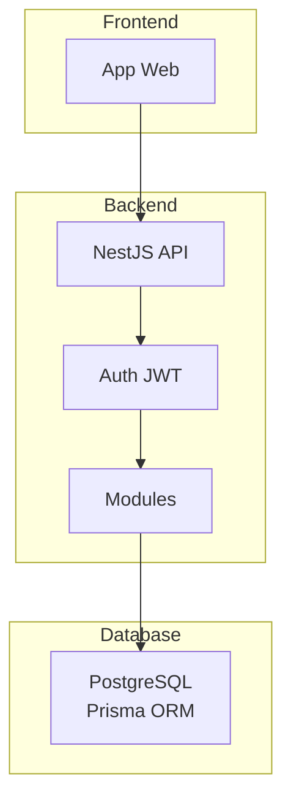

# Visao Geral do Projeto

## Nome do Projeto

**Troca Aula** - Sistema de Gerenciamento de Substituicao de Professores

## Proposito do Projeto

O sistema **Troca Aula** tem como objetivo principal facilitar e gerenciar o processo de substituicao de professores em instituicoes de ensino, evitando que aulas fiquem vazias quando um professor precisa se ausentar.

## Problema que Resolve

- **Aulas vagas**: Quando um professor falta, a aula fica sem docente
- **Processo manual**: Trocar professores e trabalhoso e pode gerar erros
- **Falta de controle**: Dificuldade em rastrear quem esta替代 em qual aula

## Objetivos do Sistema

1. **Automatizar solicitacoes**: Professores/diretores podem solicitar trocas de forma digital
2. **Verificar conflitos**: Sistema verifica automaticamente conflitos de horario
3. **Controlar permissoes**: Apenas pessoas autorizadas podem criar/aceitar trocas
4. **Rastrear historico**: Todas as trocas sao registradas para consulta futura

## Escopo do Projeto

### Escopo Principal (MVP)
- Autenticacao de usuarios
- Gerenciamento de escolas, disciplinas e turmas
- Sistema de solicitacao de trocas de aulas
- Sistema de inscricao em aulas

### Escopo Futuro (roadmap)
- Notificacoes por email/push
- Relatorios e estatisticas
- App mobile
- Integracao com calendarios

## Tipo de Projeto

Este e um projeto academico desenvolvido em **TypeScript** com **NestJS**, utilizando **PostgreSQL** como banco de dados e **Docker** para containerizacao.

## Publico Alvo

- **Diretores**: Podem criar solicitacoes de troca
- **Professores**: Podem aceitar/rejeitar trocas e se increver em aulas
- **Administradores**: Gestao geral do sistema

---

## Arquitetura Geral

---

## Stack Tecnologico

| Componente | Tecnologia |
|------------|------------|
| Linguagem | TypeScript |
| Framework | NestJS |
| ORM | Prisma |
| Banco de Dados | PostgreSQL |
| Autenticacao | JWT + bcrypt |
| Containerizacao | Docker |
| Package Manager | pnpm |