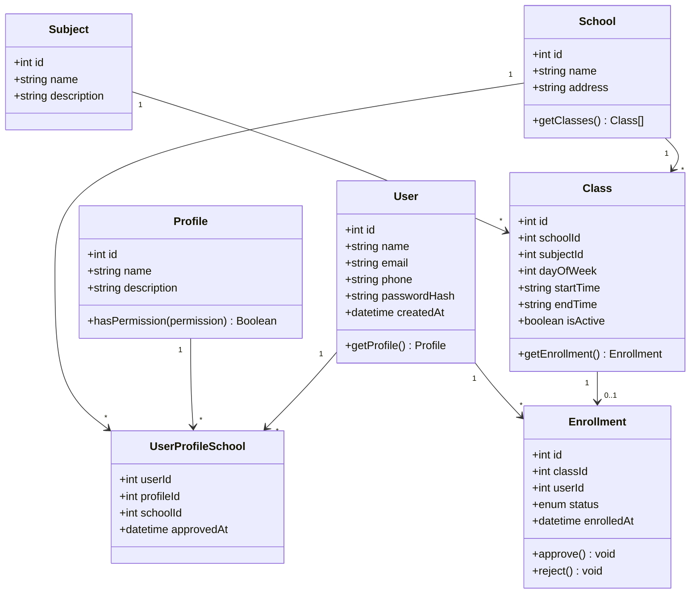
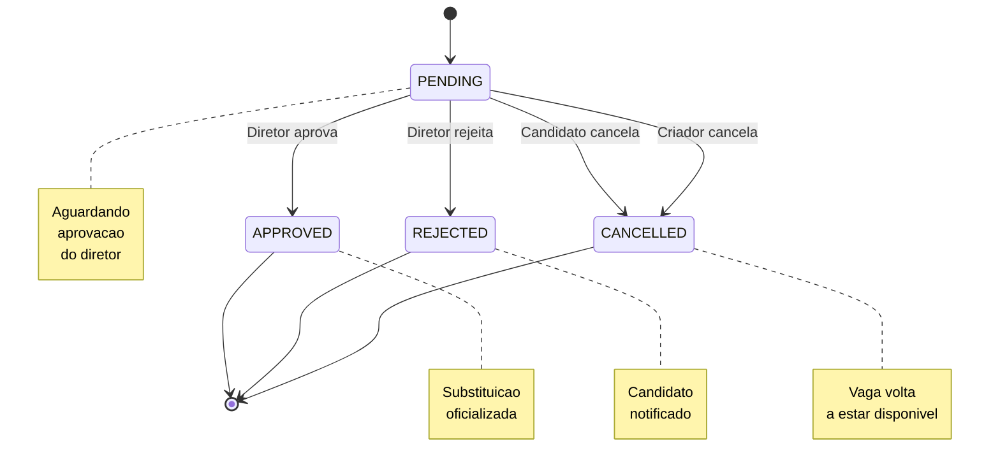
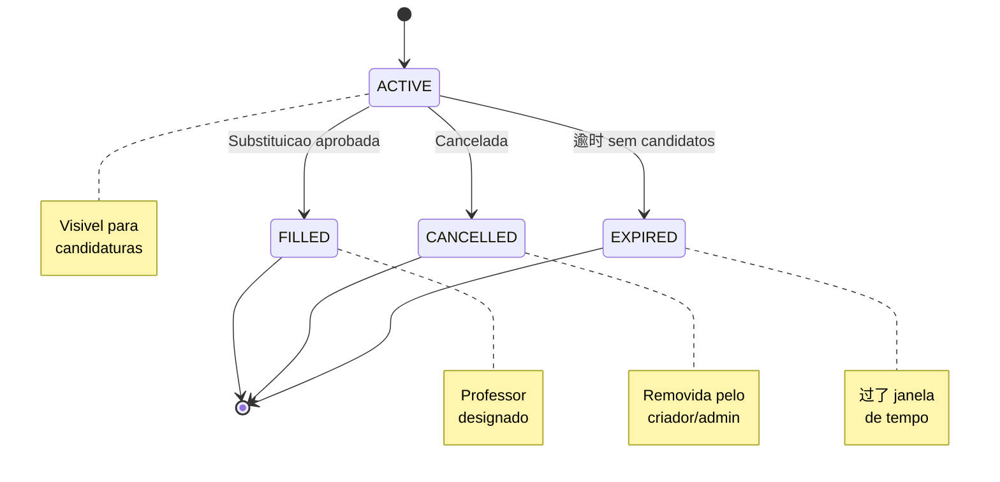
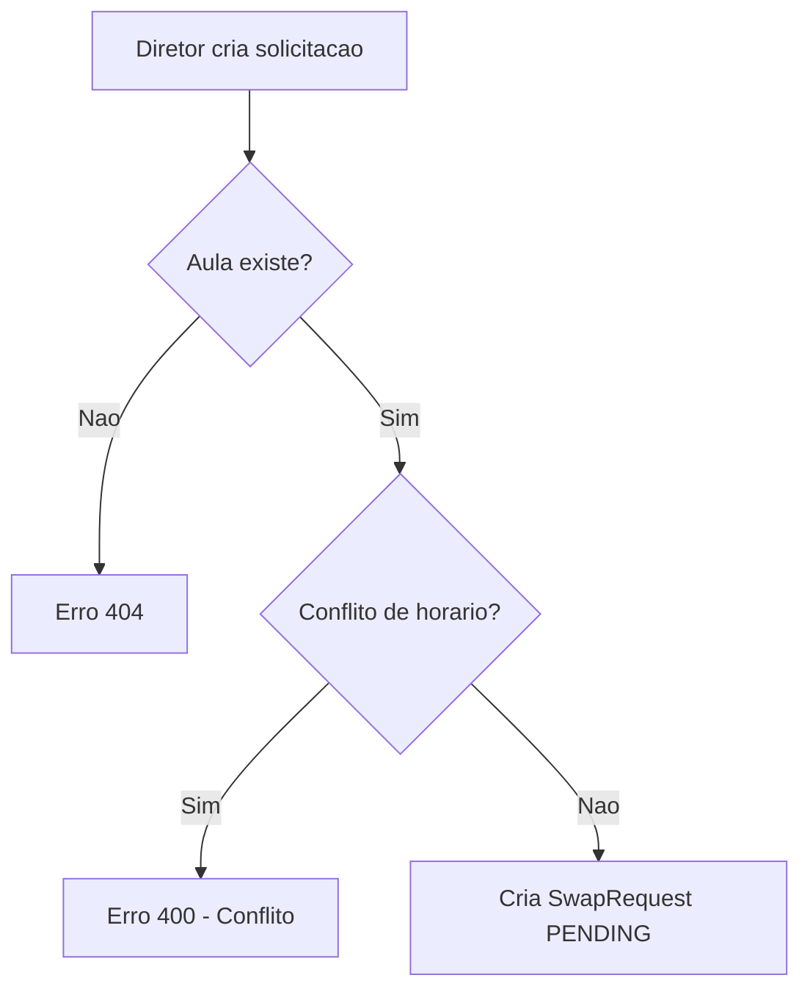
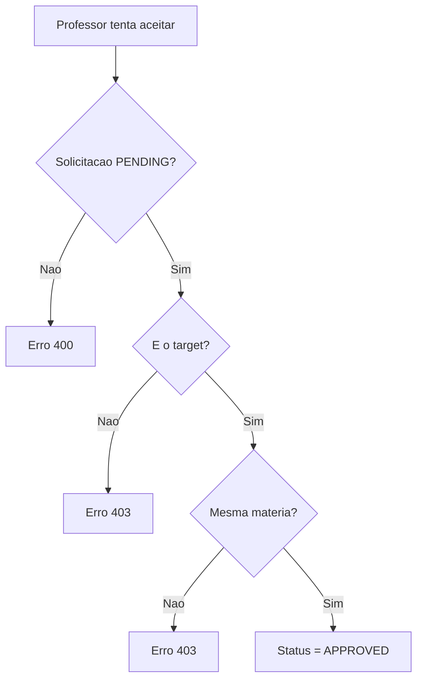
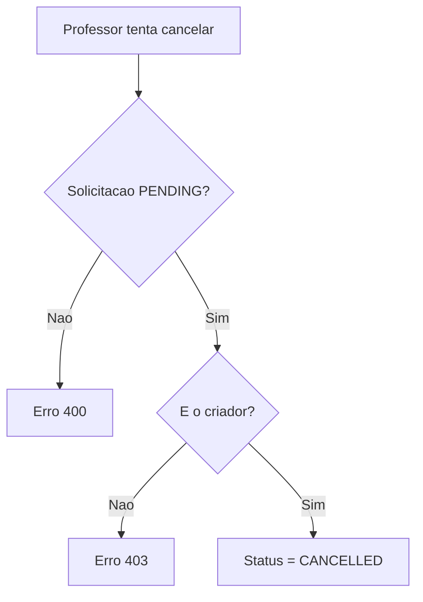
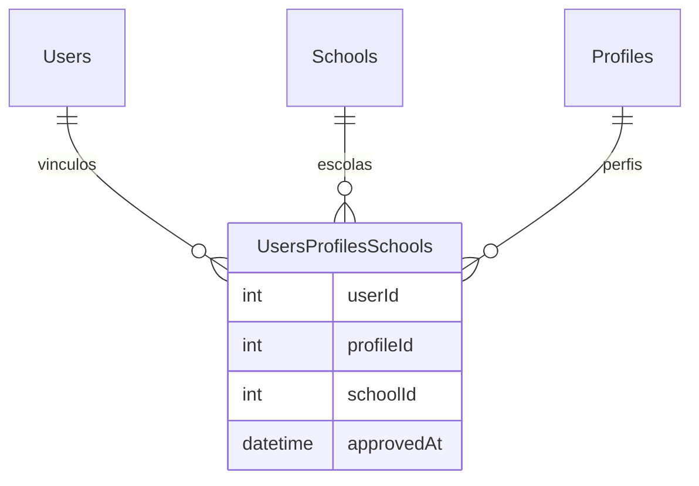

# Regras de Negocio

## Visao Geral

Este documento descreve todas as regras de negocio do sistema Troca Aula, definindo quem pode fazer o que e em quais condicoes.

---

## Diagrama de Classes — Modelo de Domínio



### Diagrama de Estados — Ciclo de Vida de uma Candidatura



### Diagrama de Estados — Ciclo de Vida de uma Aula Vaga



### Fluxo de Permissões por Perfil

```mermaid
graph TD
    subgraph "Professor"
        P1[Visualizar aulas vagas]
        P2[Se candidatar]
        P3[Cancelar propia candidatura]
        P4[Visualizar historico]
    end
    
    subgraph "Agente Administrativo"
        A1[Criar aulas vagas]
        A2[Editar aulas]
        A3[Cancelar aulas]
        A4[Visualizar tudo]
    end
    
    subgraph "Diretor"
        D1[Aprovar candidaturas]
        D2[Rejeitar candidaturas]
        D3[Gerenciar usuarios]
        D4[Configurar regras]
        D5[Visualizar relatorios]
    end
    
    P1 --> P2
    P2 --> P3
    P3 --> P4
    
    A1 --> A2
    A2 --> A3
    A3 --> A4
    
    D1 --> D2
    D2 --> D3
    D3 --> D4
    D4 --> D5
```



---

## Regras de Autenticacao

### R001 - Login de Usuario
- O usuario deve fornecer email e senha validos
- A senha e comparada usando bcrypt
- Em caso de sucesso, retorna token JWT
- Em caso de erro, retorna 401 Unauthorized

### R002 - Token JWT
- Token tem validade de 24 horas
- Todas as rotas (exceto /auth/login) requerem token valido
- O token contem o ID do usuario no payload

---

## Regras de Swap Request (Troca de Aulas)

### R003 - Criar Solicitacao de Troca

**Quem pode criar**: Apenas usuarios com perfil **DIRETOR** ou **AUXILIAR_ADMIN**

**Fluxo**:


**Validacoes**:
- classId deve existir
- targetId deve existir
- Nao pode ter conflito de horario

---

### R004 - Conflito de Horario

**Definicao**: Dois swaps conflitam quando:
- Mesmo dia da semana (dayOfWeek igual)
- Horarios se sobrepoem

**Algoritmo**:
```
dois_intervalos_conflitam(start1, end1, start2, end2):
    return start1 < end2 AND end1 > start2
```

**Exemplo**:
- Aula A: 08:00 - 09:00
- Aula B: 08:30 - 09:30
- **Conflito**: Sim (08:30 < 09:00 E 09:00 > 08:30)

---

### R005 - Aceitar Solicitacao

**Quem pode aceitar**: Apenas o **professor替代** (target)

**Validacao adicional**:
- O professor替代 deve lecionar a **mesma materia** da aula
- Comparacao: `user.subjectId = class.subjectId`

**Fluxo**:


---

### R006 - Rejeitar Solicitacao

**Quem pode rejeitar**: Apenas o **professor替代** (target)

**Condicao**: Status deve ser PENDING

---

### R007 - Cancelar Solicitacao

**Quem pode cancelar**: Apenas o **criador** da solicitacao (requesterId)

**Condicao**: Status deve ser PENDING

**Fluxo**:


---

### R008 - Listar Solicitacoes

**Filtros disponiveis**:
- **status**: PENDING, APPROVED, REJECTED, CANCELLED
- **type**: "created" (criadas por mim) | "received" (recebidas para mim)

**Sem filtro**: Retorna todas as solicitacoes onde o usuario e creator ou target

---

## Regras de Enrollment (Inscricao)

### R009 - Inscrever-se em Aula

**Quem pode**: Qualquer professor autenticado

**Validacoes**:
- Aula deve existir
- Aula nao pode estar inscrita por outro professor
- Professor nao pode estar inscrito duas vezes na mesma aula

---

### R010 - Cancelar Inscricao

**Quem pode**: Apenas o professor inscrito na aula

**Validacoes**:
- Aula deve ter inscricao ativa
- Apenas o inscrito pode cancelar

---

## Regras de Classes (Aulas)

### R011 - Criar Aula

**Quem pode**: Apenas **DIRETOR** ou **AUXILIAR_ADMIN**

**Campos obrigatorios**:
- schoolId (escola)
- subjectId (disciplina)
- createdByd (criador)

**Campos opcionais**:
- dayOfWeek (1-7)
- startTime (HH:MM)
- endTime (HH:MM)

---

### R012 - Visualizacao de Aulas

- **Admin/Diretor**: Vê todas as aulas de todas as escolas
- **Professor**: Vê apenas aulas da sua escola

---

## Regras de Usuarios

### R013 - Perfis de Usuario

| ID | Nome | Permissoes |
|----|------|------------|
| 1 | DIRETOR | Criar escolas, turmas, solicitacoes de troca |
| 2 | PROFESSOR | Aceitar/rejeitar trocas, se increver em aulas |
| 3 | AUXILIAR_ADMIN | Criar solicitacoes de troca |

### R014 - Relacao Usuario-Escola-Perfil

Um usuario pode ter multiplos vinculos com diferentes escolas e perfis:



---

## Matriz de Permissoes

| Acao | DIRETOR | PROFESSOR | AUXILIAR_ADMIN |
|------|---------|-----------|----------------|
| Criar SwapRequest | Sim | Nao | Sim |
| Aceitar Swap | Sim (mesma materia) | Sim (mesma materia) | Sim (mesma materia) |
| Rejeitar Swap | Sim | Sim | Sim |
| Cancelar Swap (proprio) | Sim | Sim | Sim |
| Criar Aula | Sim | Nao | Sim |
| Inscrever-se em Aula | Sim | Sim | Sim |
| Cancelar Inscricao (propria) | Sim | Sim | Sim |
| Listar Aulas (propria escola) | Sim | Sim | Sim |
| Listar Aulas (todas) | Sim | Nao | Sim |

---

## Validacoes de Dados

### DTOs - Regras de Validacao

**CreateSwapRequestDto**:
- classId: Obrigatorio, inteiro
- targetId: Obrigatorio, inteiro

**GetSwapRequestDto**:
- status: Opcional, enum valido
- type: Opcional, "created" ou "received"
- classId: Opcional, inteiro
- schoolId: Opcional, inteiro

**CreateUserDto**:
- name: Obrigatorio
- email: Obrigatorio, email valido, unico
- phone: Obrigatorio
- password: Obrigatorio, min 6 caracteres

---

## Casos de Erro Comuns

| Codigo | Mensagem | Causa |
|--------|----------|-------|
| 400 | Conflito de horario detectado | Professor替代 ja tem aula no mesmo horario |
| 400 | Solicitacao nao esta pendente | Status nao e PENDING |
| 400 | Aula nao esta inscrita por ninguem | Enrollment nao existe |
| 400 | Voce ja esta inscrito nesta aula | enrolledById = userId |
| 403 | Apenas diretor ou admin pode criar | Perfil nao autorizado |
| 403 | Apenas professor替代 pode aceitar | userId != targetId |
| 403 | Voce so pode aceitar aulas da sua materia | subjectId diferente |
| 403 | Apenas o criador pode cancelar | userId != requesterId |
| 404 | Usuario nao encontrado | ID invalido |
| 404 | Aula nao encontrada | ID invalido |