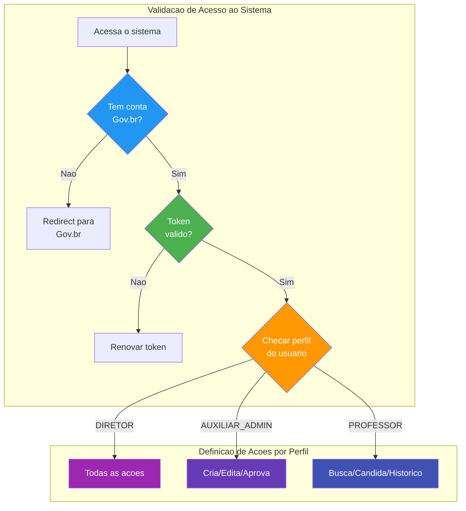
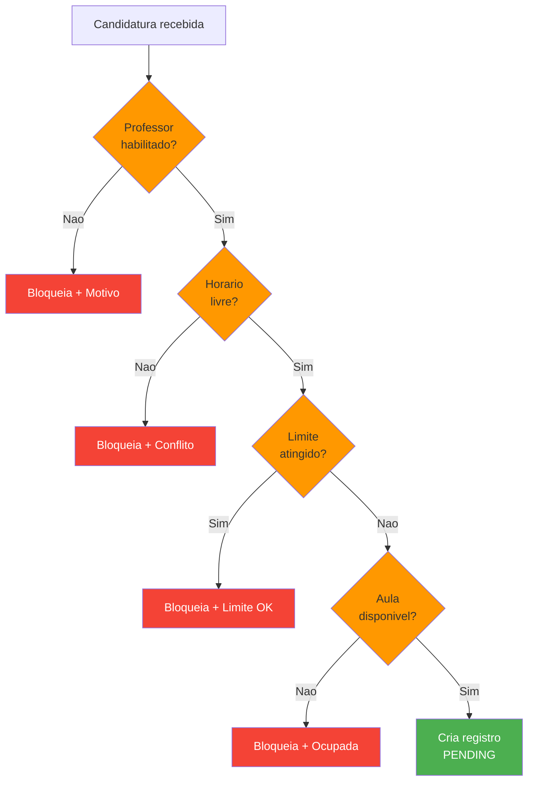
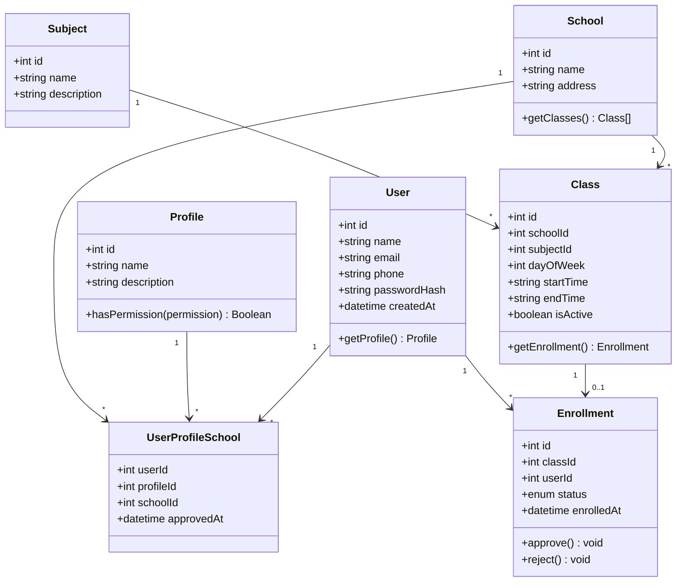
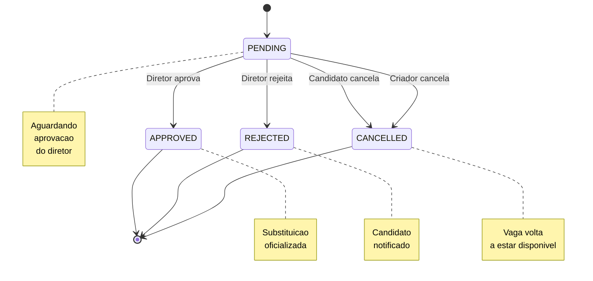
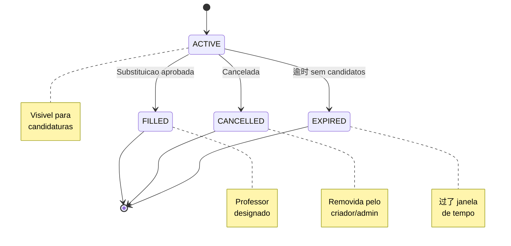
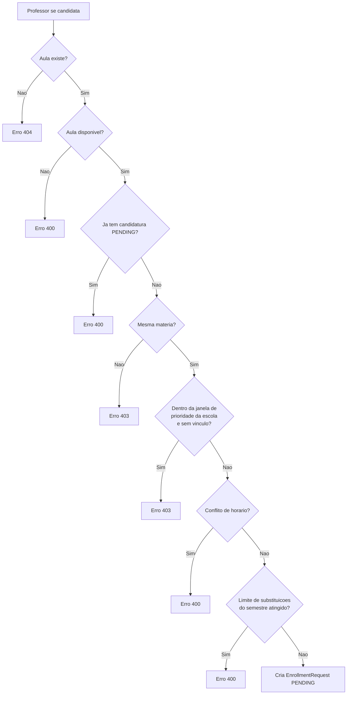
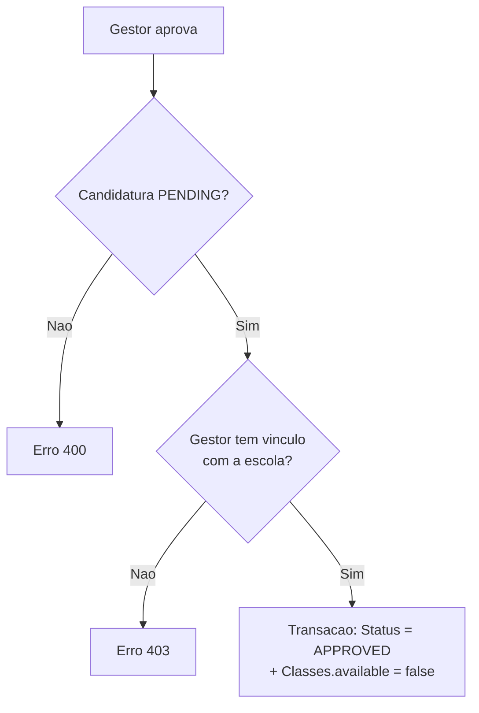
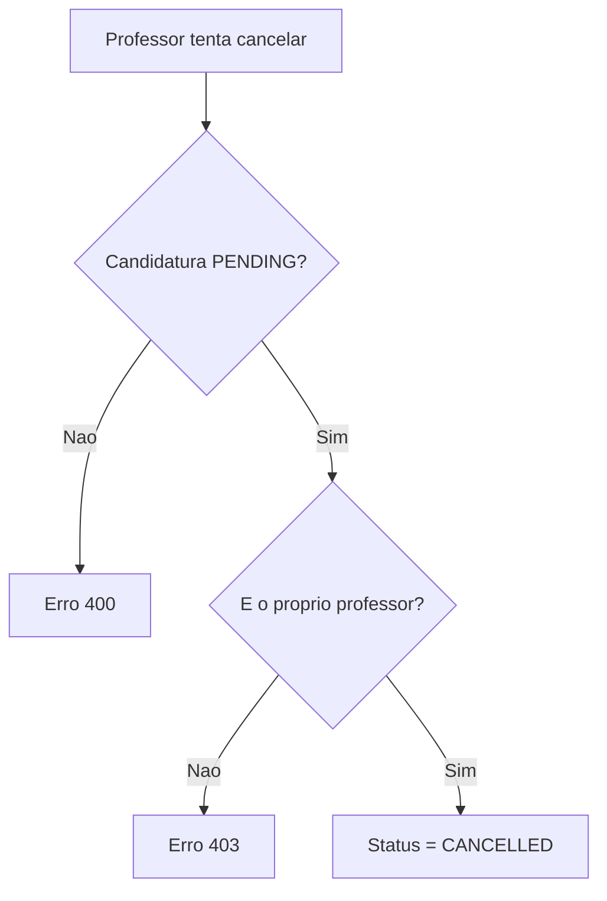
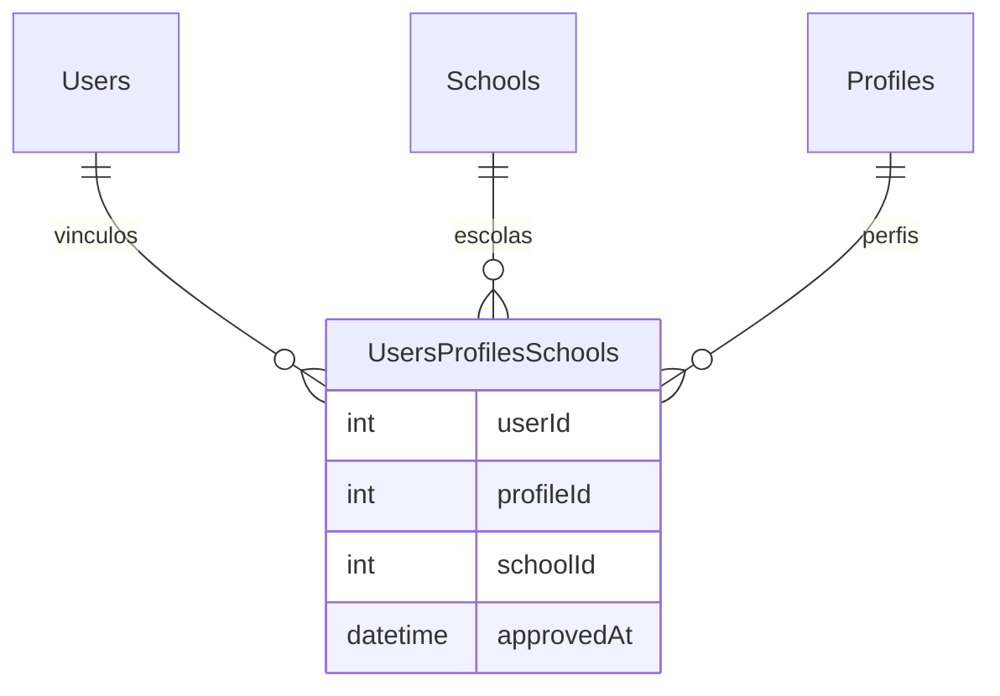

# Regras de Negocio

> **Nota de correcao (2026-09):** as secoes de "Swap Request" abaixo
> descreviam um modulo removido do codigo ha varios ciclos (migration
> `remove_swap_requests`) — corrigidas para refletir o fluxo real
> (Enrollment Request). As demais secoes deste documento **nao foram
> reauditadas por completo** nesta correcao pontual; para a autorizacao
> real e atualizada (guards `TenantGuard`/`RolesGuard`, perfis MASTER
> incluido), ver `docs/design-doc-evolucao-multi-tenant.md` na raiz do
> projeto, que e a fonte de verdade mais recente.

## Visao Geral

Este documento descreve todas as regras de negocio do sistema Troca Aula, definindo quem pode fazer o que e em quais condicoes.

---

## Diagrama de Decisão de Acesso


```mermaid
flowchart TD
    subgraph "Validacao de Acesso ao Sistema"
        INICIO[Acessa o sistema] --> LOGIN{Tem conta<br/>Gov.br?}
        LOGIN -->|Nao| CRIAR[Redirect para<br/>Gov.br]
        LOGIN -->|Sim| VALIDAR{Token<br/>valido?}
        VALIDAR -->|Nao| REFRESH[Renovar token]
        VALIDAR -->|Sim| PERFIL{Checar perfil<br/>do usuario}
    end
    
    subgraph "Definicao de Acoes por Perfil"
        PERFIL -->|DIRETOR| Acoes_D[Todas as acoes]
        PERFIL -->|AUXILIAR_ADMIN| Acoes_AA[Cria/Edita/Aprova]
        PERFIL -->|PROFESSOR| Acoes_P[Busca/Candida/Historico]
    end
    
    style LOGIN fill:#2196F3,color:#fff
    style VALIDAR fill:#4CAF50,color:#fff
    style PERFIL fill:#FF9800,color:#fff
    style Acoes_D fill:#9C27B0,color:#fff
    style Acoes_AA fill:#673AB7,color:#fff
    style Acoes_P fill:#3F51B5,color:#fff
```

### Fluxo de Validação de Candidatura


```mermaid
flowchart TB
    START[Candidatura recebida] --> V1{Professor<br/>habilitado?}
    V1 -->|Nao| E1[Bloqueia + Motivo]
    V1 -->|Sim| V2{Horario<br/>livre?}
    V2 -->|Nao| E2[Bloqueia + Conflito]
    V2 -->|Sim| V3{Limite<br/>atingido?}
    V3 -->|Sim| E3[Bloqueia + Limite OK]
    V3 -->|Nao| V4{Aula<br/>disponivel?}
    V4 -->|Nao| E4[Bloqueia + Ocupada]
    V4 -->|Sim| SUCESSO[Cria registro<br/>PENDING]
    
    style V1 fill:#FF9800
    style V2 fill:#FF9800
    style V3 fill:#FF9800
    style V4 fill:#FF9800
    style SUCESSO fill:#4CAF50,color:#fff
    style E1 fill:#f44336,color:#fff
    style E2 fill:#f44336,color:#fff
    style E3 fill:#f44336,color:#fff
    style E4 fill:#f44336,color:#fff
```

---

## Diagrama de Classes — Modelo de Domínio


```mermaid
classDiagram
    class User {
        +int id
        +string name
        +string email
        +string phone
        +string passwordHash
        +datetime createdAt
        +getProfile() Profile
    }
    
    class Profile {
        +int id
        +string name
        +string description
        +hasPermission(permission) Boolean
    }
    
    class School {
        +int id
        +string name
        +string address
        +getClasses() Class[]
    }
    
    class Class {
        +int id
        +int schoolId
        +int subjectId
        +int dayOfWeek
        +string startTime
        +string endTime
        +boolean isActive
        +getEnrollment() Enrollment
    }
    
    class Subject {
        +int id
        +string name
        +string description
    }
    
    class Enrollment {
        +int id
        +int classId
        +int userId
        +enum status
        +datetime enrolledAt
        +approve() void
        +reject() void
    }
    
    class UserProfileSchool {
        +int userId
        +int profileId
        +int schoolId
        +datetime approvedAt
    }
    
    User "1" --> "*" UserProfileSchool
    Profile "1" --> "*" UserProfileSchool
    School "1" --> "*" UserProfileSchool
    
    School "1" --> "*" Class
    Subject "1" --> "*" Class
    Class "1" --> "0..1" Enrollment
    User "1" --> "*" Enrollment
```

### Diagrama de Estados — Ciclo de Vida de uma Candidatura


```mermaid
stateDiagram-v2
    [*] --> PENDING
    
    PENDING --> APPROVED: Diretor aprova
    PENDING --> REJECTED: Diretor rejeita
    PENDING --> CANCELLED: Candidato cancela
    PENDING --> CANCELLED: Criador cancela
    
    APPROVED --> [*]
    REJECTED --> [*]
    CANCELLED --> [*]
    
    note right of PENDING: Aguardando<br/>aprovacao<br/>do diretor
    note right of APPROVED: Substituicao<br/>oficializada
    note right of REJECTED: Candidato<br/>notificado
    note right of CANCELLED: Vaga volta<br/>a estar disponivel
```

### Diagrama de Estados — Ciclo de Vida de uma Aula Vaga


```mermaid
stateDiagram-v2
    [*] --> ACTIVE
    
    ACTIVE --> FILLED: Substituicao aprobada
    ACTIVE --> CANCELLED: Cancelada
    ACTIVE --> EXPIRED:逾时 sem candidatos
    
    FILLED --> [*]
    CANCELLED --> [*]
    EXPIRED --> [*]
    
    note right of ACTIVE: Visivel para<br/>candidaturas
    note right of FILLED: Professor<br/>designado
    note right of CANCELLED: Removida pelo<br/>criador/admin
    note right of EXPIRED:超过了 janela<br/>de tempo
```

### Fluxo de Permissões por Perfil


```mermaid
graph TD
    subgraph "Professor"
        P1[Visualizar aulas vagas]
        P2[Se candidatar]
        P3[Cancelar propia candidatura]
        P4[Visualizar historico]
    end
    
    subgraph "Agente Administrativo"
        A1[Criar aulas vagas]
        A2[Editar aulas]
        A3[Cancelar aulas]
        A4[Visualizar tudo]
    end
    
    subgraph "Diretor"
        D1[Aprovar candidaturas]
        D2[Rejeitar candidaturas]
        D3[Gerenciar usuarios]
        D4[Configurar regras]
        D5[Visualizar relatorios]
    end
    
    P1 --> P2
    P2 --> P3
    P3 --> P4
    
    A1 --> A2
    A2 --> A3
    A3 --> A4
    
    D1 --> D2
    D2 --> D3
    D3 --> D4
    D4 --> D5
```

---

## Regras de Autenticacao

### R001 - Login de Usuario
- O usuario deve fornecer email e senha validos
- A senha e comparada usando bcrypt
- Em caso de sucesso, retorna token JWT
- Em caso de erro, retorna 401 Unauthorized

### R002 - Token JWT
- Token tem validade de 24 horas
- Todas as rotas (exceto /auth/login) requerem token valido
- O token contem o ID do usuario no payload

---

## Regras de Enrollment Request (Candidatura a Aula Vaga)

### R003 - Candidatar-se a uma Aula Vaga

**Quem pode candidatar-se**: Qualquer usuario com perfil **PROFESSOR**, desde que lecione a mesma materia da aula

**Fluxo real** (`EnrollmentRequestsService.create`):

```mermaid
flowchart TD
    A[Professor se candidata] --> B{Aula existe?}
    B -->|Nao| C[Erro 404]
    B -->|Sim| D{Aula disponivel?}
    D -->|Nao| E[Erro 400]
    D -->|Sim| F{Ja tem candidatura PENDING?}
    F -->|Sim| G[Erro 400]
    F -->|Nao| H{Mesma materia?}
    H -->|Nao| I[Erro 403]
    H -->|Sim| J{Dentro da janela de<br/>prioridade da escola<br/>e sem vinculo?}
    J -->|Sim| K[Erro 403]
    J -->|Nao| L{Conflito de horario?}
    L -->|Sim| M[Erro 400]
    L -->|Nao| N{Limite de substituicoes<br/>do semestre atingido?}
    N -->|Sim| O[Erro 400]
    N -->|Nao| P[Cria EnrollmentRequest PENDING]
```

**Validacoes** (todas reais, verificadas no codigo atual):
- `classId` deve existir e estar `available`
- Nao pode ja existir candidatura PENDING do mesmo professor para a mesma aula
- `professor.subjectId` deve ser igual a `class.subjectId`
- Se a escola tiver `priorityWindowHours` configurado e a janela ainda nao fechou, o professor precisa ter vinculo com a escola (ver Design Doc, Secao 9.2)
- Nao pode haver conflito de horario com outra substituicao ja aprovada do mesmo professor
- Nao pode exceder `substitutionLimitPerSemester` do professor (contagem de aprovacoes no semestre)

---

### R004 - Conflito de Horario

**Definicao**: Dois swaps conflitam quando:
- Mesmo dia da semana (dayOfWeek igual)
- Horarios se sobrepoem

**Algoritmo**:
```
dois_intervalos_conflitam(start1, end1, start2, end2):
    return start1 < end2 AND end1 > start2
```

**Exemplo**:
- Aula A: 08:00 - 09:00
- Aula B: 08:30 - 09:30
- **Conflito**: Sim (08:30 < 09:00 E 09:00 > 08:30)

---

### R005 - Aprovar Candidatura

**Quem pode aprovar**: DIRETOR, AUXILIAR_ADMIN ou MASTER da escola da aula (nao mais "o professor alvo" — a aprovacao e da gestao, nao de outro professor)

**Fluxo** (`EnrollmentRequestsService` — transacao explicita desde a migracao para Drizzle):

```mermaid
flowchart TD
    A[Gestor aprova] --> B{Candidatura PENDING?}
    B -->|Nao| C[Erro 400]
    B -->|Sim| D{Gestor tem vinculo<br/>com a escola?}
    D -->|Nao| E[Erro 403]
    D -->|Sim| F["Transacao: Status = APPROVED<br/>+ Classes.available = false"]
```

---

### R006 - Rejeitar Candidatura

**Quem pode rejeitar**: DIRETOR, AUXILIAR_ADMIN ou MASTER da escola da aula

**Condicao**: Status deve ser PENDING

---

### R007 - Cancelar Candidatura

**Quem pode cancelar**: Apenas o **proprio professor** que se candidatou

**Condicao**: Status deve ser PENDING

**Fluxo**:

```mermaid
flowchart TD
    A[Professor tenta cancelar] --> B{Candidatura PENDING?}
    B -->|Nao| C[Erro 400]
    B -->|Sim| D{E o proprio professor?}
    D -->|Nao| E[Erro 403]
    D -->|Sim| F[Status = CANCELLED]
```

---

### R008 - Listar Candidaturas

**Filtros disponiveis** (`GET /enrollment-requests`): `status`, `classId`, `professorId`, `userId`, `schoolId`, `createdAfter`, `createdBefore`, `mes`

**Sem filtro**: gestor ve as candidaturas da propria escola; professor ve as proprias. Resposta inclui `schoolSince` (tempo de vinculo do professor com a escola), usado pela direcao para decidir a quem dar preferencia na aprovacao.

---

## Regras de Enrollment (Inscricao)

### R009 - Inscrever-se em Aula

**Quem pode**: Qualquer professor autenticado

**Validacoes**:
- Aula deve existir
- Aula nao pode estar inscrita por outro professor
- Professor nao pode estar inscrito duas vezes na mesma aula

---

### R010 - Cancelar Inscricao

**Quem pode**: Apenas o professor inscrito na aula

**Validacoes**:
- Aula deve ter inscricao ativa
- Apenas o inscrito pode cancelar

---

## Regras de Classes (Aulas)

### R011 - Criar Aula

**Quem pode**: **DIRETOR**, **AUXILIAR_ADMIN** (propria escola) ou **MASTER** (qualquer escola)

**Campos obrigatorios**:
- schoolId (escola)
- subjectId (disciplina)
- createdByd (criador)

**Campos opcionais**:
- dayOfWeek (1-7)
- startTime (HH:MM)
- endTime (HH:MM)

---

### R012 - Visualizacao de Aulas (corrigido — a versao anterior estava errada)

- **MASTER**: ve todas as aulas de todas as escolas
- **DIRETOR/AUXILIAR_ADMIN**: veem apenas as aulas da **propria** escola (nao de todas)
- **PROFESSOR**: ve aulas de qualquer escola em que tenha vinculo, filtradas pela propria materia; fora disso, sujeito a janela de prioridade da escola (Design Doc, Secao 9.2)

---

## Regras de Usuarios

### R013 - Perfis de Usuario

| ID | Nome | Permissoes |
|----|------|------------|
| 1 | DIRETOR | Criar aulas vagas, aprovar/rejeitar candidaturas, gerenciar vinculos de professores da propria escola |
| 2 | AUXILIAR_ADMIN | Mesmas permissoes operacionais de DIRETOR na propria escola |
| 3 | PROFESSOR | Candidatar-se e cancelar candidaturas a aulas vagas |
| 4 | MASTER | Acesso global — qualquer escola/rede, gerencia Networks e WorkloadPolicies |

*(IDs confirmados contra a migration real `20260818220000_normalize_profile_names` — a tabela anterior desta secao estava com a ordem/composicao errada, faltando MASTER.)*

### R014 - Relacao Usuario-Escola-Perfil

Um usuario pode ter multiplos vinculos com diferentes escolas e perfis:


```mermaid
erDiagram
    Users ||--o{ UsersProfilesSchools : "vinculos"
    Schools ||--o{ UsersProfilesSchools : "escolas"
    Profiles ||--o{ UsersProfilesSchools : "perfis"
    
    UsersProfilesSchools {
        int userId
        int profileId
        int schoolId
        datetime approvedAt
    }
```

---

## Matriz de Permissoes

| Acao | DIRETOR | PROFESSOR | AUXILIAR_ADMIN | MASTER |
|------|---------|-----------|----------------|--------|
| Candidatar-se a aula vaga | Nao | Sim (mesma materia, sujeito a janela de prioridade) | Nao | Nao |
| Aprovar candidatura | Sim (propria escola) | Nao | Sim (propria escola) | Sim (qualquer escola) |
| Rejeitar candidatura | Sim (propria escola) | Nao | Sim (propria escola) | Sim (qualquer escola) |
| Cancelar candidatura (propria) | Nao | Sim | Nao | Nao |
| Criar Aula | Sim (propria escola) | Nao | Sim (propria escola) | Sim (qualquer escola) |
| Configurar janela de prioridade da escola | Sim (propria) | Nao | Sim (propria) | Sim (qualquer) |
| Gerenciar Networks/WorkloadPolicies | Nao | Nao | Nao | Sim |
| Listar Aulas (propria escola) | Sim | Sim | Sim | Sim |
| Listar Aulas (todas) | Nao | Nao | Nao | Sim |

---

## Validacoes de Dados

### DTOs - Regras de Validacao

**Candidatura a aula vaga** (`POST /enrollment-requests/request/:classId`):
- `classId`: vem da rota, obrigatorio, inteiro

**FilterEnrollmentRequestDto** (`GET /enrollment-requests`):
- status: Opcional, enum valido (PENDING/APPROVED/REJECTED/CANCELLED)
- classId, professorId, userId, schoolId: Opcionais, inteiro
- createdAfter, createdBefore, mes: Opcionais, filtros de data

**CreateUserDto**:
- name: Obrigatorio
- email: Obrigatorio, email valido, unico
- phone: Obrigatorio
- password: Obrigatorio, min 6 caracteres

---

## Casos de Erro Comuns

| Codigo | Mensagem | Causa |
|--------|----------|-------|
| 400 | Conflito de horario detectado | Professor替代 ja tem aula no mesmo horario |
| 400 | Solicitacao nao esta pendente | Status nao e PENDING |
| 400 | Aula nao esta inscrita por ninguem | Enrollment nao existe |
| 400 | Voce ja esta inscrito nesta aula | enrolledById = userId |
| 403 | Apenas diretor ou admin pode criar | Perfil nao autorizado |
| 403 | Apenas professor替代 pode aceitar | userId != targetId |
| 403 | Voce so pode aceitar aulas da sua materia | subjectId diferente |
| 403 | Apenas o criador pode cancelar | userId != requesterId |
| 404 | Usuario nao encontrado | ID invalido |
| 404 | Aula nao encontrada | ID invalido |