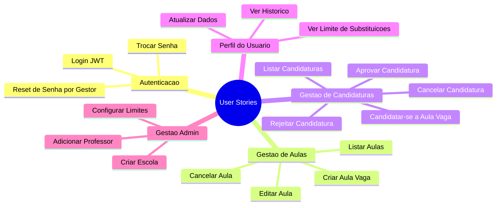
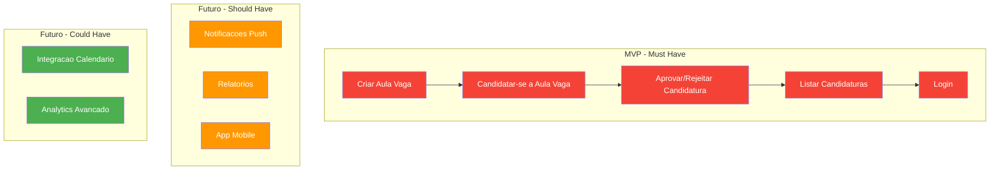

# User Stories

> **Nota de correcao (2026-09):** as historias US1-US4 deste documento
> descreviam o fluxo antigo de `SwapRequest` ("troca direta entre
> professores"), removido do banco pela migration `remove_swap_requests`.
> Foram reescritas para o fluxo real — "aula vaga (Classes.available) →
> candidatura (`POST /enrollment-requests/request/:classId`) → aprovacao da
> direcao" — e os endpoints inexistentes (`/swap-requests`, `accept`,
> `cancel`) foram substituidos pelos reais
> (`PATCH /enrollment-requests/:id/approve|reject`, `DELETE /enrollment-requests/:id`).
> As historias US6/US7
> continuam validas: as rotas de inscricao direta em `Classes` existem no
> codigo, mas sao fluxo complementar (sem aprovacao da direcao).

## Visao Geral

Este documento apresenta as historias de usuario do sistema Troca Aula, organizadas por prioridade e feature.

---

## Mapa de User Stories



### Diagrama de Priorização



---

## User Story 1: Criar Aula Vaga

**Prioridade**: P1 - MVP

**Como** usuario com perfil de Diretor ou Auxiliar Admin (ou MASTER),
**Eu quero** cadastrar uma aula vaga na minha escola,
**Para que** professores habilitados na mesma materia possam se candidatar a substitui-la.

### Cenarios de Aceitacao

**Cenario 1: Criacao bem-sucedida**
```
Dado que estou logado como Diretor/Auxiliar Admin com vinculo aprovado na escola
E informo os dados da vaga (schoolId, subjectId, statededAt, finishedAt)
Quando acesso POST /classes
Entao a aula e criada com available = true
E fica visivel para candidatura (respeitando a janela de prioridade da escola)
```

**Cenario 2: Professor nao pode criar**
```
Dado que estou logado como Professor
Quando tento criar uma aula (POST /classes)
Entao recebo erro 403 Forbidden
```

**Cenario 3: Escola sem vinculo**
```
Dado que sou gestor de outra escola
Quando tento criar uma aula em escola em que nao tenho vinculo aprovado
Entao recebo erro 403 Forbidden
```

---

## User Story 2: Candidatar-se a Aula Vaga

**Prioridade**: P1 - MVP

**Como** professor,
**Eu quero** me candidatar a uma aula vaga da minha materia,
**Para** assumir a substituicao apos a aprovacao da direcao.

### Cenarios de Aceitacao

**Cenario 1: Candidatura bem-sucedida**
```
Dado que estou logado como Professor
E existe uma aula vaga da minha materia
E nao tenho conflito de horario nem limite de substituicoes atingido
Quando acesso POST /enrollment-requests/request/:classId
Entao minha candidatura e criada com status PENDING
E a direcao da escola pode avalia-la
```

**Cenario 2: Aula indisponivel**
```
Dado que existe uma candidatura ja aprovada para a aula (available = false)
Quando tento me candidatar
Entao recebo erro 400 "Aula nao esta disponivel"
```

**Cenario 3: Materia diferente**
```
Dado que estou logado como Professor
E a aula vaga e de uma materia diferente da minha
Quando tento me candidatar
Entao recebo erro 403 "Voce so pode se candidatar a aulas da sua materia"
```

**Cenario 4: Conflito de horario**
```
Dado que ja tenho aula ou substituicao no mesmo dia e horario
Quando tento me candidatar a outra aula vaga
Entao recebo erro 400 "Conflito de horario detectado"
```

**Cenario 5: Limite de substituicoes atingido**
```
Dado que ja atingi meu limite de substituicoes aprovadas no semestre
Quando tento me candidatar
Entao recebo erro 400 "Limite de substituicoes atingido para este semestre"
```

**Cenario 6: Janela de prioridade da escola**
```
Dado que a escola configurou uma janela de prioridade (priorityWindowHours)
E a janela ainda nao terminou
E nao tenho vinculo com essa escola
Quando tento me candidatar
Entao recebo erro 403 "Esta vaga esta em janela de prioridade para professores da escola"
```

**Cenario 7: Candidatura duplicada**
```
Dado que ja tenho uma candidatura PENDING para a mesma aula
Quando tento me candidatar novamente
Entao recebo erro 400 "Ja existe uma solicitacao pendente"
```

---

## User Story 3: Aprovar/Rejeitar Candidatura

**Prioridade**: P1 - MVP

**Como** Diretor ou Auxiliar Admin da escola,
**Eu quero** aprovar ou rejeitar as candidaturas pendentes,
**Para** oficializar a substituicao apenas com professores adequados e manter a vaga aberta enquanto isso.

### Cenarios de Aceitacao

**Cenario 1: Aprovar com sucesso**
```
Dado que existe uma candidatura PENDING de um professor da minha escola
E tenho vinculo aprovado com a escola da aula
Quando acesso PATCH /enrollment-requests/:id/approve
Entao, em uma unica transacao, o status muda para APPROVED
E a aula e ocupada (enrolledById = professor, available = false)
```

**Cenario 2: Rejeitar candidatura**
```
Dado que existe uma candidatura PENDING
Quando acesso PATCH /enrollment-requests/:id/reject
Entao o status muda para REJECTED
E a aula continua vaga para outras candidaturas
```

**Cenario 3: Candidatura ja decidida**
```
Dado que a candidatura nao esta mais PENDING
Quando tento aprovar ou rejeitar
Entao recebo erro 400 "Solicitacao nao esta pendente"
```

**Cenario 4: Escola diferente**
```
Dado que a aula pertence a uma escola em que nao tenho vinculo de gestao
Quando tento aprovar ou rejeitar
Entao recebo erro 403 "Voce so pode aprovar/rejeitar solicitacoes de aulas da sua escola"
```

---

## User Story 4: Listar Candidaturas

**Prioridade**: P2

**Como** usuario autenticado,
**Eu quero** visualizar as candidaturas conforme meu perfil,
**Para** acompanhar o andamento das substituicoes.

### Cenarios de Aceitacao

**Cenario 1: Gestor lista a propria escola**
```
Dado que estou logado como Diretor/Auxiliar Admin
Quando acesso GET /enrollment-requests sem filtros
Entao vejo as candidaturas das aulas da minha escola
(MASTER ve de qualquer escola)
```

**Cenario 2: Professor lista as proprias**
```
Dado que estou logado como Professor
Quando acesso GET /enrollment-requests sem filtros
Entao vejo apenas as candidaturas que eu criei
```

**Cenario 3: Filtrar por status**
```
Dado que estou autenticado
Quando acesso GET /enrollment-requests?status=PENDING
Entao vejo apenas as candidaturas com status PENDING
```

**Cenario 4: Demais filtros disponiveis**
```
Dado que estou autenticado
Quando acesso GET /enrollment-requests com filtros
Entao posso filtrar por classId, professorId, userId, schoolId,
      createdAfter, createdBefore e mes
E cada item inclui schoolSince (tempo de vinculo do professor com a escola),
  usado pela direcao para decidir a quem dar preferencia
```

---

## User Story 5: Cancelar Candidatura

**Prioridade**: P3

**Como** professor que se candidatou,
**Eu quero** cancelar minha candidatura,
**Para** desistir da substituicao caso meus planos mudem.

### Cenarios de Aceitacao

**Cenario 1: Cancelar candidatura pendente**
```
Dado que tenho uma candidatura PENDING
Quando acesso DELETE /enrollment-requests/:id
Entao o status muda para CANCELLED
```

**Cenario 2: Cancelar candidatura ja aprovada**
```
Dado que tenho uma candidatura APPROVED e a aula esta vinculada a mim
Quando acesso DELETE /enrollment-requests/:id
Entao, em uma unica transacao, o status muda para CANCELLED
E a aula volta a ficar disponivel (enrolledById = null, available = true)
```

**Cenario 3: Nao autor**
```
Dado que nao sou o professor que criou a candidatura
Quando tento cancelar
Entao recebo erro 403 "Apenas o professor pode cancelar"
```

---

## User Story 6: Inscrever-se em Aula (fluxo complementar)

**Prioridade**: P3

> Rota complementar/legada: `POST /classes/:id/enroll` vincula o professor
> diretamente a aula (`enrolledById`), sem passar pela aprovacao da direcao.
> O fluxo padrao de substituicao e o de candidatura (`enrollment-requests`).

**Como** professor,
**Eu quero** me inscrever diretamente em uma aula,
**Para** registrar meu interesse fora do fluxo de candidatura.

### Cenarios de Aceitacao

**Cenario 1: Inscrever-se com sucesso**
```
Dado que a aula existe e nao tem professor inscrito
Quando acesso POST /classes/:id/enroll
Entao fico vinculado como professor da aula (enrolledById = meu id)
E recebo confirmacao
```

**Cenario 2: Ja inscrito**
```
Dado que eu ja estou inscrito na aula
Quando tento me inscrever novamente
Entao recebo erro 400 "Voce ja esta inscrito nesta aula"
```

**Cenario 3: Aula ja ocupada**
```
Dado que outro professor ja esta inscrito na aula
Quando tento me inscrever
Entao recebo erro 400 "Aula ja esta inscrita por outro professor"
```

---

## User Story 7: Cancelar Inscricao

**Prioridade**: P3

**Como** professor,
**Eu quero** cancelar minha inscricao em uma aula,
**Para** nao ser mais considerado como substituto por essa rota.

### Cenarios de Aceitacao

**Cenario 1: Cancelar inscricao**
```
Dado que estou inscrito em uma aula
Quando acesso DELETE /classes/:id/enroll
Entao minha inscricao e removida (enrolledById = null)
```

**Cenario 2: Aula sem inscricao**
```
Dado que a aula nao esta inscrita por ninguem
Quando tento cancelar inscricao
Entao recebo erro 400 "Aula nao esta inscrita por ninguem"
```

**Cenario 3: Nao inscrito**
```
Dado que outro professor esta inscrito na aula
Quando tento cancelar a inscricao
Entao recebo erro 403 "Apenas o professor inscrito pode cancelar inscricao"
```

---

## Matriz User Stories x Features

| User Story | Feature | Endpoint |
|------------|---------|----------|
| US1 | Criar Aula Vaga | POST /classes |
| US2 | Candidatar-se | POST /enrollment-requests/request/:classId |
| US3 | Aprovar Candidatura | PATCH /enrollment-requests/:id/approve |
| US3 | Rejeitar Candidatura | PATCH /enrollment-requests/:id/reject |
| US4 | Listar Candidaturas | GET /enrollment-requests |
| US5 | Cancelar Candidatura | DELETE /enrollment-requests/:id |
| US6 | Inscrever-se | POST /classes/:id/enroll |
| US7 | Cancelar Inscricao | DELETE /classes/:id/enroll |

---

## Definition of Done (DoD)

Cada user story sera considerada completa quando:

- [ ] Codigo implementado conforme specification
- [ ] testes unitarios criados
- [ ] Build passando
- [ ] lint sem erros criticos
- [ ] Documentacao atualizada
- [ ] Testado via Postman/cURL
