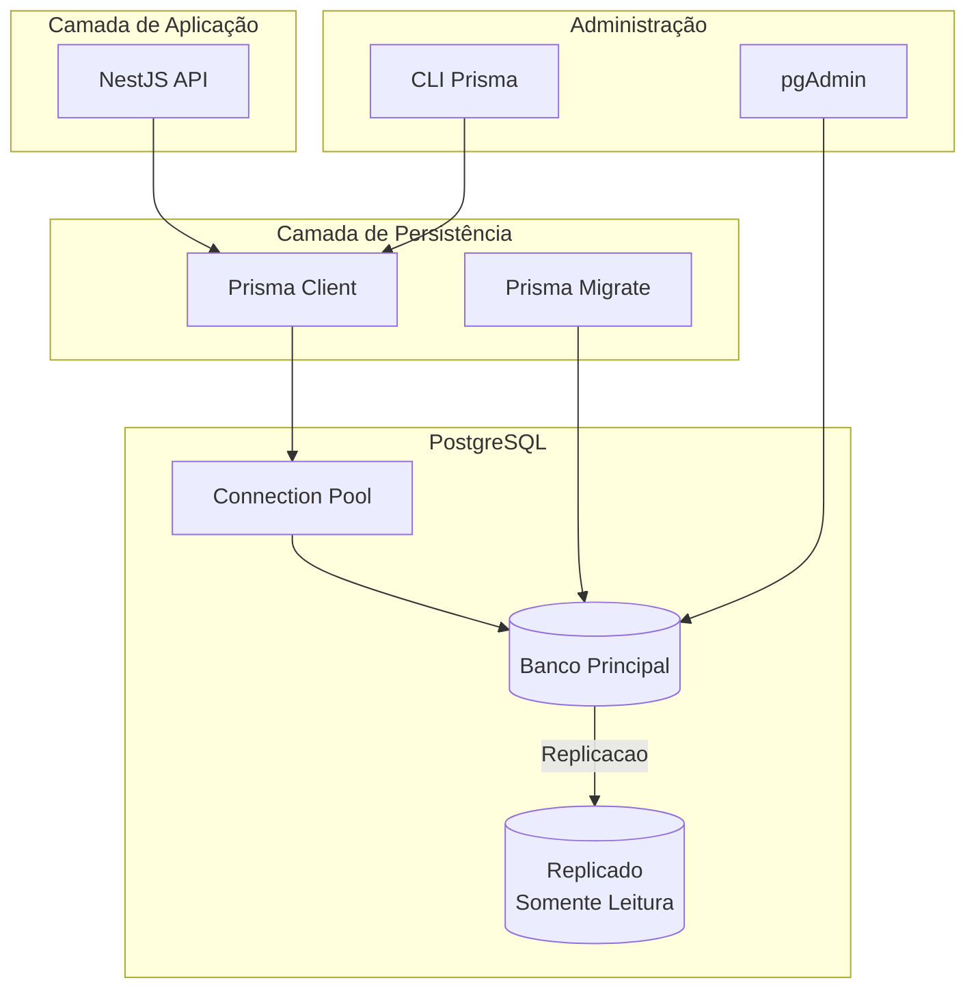
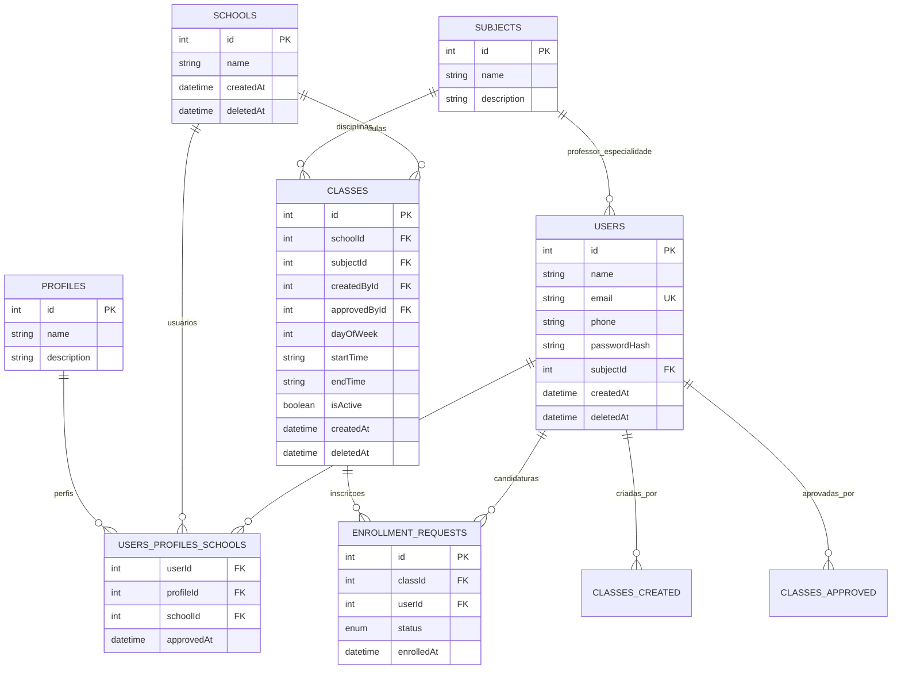
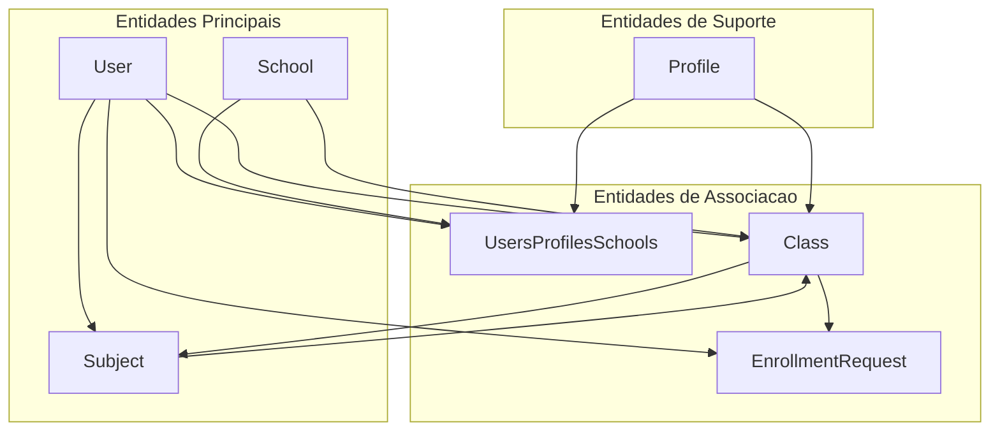
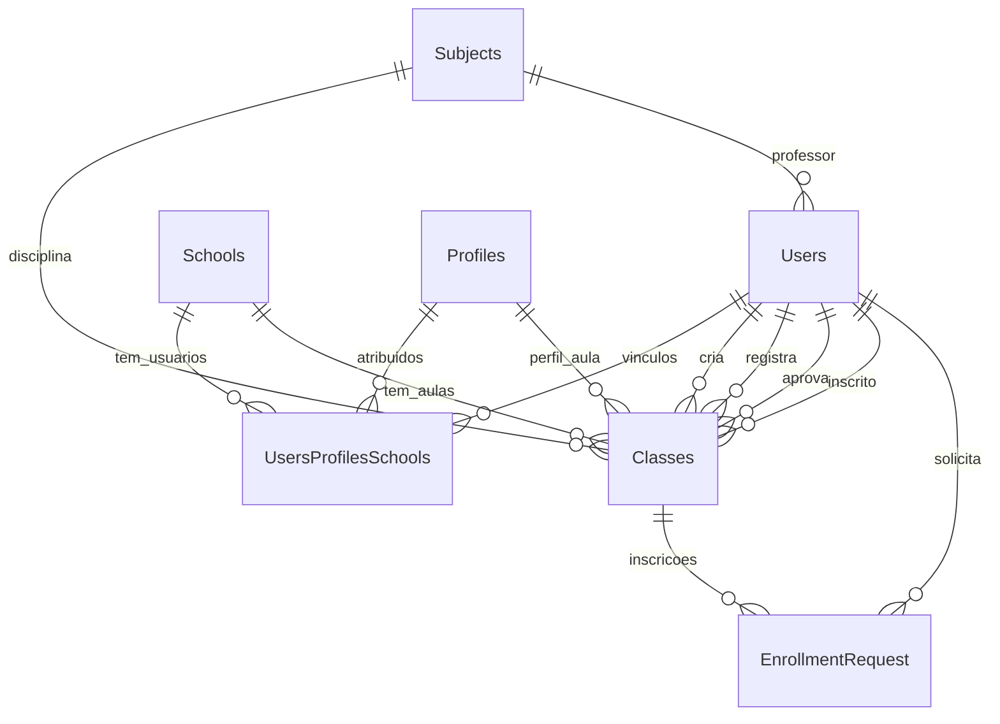
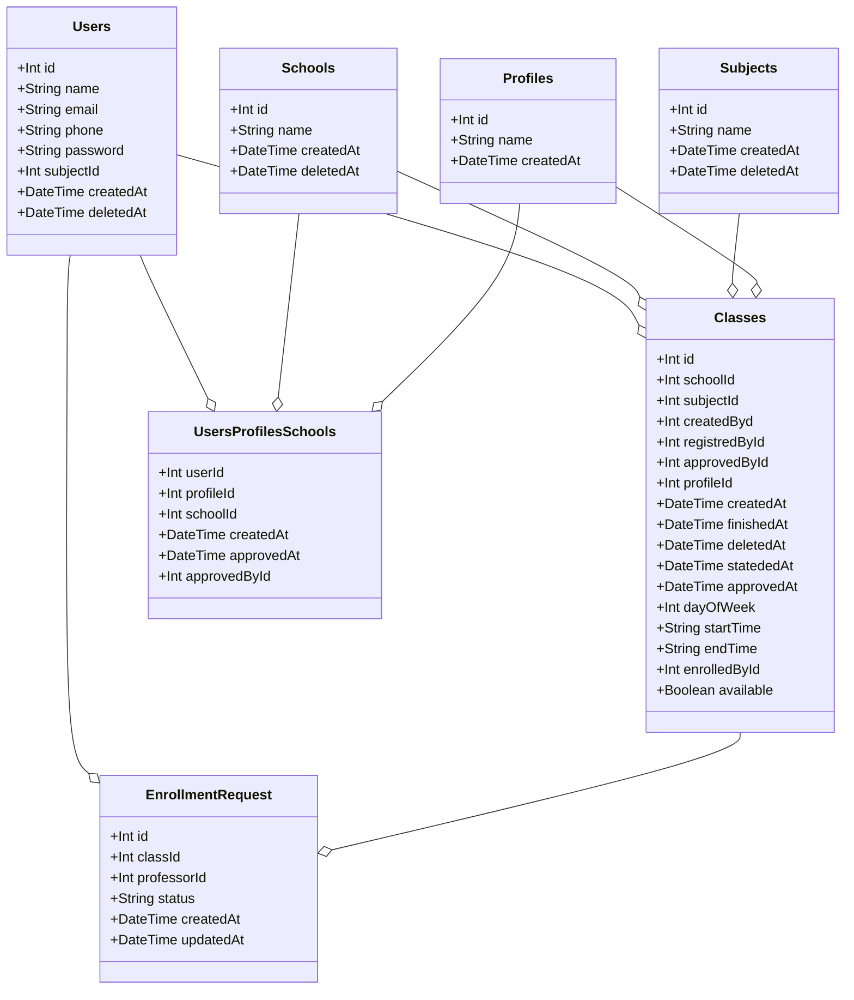
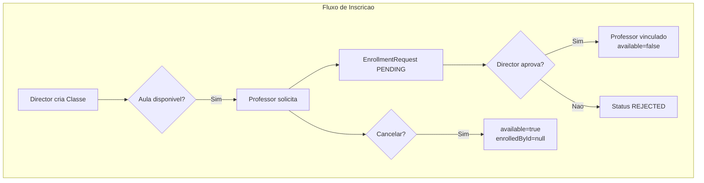
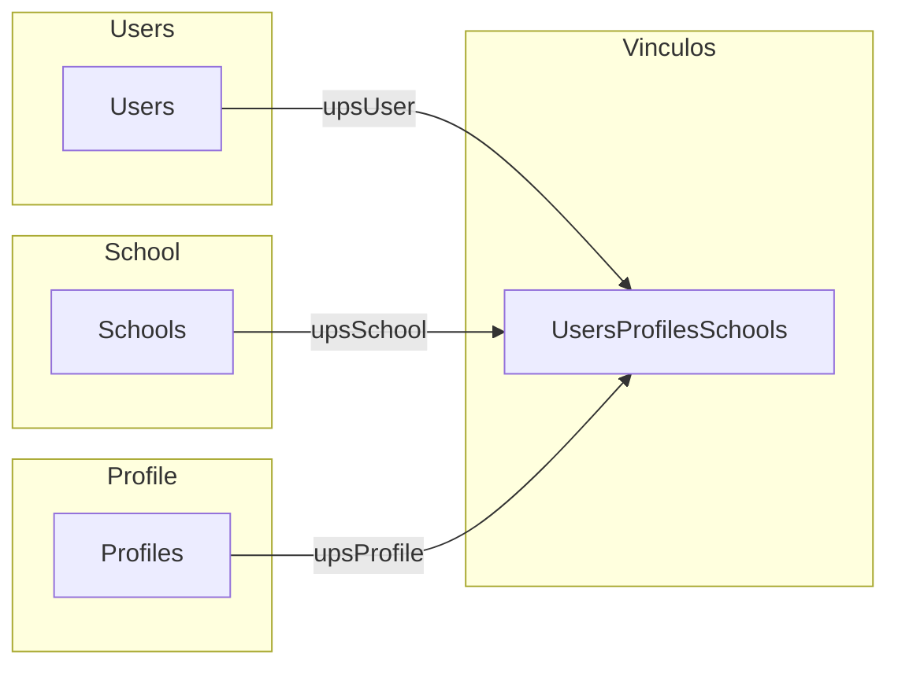

# Modelo de Dados

## Visao Geral do Banco

O banco de dados PostgreSQL e gerenciado pelo **Prisma ORM** e contem todas as entidades do sistema Troca Aula.

---

## Arquitetura do Banco de Dados



### Modelo Relacional Completo



### Diagrama de Dependencies de Entidades



---

## Diagrama de Entidades (Mermaid)



---

## Diagrama de Classes UML



---

## Fluxo de Dados



---

## Tabelas do Banco

### Users (Usuarios)

Armazena informacoes dos usuarios do sistema.

| Campo | Tipo | Obrigatorio | Descricao |
|-------|------|-------------|-----------|
| id | Int | Sim | PK auto-increment |
| name | String | Sim | Nome completo |
| email | String | Sim, unico | Email (login) |
| phone | String | Sim | Telefone |
| password | String | Sim | Senha hasheada |
| subjectId | Int | Nao | Materia que leciona |
| createdAt | DateTime | Sim | Data de criacao |
| deletedAt | DateTime | Nao | Data de exclusao |

**Indices**:
- email (unico)

---

### Schools (Escolas)

Armazena as instituicoes de ensino.

| Campo | Tipo | Obrigatorio | Descricao |
|-------|------|-------------|-----------|
| id | Int | Sim | PK auto-increment |
| name | String | Sim | Nome da escola |
| createdAt | DateTime | Sim | Data de criacao |
| deletedAt | DateTime | Nao | Data de exclusao |

---

### Subjects (Disciplinas)

Armazena as materias/disciplinas oferecidas.

| Campo | Tipo | Obrigatorio | Descricao |
|-------|------|-------------|-----------|
| id | Int | Sim | PK auto-increment |
| name | String | Sim | Nome da disciplina |
| createdAt | DateTime | Sim | Data de criacao |
| deletedAt | DateTime | Nao | Data de exclusao |

---

### Profiles (Perfis)

Define os tipos de usuarios no sistema.

| Campo | Tipo | Obrigatorio | Descricao |
|-------|------|-------------|-----------|
| id | Int | Sim | PK auto-increment |
| name | String | Sim | Nome do perfil |
| createdAt | DateTime | Sim | Data de criacao |

**Perfis disponiveis**:
- DIRETOR (id: 1)
- PROFESSOR (id: 2)
- AUXILIAR_ADMIN (id: 3)

---

### Classes (Aulas/Turmas)

Armazena as aulas cadastradas no sistema.

| Campo | Tipo | Obrigatorio | Descricao |
|-------|------|-------------|-----------|
| id | Int | Sim | PK auto-increment |
| schoolId | Int | Sim | FK para Schools |
| subjectId | Int | Sim | FK para Subjects |
| createdByd | Int | Sim | FK para Users (criador) |
| registredById | Int | Nao | FK para Users (registrador) |
| approvedById | Int | Nao | FK para Users (aprovador) |
| profileId | Int | Nao | FK para Profiles |
| createdAt | DateTime | Sim | Data de criacao |
| finishedAt | DateTime | Nao | Data de termino |
| deletedAt | DateTime | Nao | Data de exclusao |
| statededAt | DateTime | Nao | Data de inicio |
| approvedAt | DateTime | Nao | Data de aprovacao |
| dayOfWeek | Int | Nao | Dia (1-7, 1=segunda) |
| startTime | String | Nao | Horario inicio (HH:MM) |
| endTime | String | Nao | Horario fim (HH:MM) |
| enrolledById | Int | Nao | FK para Users (inscrito) |
| available | Boolean | Sim | Esta disponivel para inscricao |

**Indices**:
- schoolId
- subjectId
- createdByd
- available

---

### UsersProfilesSchools

Tabela de vinculo multiplos: Usuario <-> Perfil <-> Escola.

| Campo | Tipo | Obrigatorio | Descricao |
|-------|------|-------------|-----------|
| userId | Int | Sim | FK para Users |
| profileId | Int | Sim | FK para Profiles |
| schoolId | Int | Sim | FK para Schools |
| createdAt | DateTime | Sim | Data de criacao |
| approvedAt | DateTime | Nao | Data de aprovacao |
| approvedById | Int | Nao | FK para Users (aprovador) |

**Chave primaria composta**: (userId, profileId, schoolId)

**Indices**:
- userId
- profileId
- schoolId

---

### EnrollmentRequest (Solicitacoes de Inscricao)

Armazena as solicitacoes de inscricao em aulas.

| Campo | Tipo | Obrigatorio | Descricao |
|-------|------|-------------|-----------|
| id | Int | Sim | PK auto-increment |
| classId | Int | Sim | FK para Classes |
| professorId | Int | Sim | FK para Users |
| status | String | Sim | PENDING, APPROVED, REJECTED, CANCELLED |
| createdAt | DateTime | Sim | Data de criacao |
| updatedAt | DateTime | Sim | Data de atualizacao |

**Status possiveis**:
- PENDING: Aguardando aprovacao do diretor
- APPROVED: Aprovada pelo diretor - professor vinculado
- REJECTED: Rejeitada pelo diretor
- CANCELLED: Cancelada pelo professor

**Indices**:
- classId
- professorId
- status

---

## Relacionamentos Detalhados



---

## Queries Comuns (Prisma)

### Buscar usuario com vinculos

```typescript
const user = await prisma.users.findUnique({
  where: { id: 1 },
  include: {
    upsUser: {
      include: {
        profile: true,
        school: true
      }
    }
  }
});
```

### Buscar aulas disponiveis

```typescript
const availableClasses = await prisma.classes.findMany({
  where: {
    available: true,
    deletedAt: null
  },
  include: {
    school: true,
    subject: true
  }
});
```

### Criar EnrollmentRequest

```typescript
const enrollmentRequest = await prisma.enrollmentRequest.create({
  data: {
    class: { connect: { id: classId } },
    professor: { connect: { id: professorId } },
    status: 'PENDING'
  }
});
```

### Aprovar inscricao

```typescript
await prisma.$transaction([
  prisma.enrollmentRequest.update({
    where: { id: requestId },
    data: { status: 'APPROVED' }
  }),
  prisma.classes.update({
    where: { id: classId },
    data: {
      enrolledById: professorId,
      available: false
    }
  })
]);
```

---

## Migracoes

O banco e versionado via Prisma Migrate:

```bash
# Criar nova migration
npx prisma migrate dev --name nome_da_migration

# Aplicar migrations em producao
npx prisma migrate deploy

# Resetar banco (desenvolvimento)
npx prisma migrate reset
```

---

## Schema Prisma Completo

O arquivo completo esta em `prisma/schema.prisma` e contem todas as definicoes de modelos, relacoes e indices.