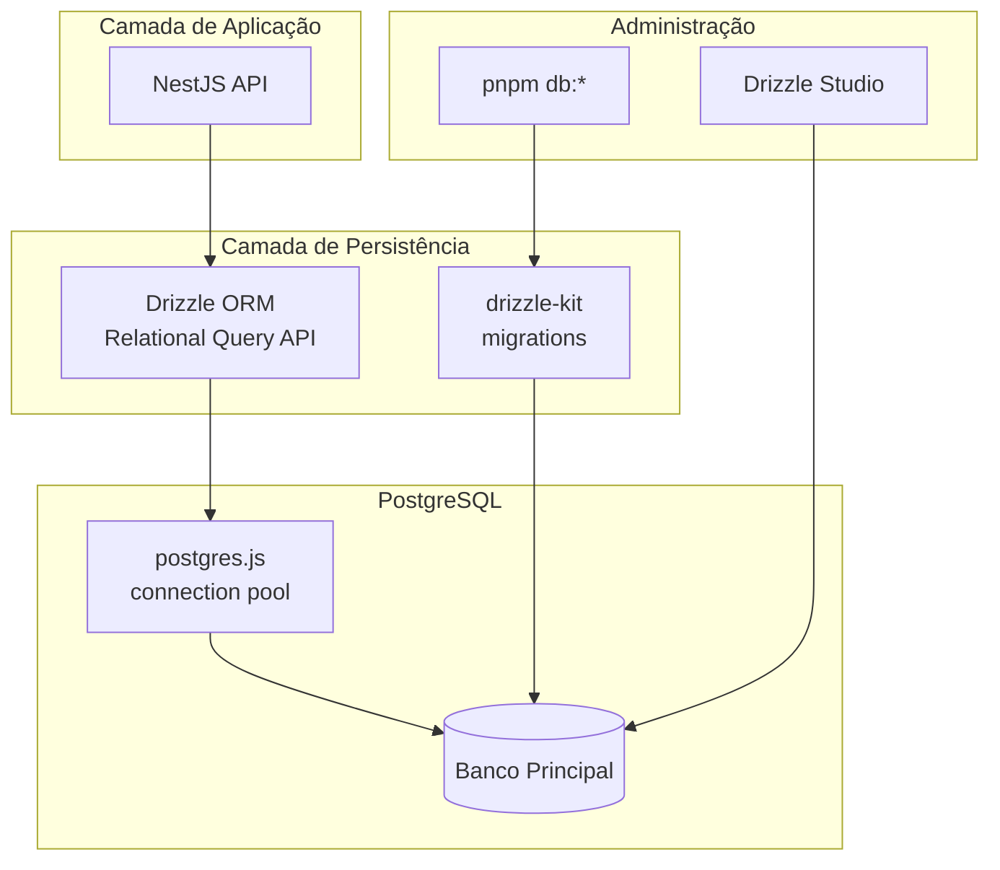
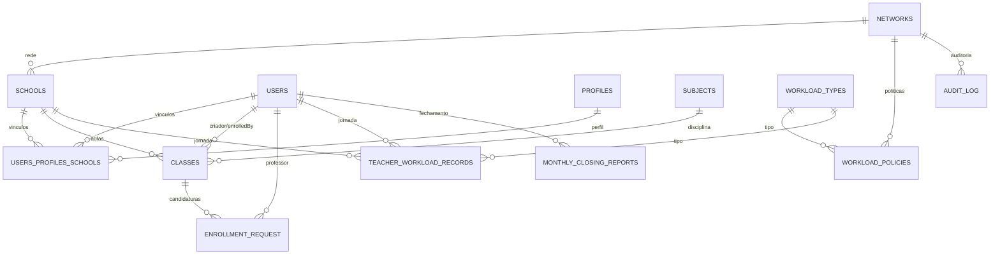

# Modelo de Dados

> **Atualizado (2026-09):** o banco é gerenciado pelo **Drizzle ORM** (migração concluída na Fase 1 — ver Design Doc, ADR-002; `prisma/` fica apenas como referência histórica). A fonte de verdade é [`src/database/schema.ts`](../src/database/schema.ts); as migrations ficam em [`drizzle/migrations/`](../drizzle/migrations).

## Visao Geral do Banco

O banco de dados PostgreSQL contém as 13 tabelas do sistema Troca Aula multi-tenant: as 7 originais (Users, Profiles, Schools, Subjects, Classes, EnrollmentRequest, UsersProfilesSchools) e as 6 da evolução multi-tenant (Networks, WorkloadTypes, WorkloadPolicies, TeacherWorkloadRecords, MonthlyClosingReports, AuditLog).

---

## Arquitetura do Banco de Dados


```mermaid
graph TB
    subgraph "Camada de Aplicação"
        APP[NestJS API]
    end

    subgraph "Camada de Persistência"
        DRIZZLE[Drizzle ORM<br/>Relational Query API]
        MIGRATE[drizzle-kit<br/>migrations]
    end

    subgraph "PostgreSQL"
        DRIVER[postgres.js<br/>connection pool]
        MAIN[(Banco Principal)]
    end

    subgraph "Administração"
        DSTUDIO[Drizzle Studio]
        CLI[pnpm db:*]
    end

    APP --> DRIZZLE
    DRIZZLE --> DRIVER
    DRIVER --> MAIN
    MIGRATE --> MAIN
    DSTUDIO --> MAIN
    CLI --> MIGRATE
```

---

## Modelo Relacional (visão geral)


```mermaid
erDiagram
    NETWORKS ||--o{ SCHOOLS : "rede"
    SCHOOLS ||--o{ USERS_PROFILES_SCHOOLS : "vinculos"
    USERS ||--o{ USERS_PROFILES_SCHOOLS : "vinculos"
    PROFILES ||--o{ USERS_PROFILES_SCHOOLS : "perfil"
    SCHOOLS ||--o{ CLASSES : "aulas"
    SUBJECTS ||--o{ CLASSES : "disciplina"
    USERS ||--o{ CLASSES : "criador/enrolledBy"
    CLASSES ||--o{ ENROLLMENT_REQUEST : "candidaturas"
    USERS ||--o{ ENROLLMENT_REQUEST : "professor"
    NETWORKS ||--o{ WORKLOAD_POLICIES : "politicas"
    WORKLOAD_TYPES ||--o{ WORKLOAD_POLICIES : "tipo"
    USERS ||--o{ TEACHER_WORKLOAD_RECORDS : "jornada"
    SCHOOLS ||--o{ TEACHER_WORKLOAD_RECORDS : "jornada"
    WORKLOAD_TYPES ||--o{ TEACHER_WORKLOAD_RECORDS : "tipo"
    USERS ||--o{ MONTHLY_CLOSING_REPORTS : "fechamento"
    NETWORKS ||--o{ AUDIT_LOG : "auditoria"
```

---

## Tabelas do Banco

### Profiles (Perfis) — `Profiles`

| Campo | Tipo | Obrigatorio | Descricao |
|-------|------|-------------|-----------|
| id | serial | Sim | PK auto-increment |
| name | text | Sim | Nome do perfil |
| createdAt | timestamp(3) | Sim | Data de criacao |

**Perfis semeados por migration** (valor real do backend, espelhado em `src/constants/profile.ts` do frontend):

| id | name |
|----|------|
| 1 | DIRETOR |
| 2 | AUXILIAR_ADMIN |
| 3 | PROFESSOR |
| 4 | MASTER |

---

### Users (Usuarios) — `Users`

| Campo | Tipo | Obrigatorio | Descricao |
|-------|------|-------------|-----------|
| id | serial | Sim | PK auto-increment |
| name | text | Sim | Nome completo |
| email | text | Sim, unico | Email (login) |
| phone | text | Sim | Telefone |
| password | text | Sim | Senha hasheada (bcrypt) |
| subjectId | integer | Nao | FK Subjects — materia que leciona |
| substitutionLimitPerSemester | integer | Nao | Limite individual de substituicoes por semestre (nullable = sem limite) |
| createdAt | timestamp(3) | Sim | Data de criacao |
| deletedAt | timestamp(3) | Nao | Soft delete (helper `notDeleted()`) |

**Indices**: `Users_email_key` (unico), `Users_email_idx`.

---

### Subjects (Disciplinas) — `Subjects`

Catalogo global (ADR-003 — não é escopado por escola/rede).

| Campo | Tipo | Obrigatorio | Descricao |
|-------|------|-------------|-----------|
| id | serial | Sim | PK auto-increment |
| name | text | Sim | Nome da disciplina |
| createdAt | timestamp(3) | Sim | Data de criacao |
| deletedAt | timestamp(3) | Nao | Soft delete |

---

### Networks (Redes de Ensino) — `Networks`

Fronteira real do tenant (ADR-004). Sem soft delete por enquanto.

| Campo | Tipo | Obrigatorio | Descricao |
|-------|------|-------------|-----------|
| id | serial | Sim | PK auto-increment |
| name | text | Sim | Nome da rede |
| createdAt | timestamp(3) | Sim | Data de criacao |

---

### Schools (Escolas) — `Schools`

| Campo | Tipo | Obrigatorio | Descricao |
|-------|------|-------------|-----------|
| id | serial | Sim | PK auto-increment |
| networkId | integer | Sim | FK Networks (on delete restrict) |
| name | text | Sim | Nome da escola |
| substitutionLimitPerSemester | integer | Nao | Limite configurado por escola (o gate hoje usa o limite do professor) |
| priorityWindowHours | integer | Nao | Janela de prioridade da propria escola; NULL = abre para todos imediatamente |
| createdAt | timestamp(3) | Sim | Data de criacao |
| deletedAt | timestamp(3) | Nao | Soft delete |

---

### UsersProfilesSchools — vinculo Usuario <-> Perfil <-> Escola

| Campo | Tipo | Obrigatorio | Descricao |
|-------|------|-------------|-----------|
| userId | integer | Sim | FK Users (PK composta) |
| profileId | integer | Sim | FK Profiles (PK composta) |
| schoolId | integer | Sim | FK Schools (PK composta) |
| createdAt | timestamp(3) | Sim | Data de criacao |
| approvedAt | timestamp(3) | Nao | Aprovacao do vinculo (so vinculos aprovados concedem acesso) |
| approvedById | integer | Nao | FK Users — quem aprovou (on delete set null) |

**Chave primaria composta**: `(userId, profileId, schoolId)`.
**Indices**: `UsersProfilesSchools_userId_idx`, `_profileId_idx`, `_schoolId_idx`.

---

### Classes (Aulas) — `Classes`

| Campo | Tipo | Obrigatorio | Descricao |
|-------|------|-------------|-----------|
| id | serial | Sim | PK auto-increment |
| schoolId | integer | Sim | FK Schools |
| subjectId | integer | Sim | FK Subjects |
| createdByd | integer | Sim | FK Users (criador — grafia historica do banco) |
| registredById | integer | Nao | FK Users (registrador — grafia historica) |
| approvedById | integer | Nao | FK Users (aprovador) |
| profileId | integer | Nao | FK Profiles |
| createdAt | timestamp(3) | Sim | Data de criacao |
| statededAt | timestamp(3) | Nao | Inicio da aula (grafia historica, e contrato da API) |
| finishedAt | timestamp(3) | Nao | Termino da aula |
| approvedAt | timestamp(3) | Nao | Data de aprovacao |
| dayOfWeek | integer | Nao | Dia da semana (0=domingo a 6=sabado) |
| startTime | text | Nao | Horario inicio (HH:MM) |
| endTime | text | Nao | Horario fim (HH:MM) |
| enrolledById | integer | Nao | FK Users — professor que ocupou a vaga (on delete set null) |
| available | boolean | Sim | Default `true`; vira `false` ao aprovar candidatura |
| deletedAt | timestamp(3) | Nao | Soft delete |

---

### EnrollmentRequest (Candidaturas) — `EnrollmentRequest`

| Campo | Tipo | Obrigatorio | Descricao |
|-------|------|-------------|-----------|
| id | serial | Sim | PK auto-increment |
| classId | integer | Sim | FK Classes |
| professorId | integer | Sim | FK Users |
| status | text | Sim | Default `PENDING` (nunca foi enum nativo do Postgres) |
| createdAt | timestamp(3) | Sim | Data de criacao |
| updatedAt | timestamp(3) | Sim | Atualizacao (setada explicitamente em cada update — Drizzle nao tem `@updatedAt`) |

**Status possiveis**: `PENDING`, `APPROVED`, `REJECTED`, `CANCELLED`.
**Indices**: `EnrollmentRequest_classId_idx`, `_professorId_idx`, `_status_idx`.

---

### WorkloadTypes (Tipos de Carga Horaria) — `WorkloadTypes`

Catalogo global fixo, semeado por migration (não há controller de escrita):

| Campo | Tipo | Descricao |
|-------|------|-----------|
| id | serial | PK |
| code | text | Codigo unico (`WorkloadTypes_code_key`) |
| name | text | Nome legivel |

**Linhas semeadas**: `AULA`, `PEDAGOGICO_COLETIVO`, `LIVRE_ESCOLHA`, `SUPLEMENTAR`, `SUBSTITUICAO`.

---

### WorkloadPolicies (Politicas de Carga por Rede) — `WorkloadPolicies`

| Campo | Tipo | Obrigatorio | Descricao |
|-------|------|-------------|-----------|
| id | serial | Sim | PK |
| networkId | integer | Sim | FK Networks (PK logica: unico com o tipo) |
| workloadTypeId | integer | Sim | FK WorkloadTypes |
| maxHoursPerWeek | numeric(6,2) | Nao | Teto semanal do tipo na rede |
| ataOficialRequired | boolean | Sim | Default `true` — exige referencia de ata oficial |
| createdAt | timestamp(3) | Sim | Data de criacao |

**Chave logica**: `(networkId, workloadTypeId)` unico.

---

### TeacherWorkloadRecords (Jornada Docente) — `TeacherWorkloadRecords`

| Campo | Tipo | Obrigatorio | Descricao |
|-------|------|-------------|-----------|
| id | serial | Sim | PK |
| userId | integer | Sim | FK Users (professor) |
| schoolId | integer | Sim | FK Schools |
| networkId | integer | Sim | FK Networks — denormalizado (ADR-005) para validar a politica sem join |
| workloadTypeId | integer | Sim | FK WorkloadTypes |
| hours | numeric(6,2) | Sim | Horas do registro |
| ataOficialRef | text | Nao | Referencia da ata oficial |
| validFrom | date | Sim | Inicio da vigencia |
| validTo | date | Nao | Fim da vigencia (NULL = em vigor) |
| createdById | integer | Sim | FK Users — quem lancou |
| createdAt | timestamp(3) | Sim | Data de criacao |

**Indices**: `(schoolId, userId, validFrom)`, `(networkId, workloadTypeId)`.

---

### MonthlyClosingReports (Fechamento de Ponto) — `MonthlyClosingReports`

| Campo | Tipo | Obrigatorio | Descricao |
|-------|------|-------------|-----------|
| id | serial | Sim | PK |
| userId | integer | Sim | FK Users (professor) |
| schoolId | integer | Sim | FK Schools |
| referenceMonth | text | Sim | Mes de referencia (`YYYY-MM`) |
| workloadBreakdown | jsonb | Sim | Agregacao `{TIPO: horas, total}` gerada a partir da jornada |
| status | text | Sim | Default `DRAFT` (`DRAFT` → `REVIEWED` → `CLOSED`; `reopen` volta para `DRAFT`) |
| reviewedById | integer | Nao | FK Users — quem revisou (on delete set null) |
| reviewedAt | timestamp(3) | Nao | Data da revisao |
| createdAt | timestamp(3) | Sim | Data de criacao |

**Chave logica**: `(userId, schoolId, referenceMonth)` unico.

---

### AuditLog (Rastreabilidade) — `AuditLog`

| Campo | Tipo | Obrigatorio | Descricao |
|-------|------|-------------|-----------|
| id | bigserial | Sim | PK |
| networkId | integer | Sim | FK Networks — denormalizado (ADR-005) para leitura por rede |
| entityType | text | Sim | Entidade alterada (ex.: `TeacherWorkloadRecords`, `MonthlyClosingReports`) |
| entityId | integer | Sim | Id da entidade |
| changedById | integer | Sim | FK Users — quem alterou |
| before | jsonb | Nao | Estado anterior |
| after | jsonb | Nao | Estado posterior |
| justification | text | Nao | Motivo (obrigatorio no `reopen` de fechamento) |
| changedAt | timestamp(3) | Sim | Data da alteracao |

**Indice**: `(networkId, entityType, entityId)`.

---

## Soft Delete

Aplicado explicitamente via helper [`notDeleted()`](../src/database/soft-delete.ts) nas tabelas que têm `deletedAt`: **Users, Subjects, Schools, Classes** (era middleware implícito do Prisma; agora cada query filtra de forma visível).

---

## Queries Comuns (Drizzle — Relational Query API)

### Buscar usuario com vinculos (e a rede de cada escola)

```typescript
const user = await db.query.users.findFirst({
  where: and(eq(users.id, 1), notDeleted(users)),
  with: {
    upsUser: {
      with: { profile: true, school: { columns: { networkId: true } } },
    },
  },
});
```

### Buscar aulas disponiveis

```typescript
const availableClasses = await db.query.classes.findMany({
  where: and(eq(classes.available, true), notDeleted(classes)),
  with: { school: true, subject: true },
});
```

### Criar candidatura

```typescript
const [enrollmentRequest] = await db
  .insert(enrollmentRequest)
  .values({ classId, professorId, status: 'PENDING', updatedAt: new Date() })
  .returning();
```

### Aprovar candidatura (transacao atomica)

```typescript
await db.transaction(async (tx) => {
  await tx
    .update(enrollmentRequest)
    .set({ status: 'APPROVED', updatedAt: new Date() })
    .where(eq(enrollmentRequest.id, requestId));
  await tx
    .update(classes)
    .set({ enrolledById: professorId, available: false })
    .where(eq(classes.id, classId));
});
```

### Jornada docente vigente de um professor na escola

```typescript
const records = await db.query.teacherWorkloadRecords.findMany({
  where: and(
    eq(teacherWorkloadRecords.userId, userId),
    eq(teacherWorkloadRecords.schoolId, schoolId),
  ),
  with: { workloadType: true, school: true },
  orderBy: (fields, { desc }) => [desc(fields.validFrom)],
});
```

---

## Migracoes

O banco e versionado pelo **drizzle-kit**:

```bash
# Gerar migration a partir de src/database/schema.ts
pnpm db:generate

# Aplicar migrations pendentes (carrega o .env sozinho)
pnpm db:migrate

# Drizzle Studio (inspecao visual)
pnpm db:studio
```

O baseline da migração Prisma -> Drizzle (`0000_...`) foi registrado manualmente em `drizzle.__drizzle_migrations` sem reexecutar DDL (as tabelas já existiam). A migration da Fase 2 (`0001_...`) faz backfill da "Rede Padrão" antes de `Schools.networkId` virar `NOT NULL`.

---

## Schema Completo

A definição completa (tabelas, colunas, FKs, índices e relations) está em [`src/database/schema.ts`](../src/database/schema.ts). `prisma/schema.prisma` e `prisma/migrations/` continuam no repositório apenas como referência histórica da era pré-Drizzle.
