# Fluxos de Negocio

## Visão Geral dos Fluxos

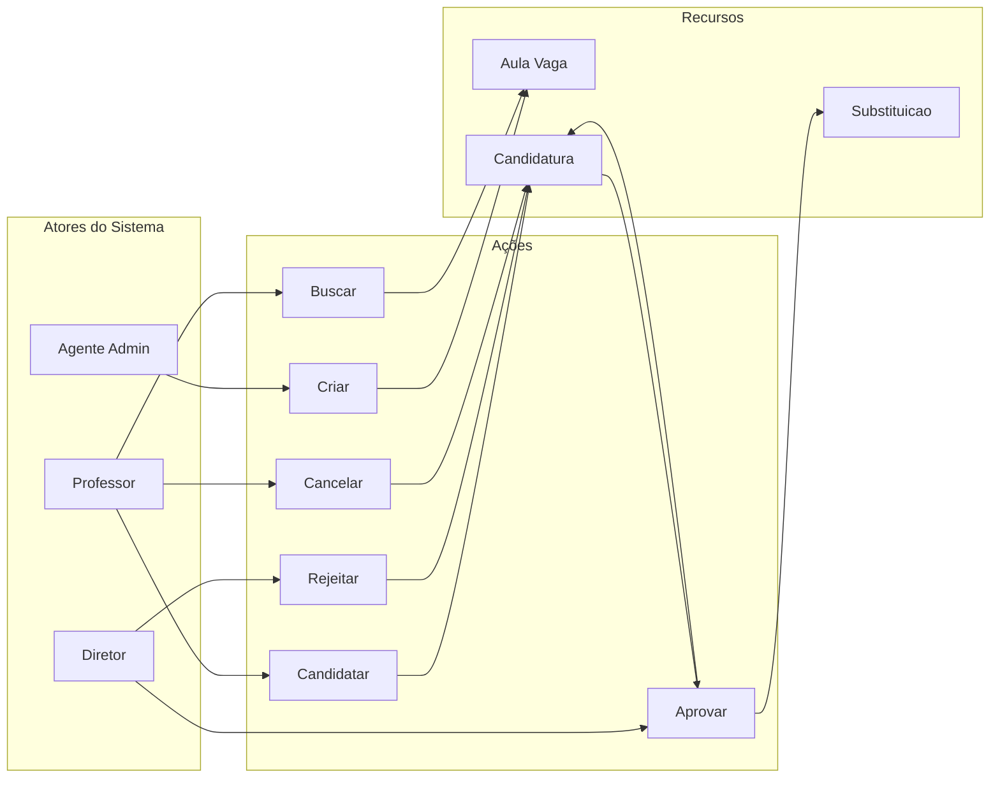

### Mapa Mental — Fluxos de Negócio

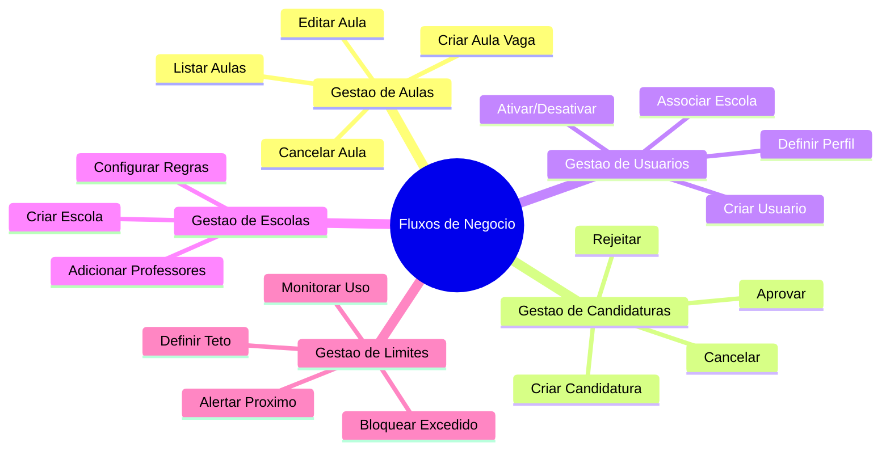

### Diagrama de Atividades — Processo Completo de Substituição

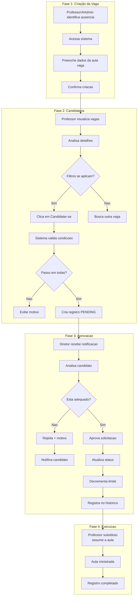

---

## Fluxo Macro: Sistema de Troca de Aulas

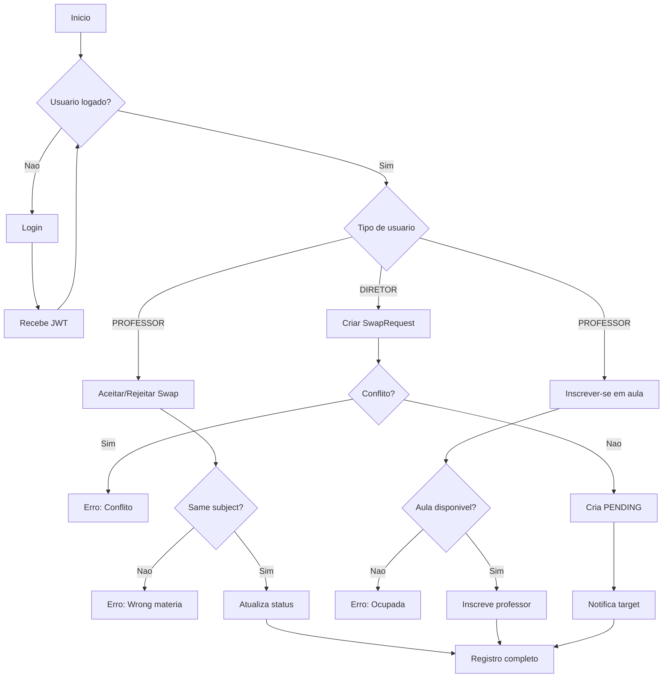

---

## Fluxo 1: Criar Solicitacao de Troca

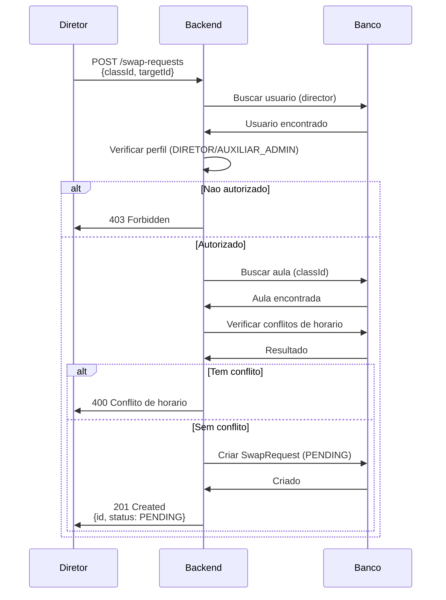

---

## Fluxo 2: Aceitar/Rejeitar Troca

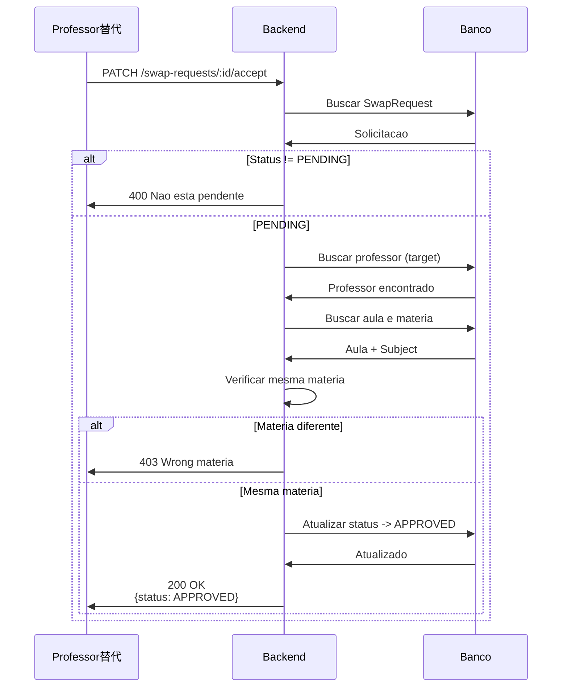

---

## Fluxo 3: Cancelar Solicitacao

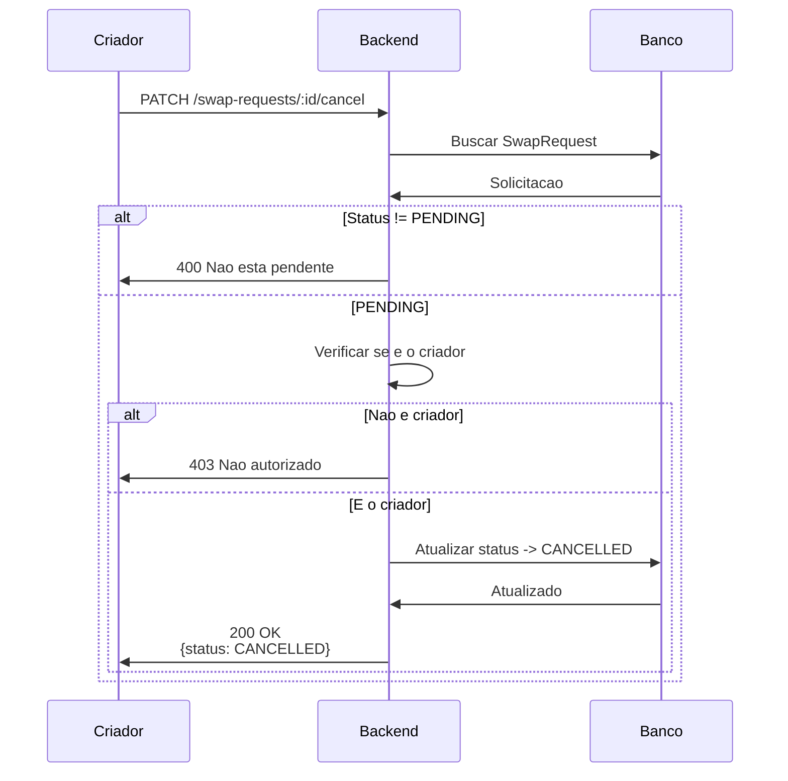

---

## Fluxo 4: Inscrever-se em Aula

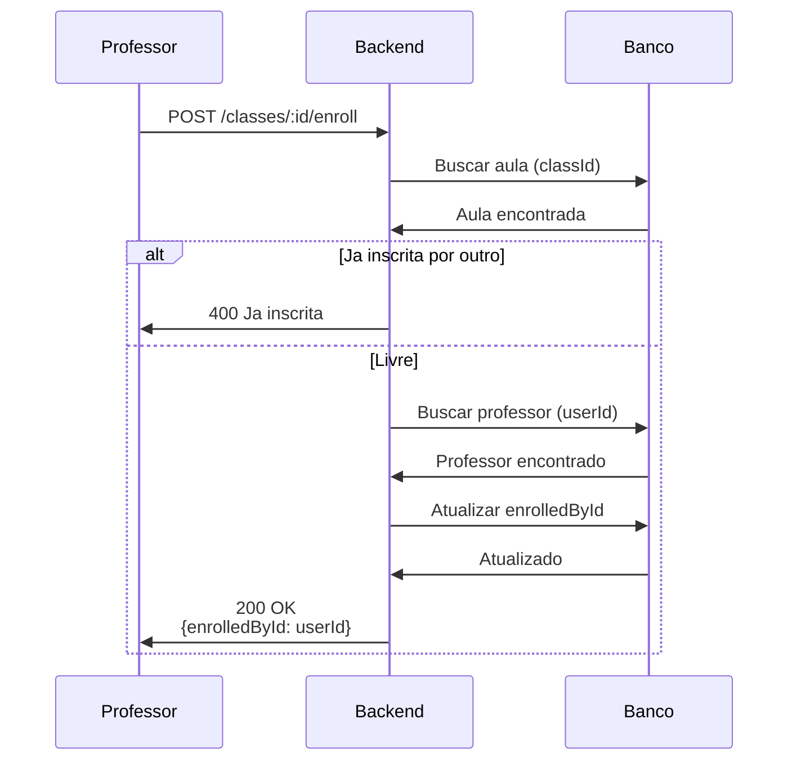

---

## Fluxo 5: Listar Solicitacoes

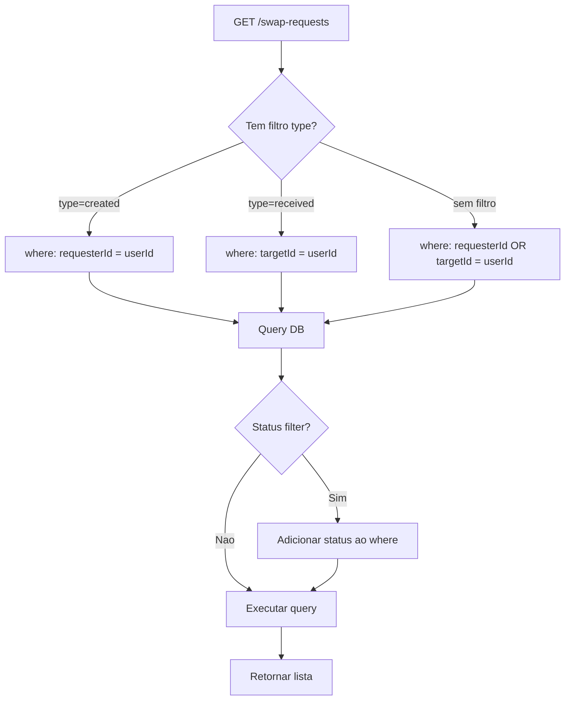

---

## Fluxo 6: Autenticacao (Login)

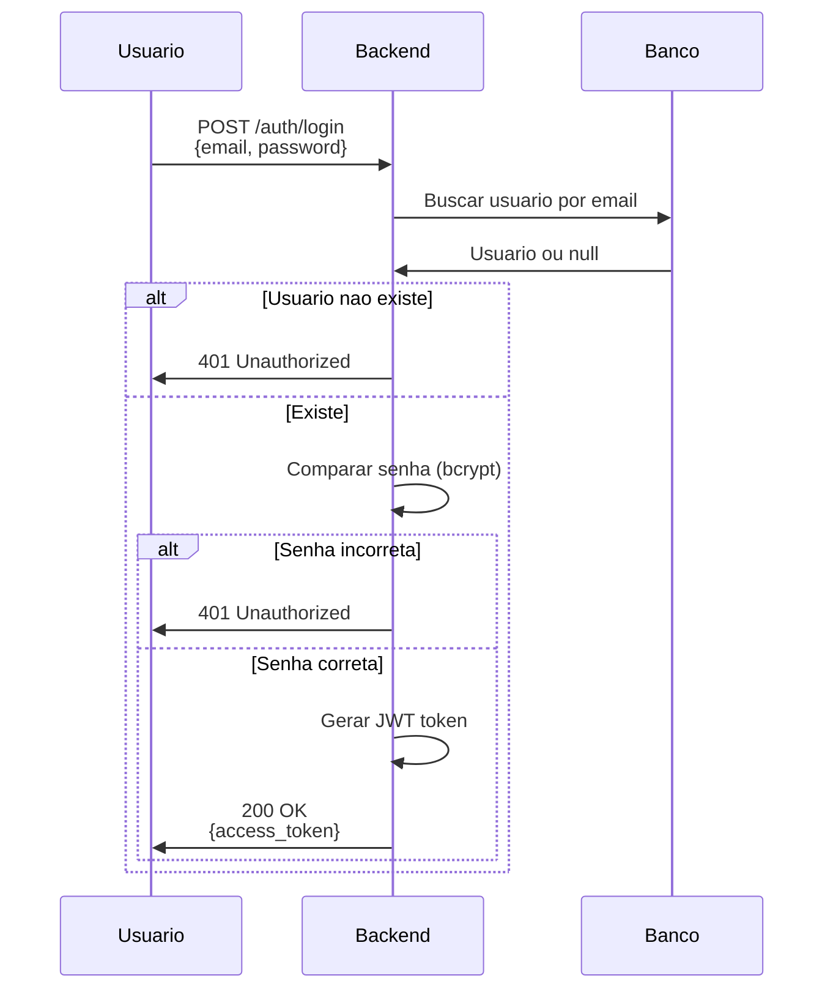

---

## Fluxo 7: Deteccao de Conflito de Horario

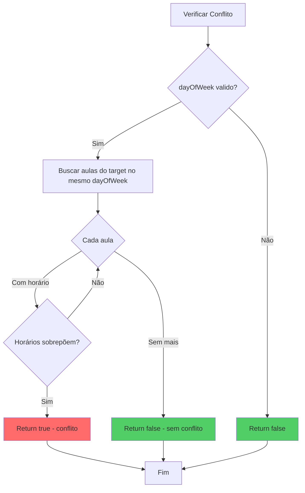

---

## Resumo dos Fluxos

| Fluxo | Ator Principal | Descricao |
|-------|----------------|-----------|
| 1 | Diretor | Criar solicitacao de troca |
| 2 | Professor替代 | Aceitar/rejeitar solicitacao |
| 3 | Criador | Cancelar solicitacao |
| 4 | Professor | Inscrever-se em aula |
| 5 | Usuario | Listar solicitacoes |
| 6 | Usuario | Login e autenticacao |
| 7 | Sistema | Verificar conflitos |
