# Fluxos de Negocio

> **Nota de correcao (2026-09):** este documento descrevia o fluxo antigo de
> `SwapRequest` e endpoints removidos (`/swap-requests`, `accept`, `cancel`).
> Os fluxos abaixo foram reescritos para o fluxo real — aula vaga
> (`Classes.available`) → candidatura (`POST /enrollment-requests/request/:classId`,
> sujeita a materia, janela de prioridade, conflito de horario e limite) →
> aprovacao/rejeicao pela direcao (`PATCH /enrollment-requests/:id/approve|reject`)
> → aula ocupada. Os fluxos 8 e 9 cobrem os modulos multi-tenant mais recentes
> (jornada docente e fechamento mensal).

## Visão Geral dos Fluxos

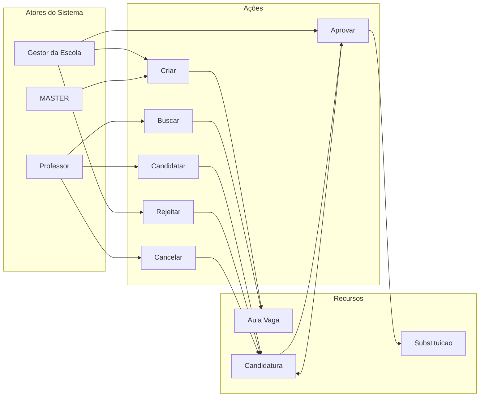
```mermaid
graph LR
    subgraph "Atores do Sistema"
        P[Professor]
        G[Gestor da Escola]
        M[MASTER]
    end
    
    subgraph "Recursos"
        AV[Aula Vaga]
        C[Candidatura]
        S[Substituicao]
    end
    
    subgraph "Ações"
        CRIAR[Criar]
        BUSCAR[Buscar]
        CANDIDATAR[Candidatar]
        APPROVAR[Aprovar]
        REJEITAR[Rejeitar]
        CANCELAR[Cancelar]
    end
    
    %% Fluxos passando pelas ações
    G --> CRIAR --> AV
    M --> CRIAR
    P --> BUSCAR --> AV
    P --> CANDIDATAR --> C
    G --> APPROVAR --> C
    G --> REJEITAR --> C
    P --> CANCELAR --> C
    C --> APPROVAR --> S
```

### Mapa Mental — Fluxos de Negócio

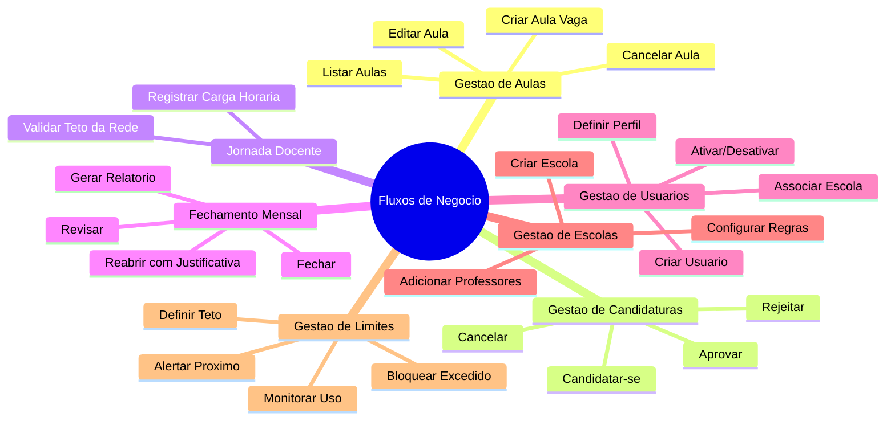
```mermaid
mindmap
  root((Fluxos de Negocio))
    Gestao de Aulas
      Criar Aula Vaga
      Editar Aula
      Cancelar Aula
      Listar Aulas
    Gestao de Candidaturas
      Candidatar-se
      Aprovar
      Rejeitar
      Cancelar
    Jornada Docente
      Registrar Carga Horaria
      Validar Teto da Rede
    Fechamento Mensal
      Gerar Relatorio
      Revisar
      Fechar
      Reabrir com Justificativa
    Gestao de Usuarios
      Criar Usuario
      Ativar/Desativar
      Associar Escola
      Definir Perfil
    Gestao de Escolas
      Criar Escola
      Configurar Regras
      Adicionar Professores
    Gestao de Limites
      Definir Teto
      Monitorar Uso
      Alertar Proximo
      Bloquear Excedido
```

### Diagrama de Atividades — Processo Completo de Substituição

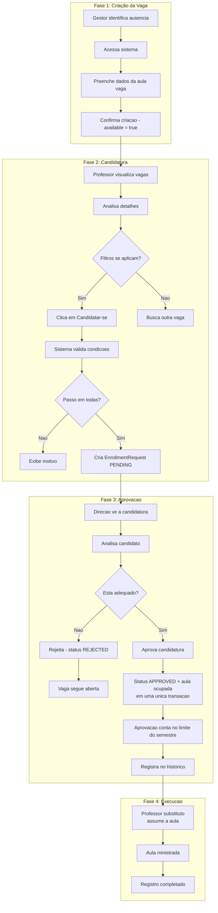
```mermaid
flowchart TB
    subgraph "Fase 1: Criação da Vaga"
        A1[Gestor identifica ausencia] --> A2[Acessa sistema]
        A2 --> A3[Preenche dados da aula vaga]
        A3 --> A4[Confirma criacao - available = true]
    end
    
    subgraph "Fase 2: Candidatura"
        B1[Professor visualiza vagas] --> B2[Analisa detalhes]
        B2 --> B3{Filtros se aplicam?}
        B3 -->|Sim| B4[Clica em Candidatar-se]
        B3 -->|Nao| B5[Busca outra vaga]
        B4 --> B6[Sistema valida condicoes]
        B6 --> B7{Passo em todas?}
        B7 -->|Nao| B8[Exibe motivo]
        B7 -->|Sim| B9[Cria EnrollmentRequest PENDING]
    end
    
    subgraph "Fase 3: Aprovacao"
        C1[Direcao ve a candidatura] --> C2[Analisa candidato]
        C2 --> C3{Esta adequado?}
        C3 -->|Nao| C4[Rejeita - status REJECTED]
        C3 -->|Sim| C5[Aprova candidatura]
        C4 --> C6[Vaga segue aberta]
        C5 --> C7[Status APPROVED + aula ocupada<br/>em uma unica transacao]
        C7 --> C8[Aprovacao conta no limite do semestre]
        C8 --> C9[Registra no historico]
    end
    
    subgraph "Fase 4: Execucao"
        D1[Professor substituto<br/>assume a aula] --> D2[Aula ministrada]
        D2 --> D3[Registro completado]
    end
    
    A4 --> B1
    B9 --> C1
    C9 --> D1
```

---

## Fluxo Macro: Sistema de Troca de Aulas

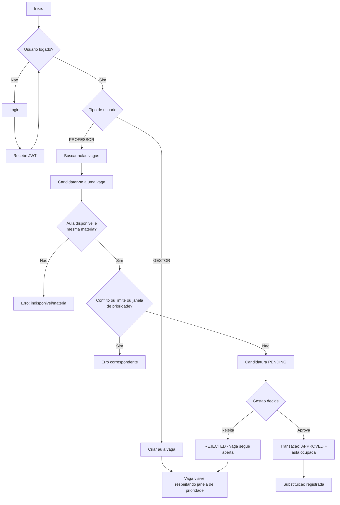
```mermaid
flowchart TD
    A[Inicio] --> B{Usuario logado?}
    
    B -->|Nao| C[Login]
    C --> D[Recebe JWT]
    D --> B
    
    B -->|Sim| E{Tipo de usuario}
    
    E -->|GESTOR| F[Criar aula vaga]
    E -->|PROFESSOR| G[Buscar aulas vagas]
    G --> H[Candidatar-se a uma vaga]
    
    F --> I[Vaga visivel<br/>respeitando janela de prioridade]
    
    H --> J{Aula disponivel e<br/>mesma materia?}
    J -->|Nao| K[Erro: indisponivel/materia]
    J -->|Sim| L{Conflito ou limite ou janela<br/>de prioridade?}
    L -->|Sim| M[Erro correspondente]
    L -->|Nao| N[Candidatura PENDING]
    
    N --> O{Gestao decide}
    O -->|Aprova| P["Transacao: APPROVED +<br/>aula ocupada"]
    O -->|Rejeita| Q[REJECTED - vaga segue aberta]
    
    P --> R[Substituicao registrada]
    Q --> I
```

---

## Fluxo 1: Criar Aula Vaga

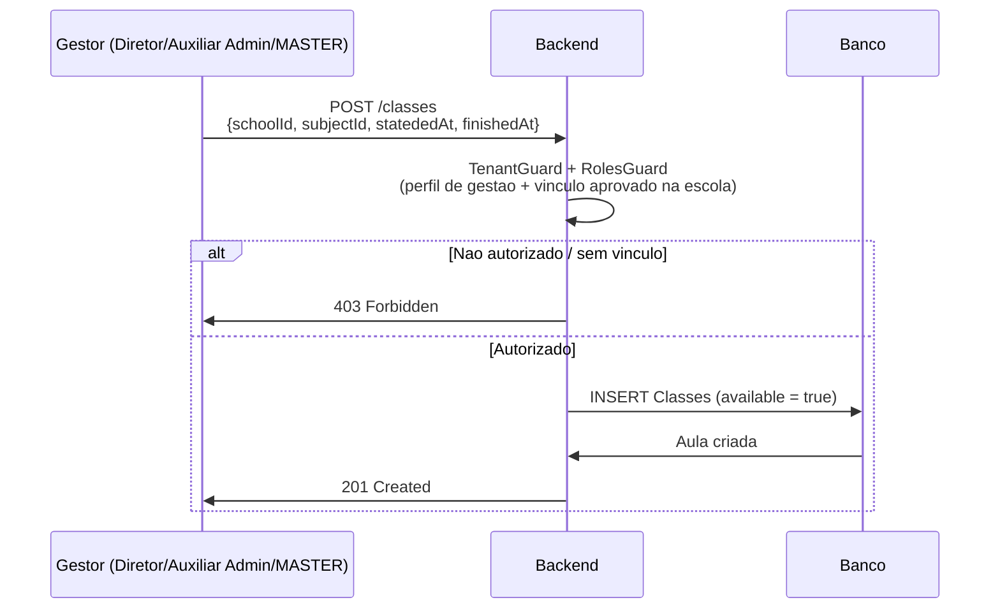
```mermaid
sequenceDiagram
    participant Gestor as Gestor (Diretor/Auxiliar Admin/MASTER)
    participant API as Backend
    participant DB as Banco

    Gestor->>API: POST /classes<br/>{schoolId, subjectId, statededAt, finishedAt}
    
    API->>API: TenantGuard + RolesGuard<br/>(perfil de gestao + vinculo aprovado na escola)
    
    alt Nao autorizado / sem vinculo
        API->>Gestor: 403 Forbidden
    else Autorizado
        API->>DB: INSERT Classes (available = true)
        DB->>API: Aula criada
        API->>Gestor: 201 Created
    end
```

---

## Fluxo 2: Candidatar-se a Aula Vaga

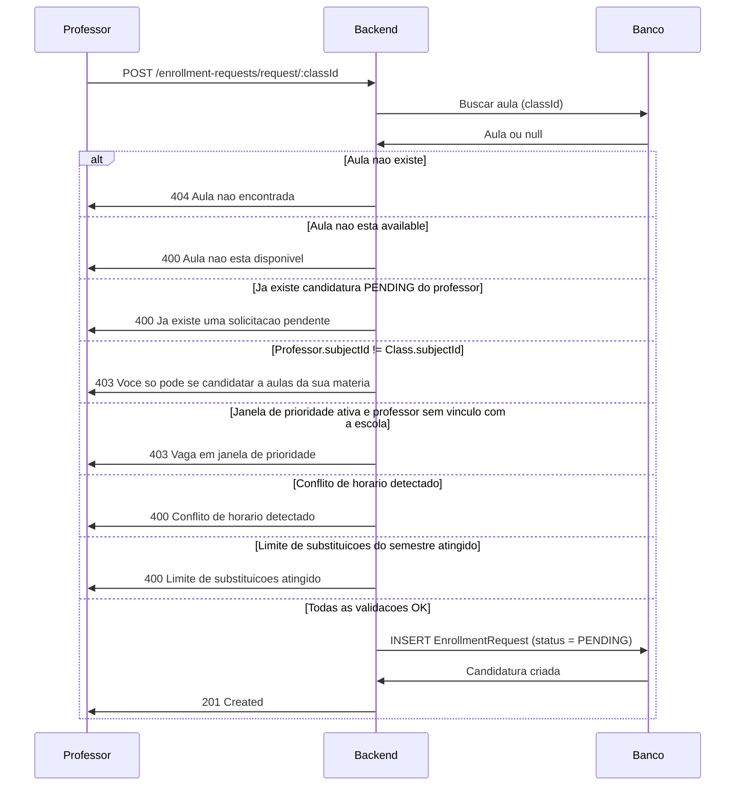
```mermaid
sequenceDiagram
    participant Professor as Professor
    participant API as Backend
    participant DB as Banco

    Professor->>API: POST /enrollment-requests/request/:classId
    
    API->>DB: Buscar aula (classId)
    DB->>API: Aula ou null
    
    alt Aula nao existe
        API->>Professor: 404 Aula nao encontrada
    else Aula nao esta available
        API->>Professor: 400 Aula nao esta disponivel
    else Ja existe candidatura PENDING do professor
        API->>Professor: 400 Ja existe uma solicitacao pendente
    else Professor.subjectId != Class.subjectId
        API->>Professor: 403 Voce so pode se candidatar a aulas da sua materia
    else Janela de prioridade ativa e professor sem vinculo com a escola
        API->>Professor: 403 Vaga em janela de prioridade
    else Conflito de horario detectado
        API->>Professor: 400 Conflito de horario detectado
    else Limite de substituicoes do semestre atingido
        API->>Professor: 400 Limite de substituicoes atingido
    else Todas as validacoes OK
        API->>DB: INSERT EnrollmentRequest (status = PENDING)
        DB->>API: Candidatura criada
        API->>Professor: 201 Created
    end
```

**Validacoes na ordem real do codigo** (`EnrollmentRequestsService.create`):
1. Aula existe e `Classes.available = true`
2. Nao existe candidatura `PENDING` do mesmo professor para a mesma aula
3. Professor existe
4. `Users.subjectId` = `Classes.subjectId` (mesma materia)
5. Se `Schools.priorityWindowHours` esta configurado e a janela ainda nao fechou, so professores com vinculo com a escola podem se candidatar
6. Sem conflito de horario com outra aula/substituicao do professor
7. Limite de substituicoes do semestre nao atingido (`Users.substitutionLimitPerSemester`, contando apenas `APPROVED` do semestre atual)
8. Cria o registro `PENDING`

---

## Fluxo 3: Aprovar/Rejeitar Candidatura

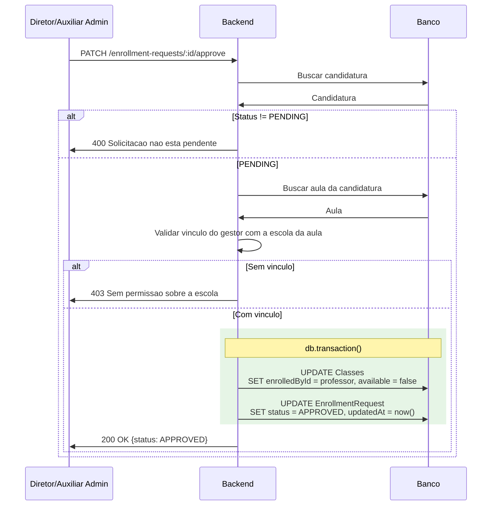
```mermaid
sequenceDiagram
    participant Gestor as Diretor/Auxiliar Admin
    participant API as Backend
    participant DB as Banco

    Gestor->>API: PATCH /enrollment-requests/:id/approve
    
    API->>DB: Buscar candidatura
    DB->>API: Candidatura
    
    alt Status != PENDING
        API->>Gestor: 400 Solicitacao nao esta pendente
    else PENDING
        API->>DB: Buscar aula da candidatura
        DB->>API: Aula
        
        API->>API: Validar vinculo do gestor com a escola da aula
        
        alt Sem vinculo
            API->>Gestor: 403 Sem permissao sobre a escola
        else Com vinculo
            rect rgb(230, 245, 230)
                note over API,DB: db.transaction()
                API->>DB: UPDATE Classes<br/>SET enrolledById = professor, available = false
                API->>DB: UPDATE EnrollmentRequest<br/>SET status = APPROVED, updatedAt = now()
            end
            API->>Gestor: 200 OK {status: APPROVED}
        end
    end
```

Para rejeitar, o fluxo e analogo (`PATCH /enrollment-requests/:id/reject`): valida `PENDING` + vinculo com a escola e grava `status = REJECTED` — a aula **nao** e alterada e segue disponivel para outras candidaturas.

---

## Fluxo 4: Cancelar Candidatura

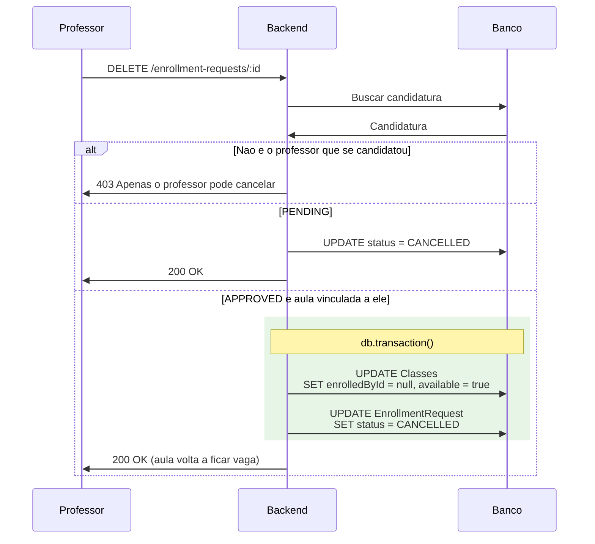
```mermaid
sequenceDiagram
    participant Professor as Professor
    participant API as Backend
    participant DB as Banco

    Professor->>API: DELETE /enrollment-requests/:id
    
    API->>DB: Buscar candidatura
    DB->>API: Candidatura
    
    alt Nao e o professor que se candidatou
        API->>Professor: 403 Apenas o professor pode cancelar
    else PENDING
        API->>DB: UPDATE status = CANCELLED
        API->>Professor: 200 OK
    else APPROVED e aula vinculada a ele
        rect rgb(230, 245, 230)
            note over API,DB: db.transaction()
            API->>DB: UPDATE Classes<br/>SET enrolledById = null, available = true
            API->>DB: UPDATE EnrollmentRequest<br/>SET status = CANCELLED
        end
        API->>Professor: 200 OK (aula volta a ficar vaga)
    end
```

---

## Fluxo 5: Listar Candidaturas

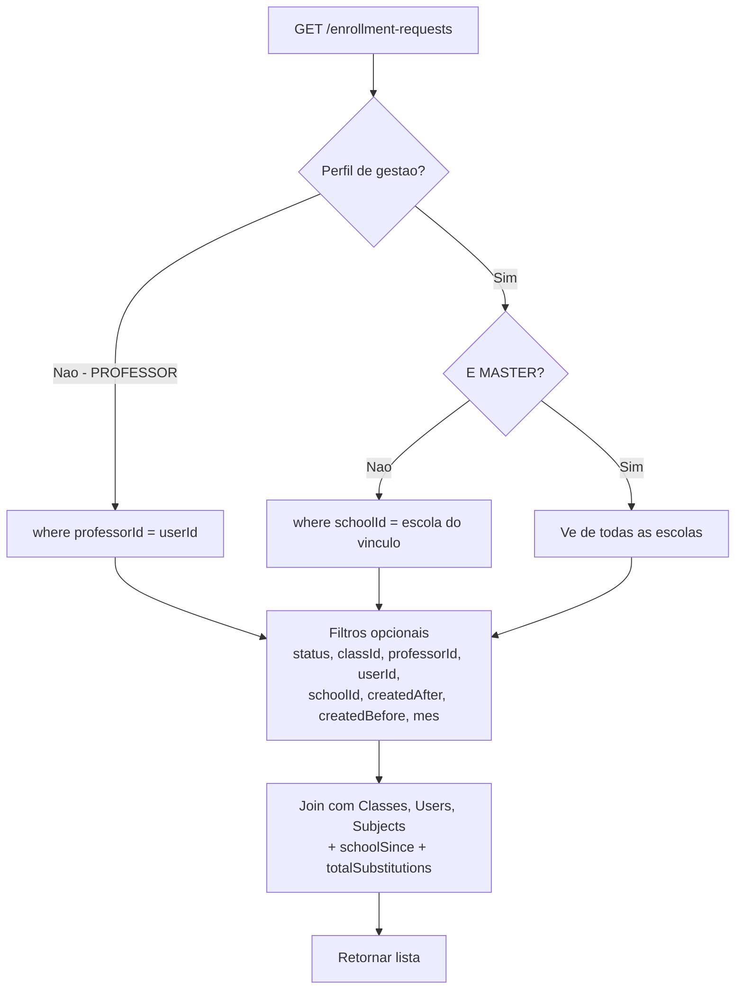
```mermaid
flowchart TB
    A[GET /enrollment-requests] --> B{Perfil de gestao?}
    
    B -->|Nao - PROFESSOR| C[where professorId = userId]
    B -->|Sim| D{E MASTER?}
    D -->|Sim| E[Ve de todas as escolas]
    D -->|Nao| F[where schoolId = escola do vinculo]
    
    C --> G[Filtros opcionais<br/>status, classId, professorId, userId,<br/>schoolId, createdAfter, createdBefore, mes]
    F --> G
    E --> G
    
    G --> H[Join com Classes, Users, Subjects<br/>+ schoolSince + totalSubstitutions]
    H --> I[Retornar lista]
```

**Resposta enriquecida**: cada candidatura inclui `schoolSince` (data de aprovacao do vinculo do professor com a escola da aula — criterio informativo de preferencia para a direcao) e os dados do professor (`name`, `email`, `subject`, `totalSubstitutions`).

---

## Fluxo 6: Autenticacao (Login)

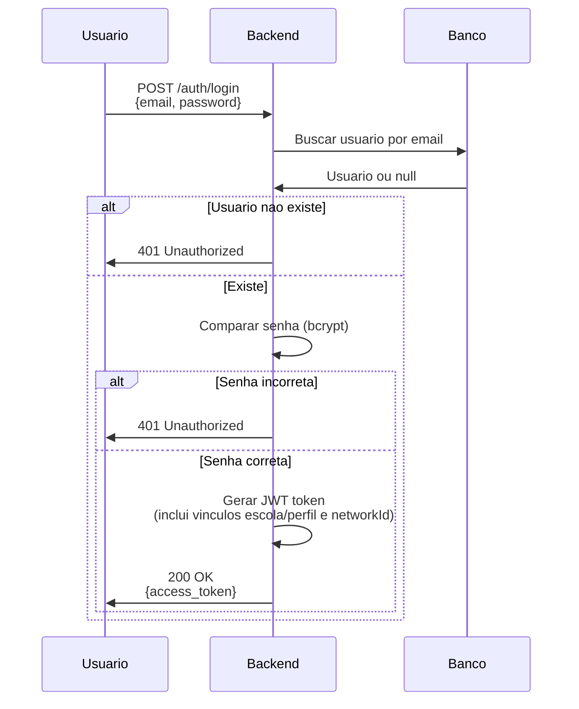
```mermaid
sequenceDiagram
    participant User as Usuario
    participant API as Backend
    participant DB as Banco

    User->>API: POST /auth/login<br/>{email, password}
    
    API->>DB: Buscar usuario por email
    DB->>API: Usuario ou null
    
    alt Usuario nao existe
        API->>User: 401 Unauthorized
    else Existe
        API->>API: Comparar senha (bcrypt)
        
        alt Senha incorreta
            API->>User: 401 Unauthorized
        else Senha correta
            API->>API: Gerar JWT token<br/>(inclui vinculos escola/perfil e networkId)
            API->>User: 200 OK<br/>{access_token}
        end
    end
```

---

## Fluxo 7: Deteccao de Conflito de Horario

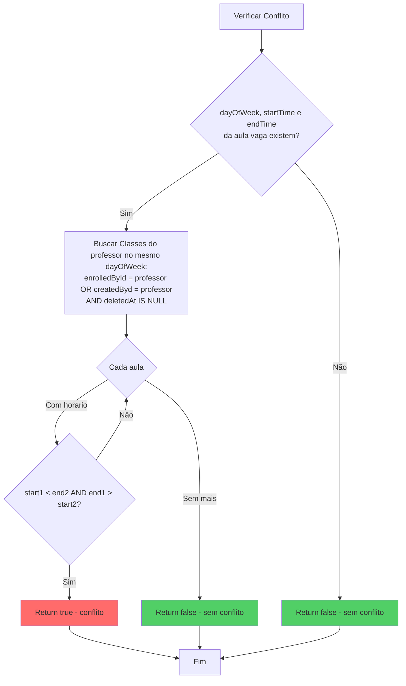
```mermaid
flowchart TD
    A[Verificar Conflito] --> B{dayOfWeek, startTime e endTime<br/>da aula vaga existem?}
    
    B -->|Não| C[Return false - sem conflito]
    B -->|Sim| D["Buscar Classes do professor no mesmo dayOfWeek:<br/>enrolledById = professor OR createdByd = professor<br/>AND deletedAt IS NULL"]
    
    D --> E{Cada aula}
    
    E -->|Com horario| F{start1 < end2 AND end1 > start2?}
    F -->|Sim| G[Return true - conflito]
    F -->|Não| E
    
    E -->|Sem mais| H[Return false - sem conflito]
    
    G --> I[Fim]
    H --> I
    C --> I
    
    style G fill:#ff6b6b
    style C fill:#51cf66
    style H fill:#51cf66
```

---

## Fluxo 8: Jornada Docente — Validacao do Teto de Carga Horaria da Rede

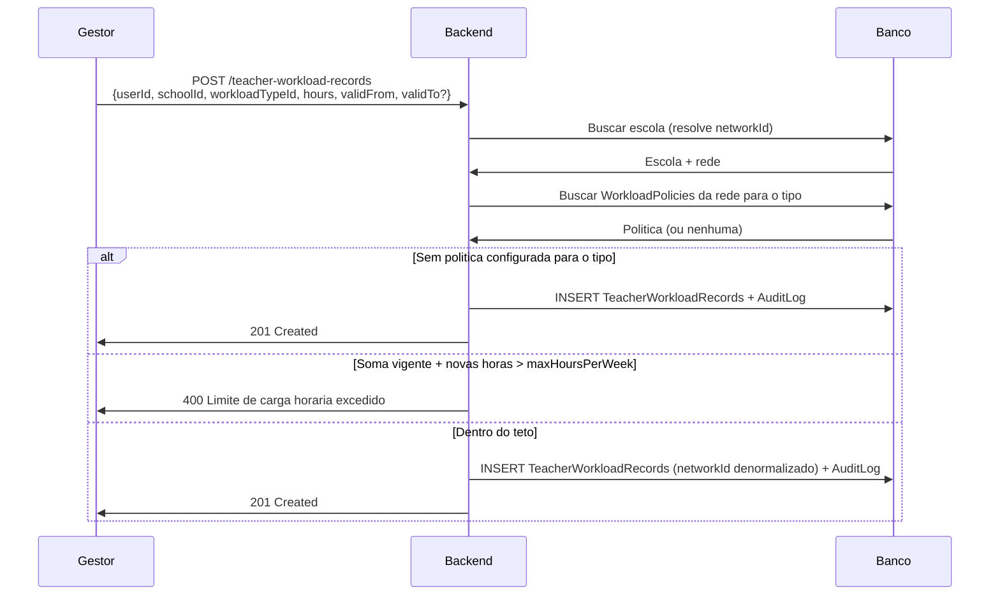
```mermaid
sequenceDiagram
    participant Gestor as Gestor
    participant API as Backend
    participant DB as Banco

    Gestor->>API: POST /teacher-workload-records<br/>{userId, schoolId, workloadTypeId, hours, validFrom, validTo?}
    
    API->>DB: Buscar escola (resolve networkId)
    DB->>API: Escola + rede
    
    API->>DB: Buscar WorkloadPolicies da rede para o tipo
    DB->>API: Politica (ou nenhuma)
    
    alt Sem politica configurada para o tipo
        API->>DB: INSERT TeacherWorkloadRecords + AuditLog
        API->>Gestor: 201 Created
    else Soma vigente + novas horas > maxHoursPerWeek
        API->>Gestor: 400 Limite de carga horaria excedido
    else Dentro do teto
        API->>DB: INSERT TeacherWorkloadRecords (networkId denormalizado) + AuditLog
        API->>Gestor: 201 Created
    end
```

O professor consulta os proprios registros em `GET /teacher-workload-records/me`; a gestao lista por escola (`GET /teacher-workload-records?schoolId=`). Toda criacao/edicao/remocao passa pelo `AuditLog`.

---

## Fluxo 9: Fechamento Mensal — DRAFT → REVIEWED → CLOSED (com reabertura)

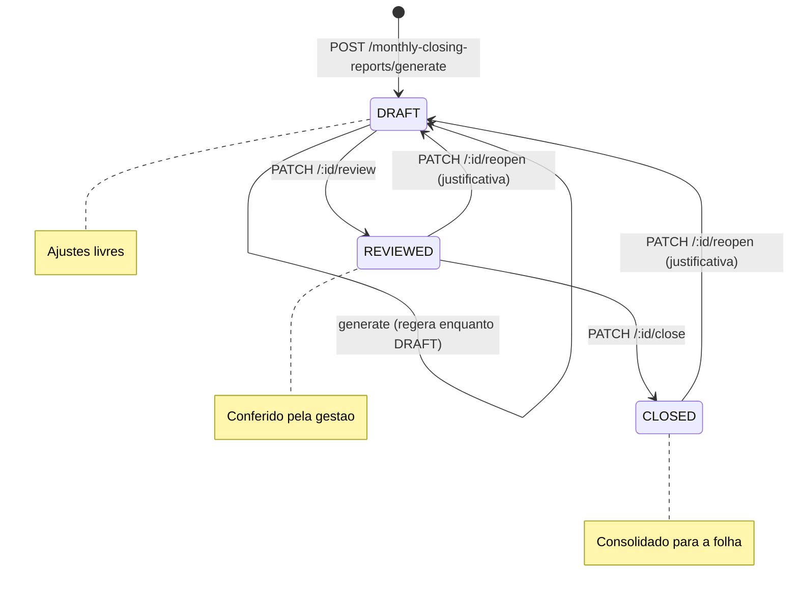
```mermaid
stateDiagram-v2
    [*] --> DRAFT: POST /monthly-closing-reports/generate
    DRAFT --> DRAFT: generate (regera enquanto DRAFT)
    DRAFT --> REVIEWED: PATCH /:id/review
    REVIEWED --> CLOSED: PATCH /:id/close
    REVIEWED --> DRAFT: PATCH /:id/reopen (justificativa)
    CLOSED --> DRAFT: PATCH /:id/reopen (justificativa)
    
    note right of DRAFT: Ajustes livres
    note right of REVIEWED: Conferido pela gestao
    note right of CLOSED: Consolidado para a folha
```

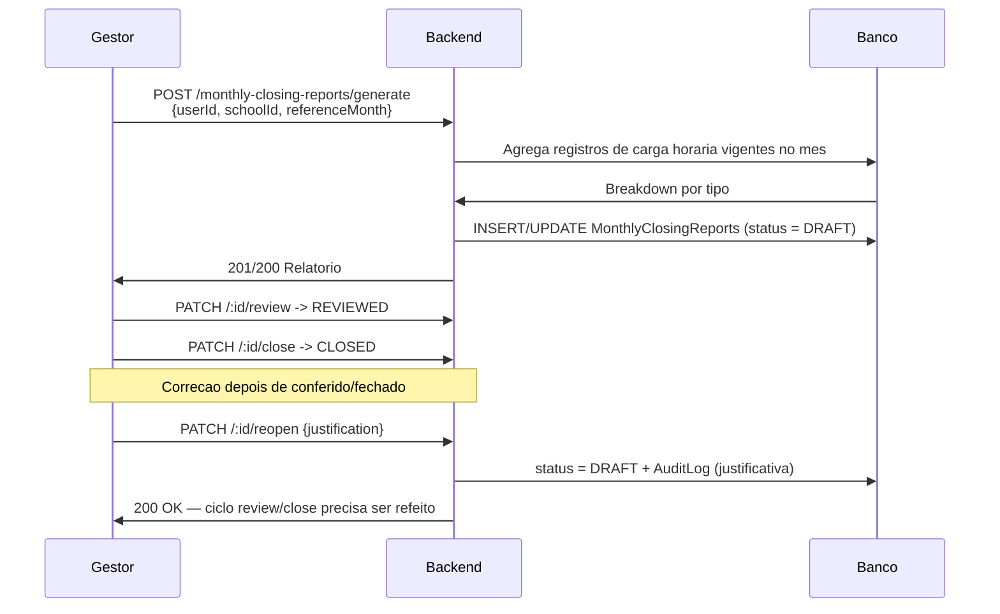
```mermaid
sequenceDiagram
    participant Gestor as Gestor
    participant API as Backend
    participant DB as Banco

    Gestor->>API: POST /monthly-closing-reports/generate<br/>{userId, schoolId, referenceMonth}
    API->>DB: Agrega registros de carga horaria vigentes no mes
    DB->>API: Breakdown por tipo
    API->>DB: INSERT/UPDATE MonthlyClosingReports (status = DRAFT)
    API->>Gestor: 201/200 Relatorio

    Gestor->>API: PATCH /:id/review -> REVIEWED
    Gestor->>API: PATCH /:id/close -> CLOSED
    
    Note over Gestor,API: Correcao depois de conferido/fechado
    Gestor->>API: PATCH /:id/reopen {justification}
    API->>DB: status = DRAFT + AuditLog (justificativa)
    API->>Gestor: 200 OK — ciclo review/close precisa ser refeito
```

Regras: `close` exige `REVIEWED` (nao permite pular de `DRAFT`); `reopen` exige justificativa obrigatoria e funciona apenas fora de `DRAFT`; todas as transicoes sao registradas no `AuditLog`.

---

## Resumo dos Fluxos

| Fluxo | Ator Principal | Descricao |
|-------|----------------|-----------|
| 1 | Gestor (Diretor/Auxiliar Admin/MASTER) | Criar aula vaga |
| 2 | Professor | Candidatar-se a aula vaga |
| 3 | Diretor/Auxiliar Admin/MASTER | Aprovar/rejeitar candidatura |
| 4 | Professor | Cancelar candidatura (inclusive aprovada, liberando a vaga) |
| 5 | Usuario | Listar candidaturas conforme o perfil |
| 6 | Usuario | Login e autenticacao (JWT) |
| 7 | Sistema | Verificar conflitos de horario |
| 8 | Gestor | Registrar jornada docente validando o teto da rede |
| 9 | Gestor | Fechamento mensal DRAFT → REVIEWED → CLOSED (com reabertura) |
