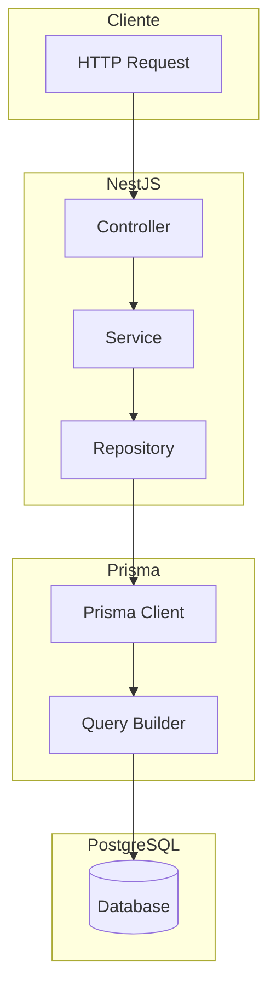
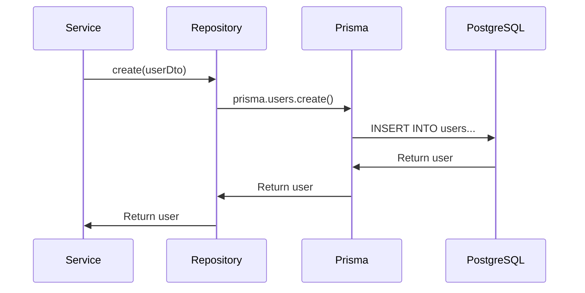
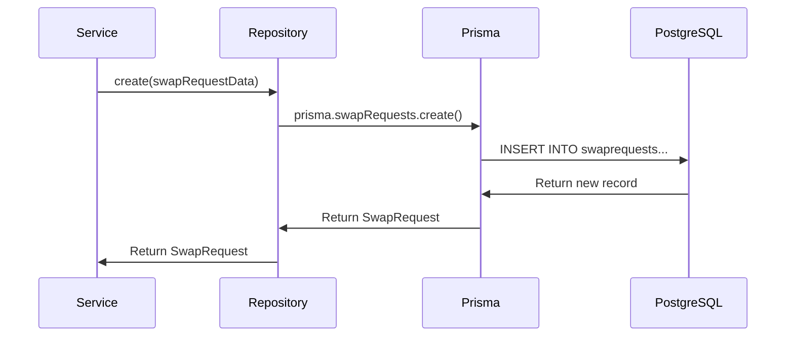
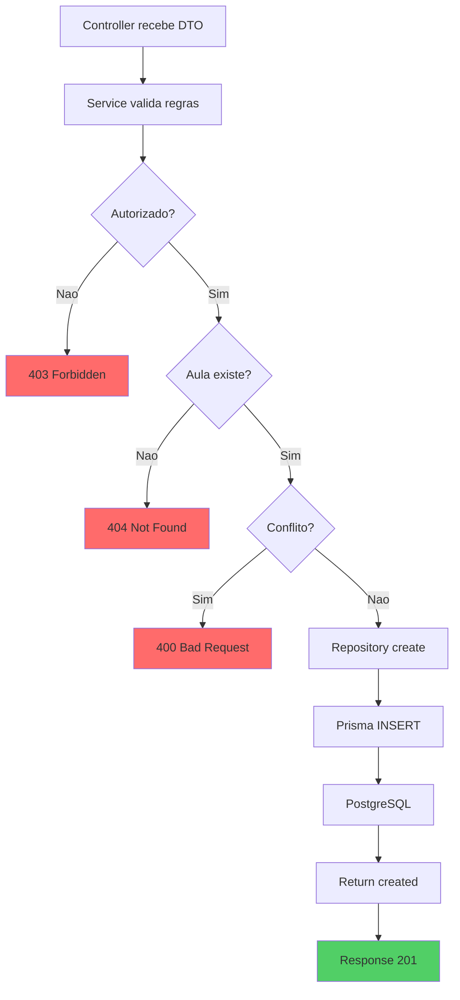

# Fluxo do Banco de Dados

## Visao Geral

Este documento descreve o fluxo de dados no banco PostgreSQL, mostrando como as informacoes sao armazenadas e relacionadas.

---

## Arquitetura de Acesso a Dados



---

## Operacoes de Criacao (INSERT)

### Criar Usuario



**Queries executadas**:
1. INSERT INTO users (dados do usuario)
2. INSERT INTO usersprofileschools (vinculo com escola/perfil)

---

### Criar SwapRequest



**Query**:
```sql
INSERT INTO "SwapRequests" 
  (classId, requesterId, targetId, status, createdAt, updatedAt)
VALUES (1, 3, 2, 'PENDING', NOW(), NOW())
RETURNING *;
```

---

## Operacoes de Leitura (SELECT)

### Listar SwapRequests por Usuario

```sql
SELECT * FROM "SwapRequests"
WHERE "requesterId" = 1 OR "targetId" = 1
ORDER BY "createdAt" DESC;
```

### Listar com Filtros

```sql
SELECT * FROM "SwapRequests"
WHERE 
  ("requesterId" = 1 OR "targetId" = 1)
  AND "status" = 'PENDING'
ORDER BY "createdAt" DESC;
```

---

### Buscar Conflictos de Horario

```sql
SELECT * FROM "Classes"
WHERE 
  ("enrolledById" = 2 OR "createdByd" = 2)
  AND "dayOfWeek" = 1
  AND "deletedAt" IS NULL
  AND (
    ("startTime" < '09:00' AND "endTime" > '08:00')
  );
```

**Logica de sobreposicao**:
- Intervalo A: startA < endB AND endA > startB
- Exemplo: 08:00-09:00 vs 08:30-09:30 = sobrepoe

---

## Operacoes de Atualizacao (UPDATE)

### Aceitar SwapRequest

```sql
UPDATE "SwapRequests"
SET "status" = 'APPROVED', "updatedAt" = NOW()
WHERE "id" = 1
RETURNING *;
```

### Inscrever-se em Aula

```sql
UPDATE "Classes"
SET "enrolledById" = 2, "updatedAt" = NOW()
WHERE "id" = 1
RETURNING *;
```

---

## Transacoes e Consistencia

### Exemplo de Transacao

```typescript
// Em Prisma, transacoes sao automaticas para operacoes relacionadas
await prisma.$transaction([
  prisma.swapRequests.create({ ... }),
  prisma.classes.update({ 
    where: { id: classId },
    data: { enrolledById: targetId }
  })
]);
```

---

## Indices e Performance

### Indices Criados

| Tabela | Indice | Coluna(s) | Tipo |
|--------|--------|-----------|------|
| Users | email | email | UNICO |
| UsersProfilesSchools | userId | userId | INDEX |
| UsersProfilesSchools | profileId | profileId | INDEX |
| UsersProfilesSchools | schoolId | schoolId | INDEX |
| SwapRequests | classId | classId | INDEX |
| SwapRequests | requesterId | requesterId | INDEX |
| SwapRequests | targetId | targetId | INDEX |
| SwapRequests | status | status | INDEX |

---

## Lazy Loading vs Eager Loading

### Lazy Loading (padrao)
```typescript
// Carrega apenas o usuario
const user = await prisma.users.findUnique({ where: { id: 1 } });
```

### Eager Loading (com include)
```typescript
// Carrega usuario + vinculos
const user = await prisma.users.findUnique({
  where: { id: 1 },
  include: {
    upsUser: {
      include: {
        profile: true,
        school: true
      }
    }
  }
});
```

**Query gerada**:
```sql
SELECT u.*, ups.*, p.*, s.*
FROM "Users" u
LEFT JOIN "UsersProfilesSchools" ups ON u.id = ups."userId"
LEFT JOIN "Profiles" p ON ups."profileId" = p.id
LEFT JOIN "Schools" s ON ups."schoolId" = s.id
WHERE u.id = 1;
```

---

## Soft Delete vs Hard Delete

O sistema utiliza **Soft Delete** para algumas entidades:

### Users
- Campo `deletedAt` permite recuperacao
- Queries filtram: `WHERE deletedAt IS NULL`

### Classes
- Campo `deletedAt` para soft delete

### SwapRequests
- Nao usa delete, usa status para controle
- Status: PENDING -> APPROVED/REJECTED/CANCELLED

---

## Fluxo de Dados - Criar SwapRequest



---

## Queries Frequentes - Resumo

| Operacao | Query |
|----------|-------|
| Login | SELECT * FROM users WHERE email = ? |
| Listar minhas trocas | SELECT * FROM swprequests WHERE requesterId = ? OR targetId = ? |
| Verificar conflito | SELECT * FROM classes WHERE (enrolledById = ? OR createdByd = ?) AND dayOfWeek = ? |
| Accept swap | UPDATE swprequests SET status = 'APPROVED' WHERE id = ? |
| Inscrever | UPDATE classes SET enrolledById = ? WHERE id = ? |