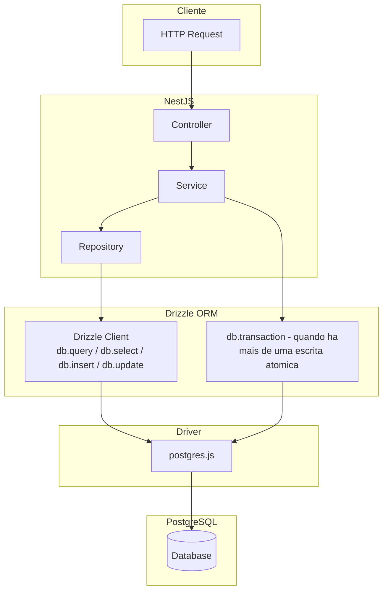
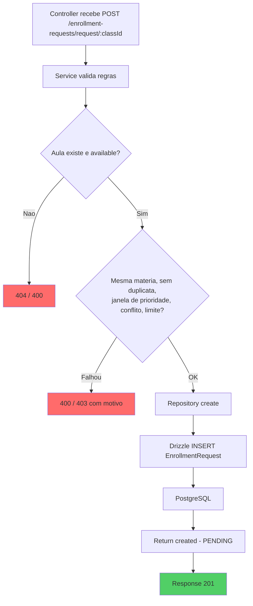

# Fluxo do Banco de Dados

> **Nota de correcao (2026-09 — migracao Prisma → Drizzle):** este documento
> descrevia o acesso via Prisma e a tabela `SwapRequests` (removida do banco
> pela migration `remove_swap_requests`). Foi reescrito para o estado real:
> **Drizzle ORM** (`src/database/schema.ts`) e as tabelas atuais. Nao foram
> inventadas colunas — tudo abaixo foi conferido no schema e nos repositories.

## Visao Geral

Este documento descreve o fluxo de dados no banco PostgreSQL, mostrando como as informacoes sao armazenadas e relacionadas.

| Item | Onde fica |
|------|-----------|
| Schema (fonte de verdade) | `src/database/schema.ts` |
| Conexao com o banco | `src/database/drizzle.service.ts` (driver `postgres`, postgres.js) |
| Migrations | `drizzle/migrations/` (geradas por `pnpm db:generate`) |
| Aplicacao das migrations | `pnpm db:migrate` (script `src/database/migrate.ts`) |
| Interface visual | `pnpm db:studio` (Drizzle Studio) |
| Soft delete | Helpers explicitos em `src/database/soft-delete.ts` |
| Historico (Prisma) | `prisma/schema.prisma` e `prisma/migrations/` mantidos apenas como referencia; nao sao mais a fonte de verdade |

---

## Arquitetura de Acesso a Dados


```mermaid
flowchart TB
    subgraph Cliente
        HTTP[HTTP Request]
    end
    
    subgraph NestJS
        CTRL[Controller]
        SVC[Service]
        REPO[Repository]
    end
    
    subgraph "Drizzle ORM"
        CLIENT[Drizzle Client<br/>db.query / db.select / db.insert / db.update]
        TX[db.transaction - quando ha<br/>mais de uma escrita atomica]
    end
    
    subgraph Driver
        PG[postgres.js]
    end
    
    subgraph PostgreSQL
        DB[(Database)]
    end
    
    HTTP --> CTRL
    CTRL --> SVC
    SVC --> REPO
    REPO --> CLIENT
    SVC --> TX
    CLIENT --> PG
    TX --> PG
    PG --> DB
```

**Diferencas praticas em relacao ao Prisma (migracao da Fase 1):**
- Soft delete deixou de ser middleware implicito e passou a ser explicito: cada query nas tabelas `Users`, `Subjects`, `Schools` e `Classes` chama `notDeleted(table)` (`WHERE "deletedAt" IS NULL`).
- `@updatedAt` nao existe no Drizzle: quem faz `update()` seta `updatedAt: new Date()` explicitamente (padrao usado em `EnrollmentRequest`).
- Transacoes agora sao explicitas (`db.transaction(async (tx) => ...)`) onde havia mais de uma escrita que precisava ser atomica.

---

## Tabelas do Sistema

| Tabela | Papel |
|--------|-------|
| `Profiles` | Perfis (DIRETOR, AUXILIAR_ADMIN, PROFESSOR, MASTER) |
| `Users` | Usuarios; `subjectId` (materia) e `substitutionLimitPerSemester` (limite de substituicoes) |
| `Subjects` | Disciplinas/materias |
| `Networks` | Redes de ensino (fronteira de isolamento multi-tenant) |
| `Schools` | Escolas; `networkId` (rede), `priorityWindowHours` (janela de prioridade) e `substitutionLimitPerSemester` |
| `UsersProfilesSchools` | Vinculos usuario x perfil x escola (PK composta), com `approvedAt`/`approvedById` |
| `Classes` | Aulas/turmas; `available` (vaga), `enrolledById` (professor que assumiu), `createdByd`, horarios |
| `EnrollmentRequest` | Candidaturas a aula vaga (`classId`, `professorId`, `status`) |
| `WorkloadTypes` | Catalogo global de tipos de carga horaria (5 linhas fixas semeadas na migration) |
| `WorkloadPolicies` | Teto de carga horaria por rede x tipo (`maxHoursPerWeek`) |
| `TeacherWorkloadRecords` | Jornada docente: horas por professor/escola/tipo, com vigencia (`validFrom`/`validTo`) |
| `MonthlyClosingReports` | Fechamento mensal por professor/escola/mes (`DRAFT`/`REVIEWED`/`CLOSED`) |
| `AuditLog` | Trilha de auditoria (antes/depois + justificativa) |

---

## Operacoes de Criacao (INSERT)

### Criar Usuario

```typescript
// src/modules/users/users.repository.ts
const [user] = await this.drizzle.db
  .insert(users)
  .values({ ...createUserDto })
  .returning();
```

O vinculo com escola/perfil e criado a parte, por `assignProfile()`:

```typescript
const [link] = await this.drizzle.db
  .insert(usersProfilesSchools)
  .values({ userId, profileId, schoolId, approvedAt: new Date(), approvedById })
  .onConflictDoUpdate({
    target: [usersProfilesSchools.userId, usersProfilesSchools.profileId, usersProfilesSchools.schoolId],
    set: { approvedAt: new Date(), approvedById },
  })
  .returning();
```

**SQL equivalente**:
```sql
INSERT INTO "UsersProfilesSchools"
  ("userId", "profileId", "schoolId", "approvedAt", "approvedById")
VALUES (2, 3, 1, NOW(), 1)
ON CONFLICT ("userId", "profileId", "schoolId")
DO UPDATE SET "approvedAt" = NOW(), "approvedById" = 1
RETURNING *;
```

### Criar Candidatura (EnrollmentRequest)

`EnrollmentRequestsRepository.create()` insere a candidatura com `status = PENDING` e `updatedAt` explicito (nao existe `@updatedAt`):

```sql
INSERT INTO "EnrollmentRequest"
  ("classId", "professorId", "status", "updatedAt")
VALUES (1, 2, 'PENDING', NOW())
RETURNING *;
```

---

## Operacoes de Leitura (SELECT)

### Listar Candidaturas por Perfil

`GET /enrollment-requests` — o repository faz um join com `Classes` (para resolver a escola), `UsersProfilesSchools` (para o `schoolSince`), `Users` e `Subjects` (dados do professor):

```sql
SELECT er.*, ups."approvedAt" AS "schoolSince",
       u."name", u."email", u."subjectId", s."name" AS "professorSubjectName"
FROM "EnrollmentRequest" er
INNER JOIN "Classes" c ON c."id" = er."classId"
LEFT JOIN "UsersProfilesSchools" ups
       ON ups."userId" = er."professorId" AND ups."schoolId" = c."schoolId"
LEFT JOIN "Users" u ON u."id" = er."professorId"
LEFT JOIN "Subjects" s ON s."id" = u."subjectId"
WHERE er."status" = 'PENDING'          -- filtro opcional
  AND er."professorId" = 2             -- professor ve apenas as proprias
  -- gestor: AND c."schoolId" = 1; MASTER: sem recorte de escola
ORDER BY er."createdAt" DESC;
```

Uma segunda query agregada conta as substituicoes `APPROVED` por professor (`COUNT(*) ... GROUP BY "professorId"`) para preencher `totalSubstitutions` sem subquery por linha.

### Buscar Conflito de Horario

```sql
SELECT * FROM "Classes"
WHERE ("enrolledById" = 2 OR "createdByd" = 2)
  AND "dayOfWeek" = 1
  AND "deletedAt" IS NULL;
```

**Logica de sobreposicao** (feita em memoria sobre as aulas retornadas):
- Intervalo A: `start1 < end2 AND end1 > start2`
- Exemplo: 08:00-09:00 vs 08:30-09:30 = sobrepoe

### Contar Substituicoes Aprovadas no Semestre

```sql
SELECT COUNT(*) FROM "EnrollmentRequest"
WHERE "professorId" = 2
  AND "status" = 'APPROVED'
  AND "createdAt" >= '2026-07-01T00:00:00.000Z';  -- inicio do semestre atual (jan ou jul, UTC)
```

---

## Operacoes de Atualizacao (UPDATE)

### Aprovar Candidatura (transacao)

`EnrollmentRequestsService.approve()` — as duas escritas rodam na mesma transacao (ou ambas persistem, ou nenhuma):

```sql
-- 1) ocupa a aula
UPDATE "Classes"
SET "enrolledById" = 2, "available" = false
WHERE "id" = 1;

-- 2) aprova a candidatura
UPDATE "EnrollmentRequest"
SET "status" = 'APPROVED', "updatedAt" = NOW()
WHERE "id" = 10
RETURNING *;
```

### Cancelar Candidatura Aprovada (transacao)

`EnrollmentRequestsService.cancel()` — quando a candidatura ja esta `APPROVED` e a aula esta vinculada ao professor, a vaga e liberada:

```sql
UPDATE "Classes"
SET "enrolledById" = NULL, "available" = true
WHERE "id" = 1;

UPDATE "EnrollmentRequest"
SET "status" = 'CANCELLED', "updatedAt" = NOW()
WHERE "id" = 10
RETURNING *;
```

### Rejeitar Candidatura

```sql
UPDATE "EnrollmentRequest"
SET "status" = 'REJECTED', "updatedAt" = NOW()
WHERE "id" = 10
RETURNING *;
```

### Inscrever-se em Aula (rota complementar)

`POST /classes/:id/enroll` — vincula direto, sem aprovacao (`enrolledById`):

```sql
UPDATE "Classes"
SET "enrolledById" = 2
WHERE "id" = 1
RETURNING *;
```

---

## Transacoes e Consistencia

Exemplo real (`EnrollmentRequestsService.approve`):

```typescript
const [updated] = await this.drizzle.db.transaction(async (tx) => {
  await tx
    .update(classes)
    .set({ enrolledById: request.professorId, available: false })
    .where(eq(classes.id, request.classId));

  return tx
    .update(enrollmentRequest)
    .set({ status: 'APPROVED', updatedAt: new Date() })
    .where(eq(enrollmentRequest.id, id))
    .returning();
});
```

> **Historico:** antes da migracao para Drizzle isso eram duas chamadas Prisma sequenciais, sem `$transaction` — uma falha entre elas deixava a aula "ocupada" sem candidatura aprovada. O `db.transaction()` explicito corrige esse achado (ver ADR-002 no Design Doc).

---

## Indices e Performance

Indices declarados explicitamente em `src/database/schema.ts`:

| Tabela | Indice | Coluna(s) | Tipo |
|--------|--------|-----------|------|
| Users | Users_email_key | email | UNICO |
| Users | Users_email_idx | email | INDEX |
| UsersProfilesSchools | PK composta | userId + profileId + schoolId | PRIMARY KEY |
| UsersProfilesSchools | UsersProfilesSchools_schoolId_idx | schoolId | INDEX |
| UsersProfilesSchools | UsersProfilesSchools_userId_idx | userId | INDEX |
| UsersProfilesSchools | UsersProfilesSchools_profileId_idx | profileId | INDEX |
| EnrollmentRequest | EnrollmentRequest_classId_idx | classId | INDEX |
| EnrollmentRequest | EnrollmentRequest_professorId_idx | professorId | INDEX |
| EnrollmentRequest | EnrollmentRequest_status_idx | status | INDEX |
| WorkloadTypes | WorkloadTypes_code_key | code | UNICO |
| WorkloadPolicies | WorkloadPolicies_networkId_workloadTypeId_key | networkId + workloadTypeId | UNICO |
| WorkloadPolicies | WorkloadPolicies_networkId_idx | networkId | INDEX |
| TeacherWorkloadRecords | TeacherWorkloadRecords_schoolId_userId_validFrom_idx | schoolId + userId + validFrom | INDEX |
| TeacherWorkloadRecords | TeacherWorkloadRecords_networkId_workloadTypeId_idx | networkId + workloadTypeId | INDEX |
| MonthlyClosingReports | MonthlyClosingReports_userId_schoolId_referenceMonth_key | userId + schoolId + referenceMonth | UNICO |
| AuditLog | AuditLog_networkId_entityType_entityId_idx | networkId + entityType + entityId | INDEX |

---

## Queries com a Relational Query API

O schema exporta `relations(...)` (`usersRelations`, `classesRelations` etc.), o que habilita a API relacional do Drizzle (`db.query`):

```typescript
// Carrega usuario + vinculos + perfil + escola
const user = await db.query.users.findFirst({
  where: eq(users.id, 1),
  with: {
    upsUser: {
      with: { profile: true, school: true },
    },
  },
});
```

---

## Soft Delete vs Hard Delete

O sistema utiliza **Soft Delete** para quatro entidades (helper `notDeleted()` em `src/database/soft-delete.ts`):

| Tabela | Campo | Observacao |
|--------|-------|------------|
| Users | `deletedAt` | Queries filtram `deletedAt IS NULL` |
| Subjects | `deletedAt` | Idem |
| Schools | `deletedAt` | Idem |
| Classes | `deletedAt` | Idem |

As demais tabelas **nao usam delete**:
- `EnrollmentRequest` controla o ciclo de vida por `status`: `PENDING → APPROVED / REJECTED / CANCELLED`
- `MonthlyClosingReports` controla por `status`: `DRAFT → REVIEWED → CLOSED` (com `reopen`)
- `TeacherWorkloadRecords`: remocao feita pelo repository, com registro correspondente no `AuditLog`

---

## Fluxo de Dados — Candidatura a Aula Vaga


```mermaid
flowchart TD
    A["Controller recebe POST /enrollment-requests/request/:classId"] --> B[Service valida regras]
    B --> C{Aula existe e available?}
    C -->|Nao| D[404 / 400]
    C -->|Sim| E{Mesma materia, sem duplicata,<br/>janela de prioridade, conflito, limite?}
    E -->|Falhou| F[400 / 403 com motivo]
    E -->|OK| G[Repository create]
    G --> H[Drizzle INSERT EnrollmentRequest]
    H --> I[PostgreSQL]
    I --> J[Return created - PENDING]
    J --> K[Response 201]
    
    style D fill:#ff6b6b
    style F fill:#ff6b6b
    style K fill:#51cf66
```

---

## Queries Frequentes - Resumo

| Operacao | Query |
|----------|-------|
| Login | SELECT * FROM "Users" WHERE "email" = ? AND "deletedAt" IS NULL |
| Listar minhas candidaturas | SELECT * FROM "EnrollmentRequest" WHERE "professorId" = ? |
| Candidaturas da escola | SELECT er.* FROM "EnrollmentRequest" er JOIN "Classes" c ON c.id = er."classId" WHERE c."schoolId" = ? |
| Contar aprovadas no semestre | SELECT COUNT(*) FROM "EnrollmentRequest" WHERE "professorId" = ? AND "status" = 'APPROVED' AND "createdAt" >= ? |
| Verificar conflito | SELECT * FROM "Classes" WHERE ("enrolledById" = ? OR "createdByd" = ?) AND "dayOfWeek" = ? AND "deletedAt" IS NULL |
| Aprovar candidatura | UPDATE "EnrollmentRequest" SET "status" = 'APPROVED', "updatedAt" = NOW() WHERE "id" = ? (+ UPDATE "Classes" na mesma transacao) |
| Inscrever (rota complementar) | UPDATE "Classes" SET "enrolledById" = ? WHERE "id" = ? |
