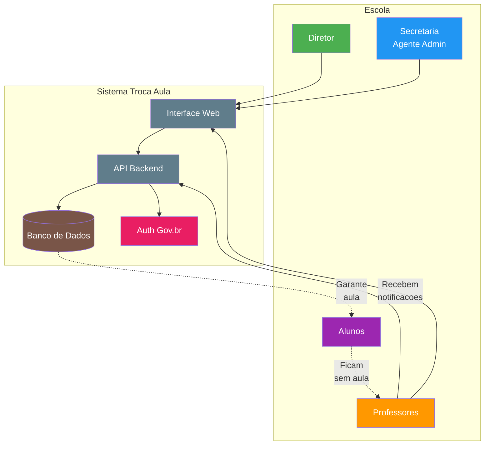
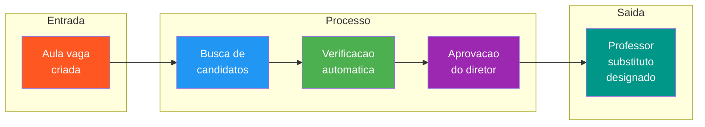
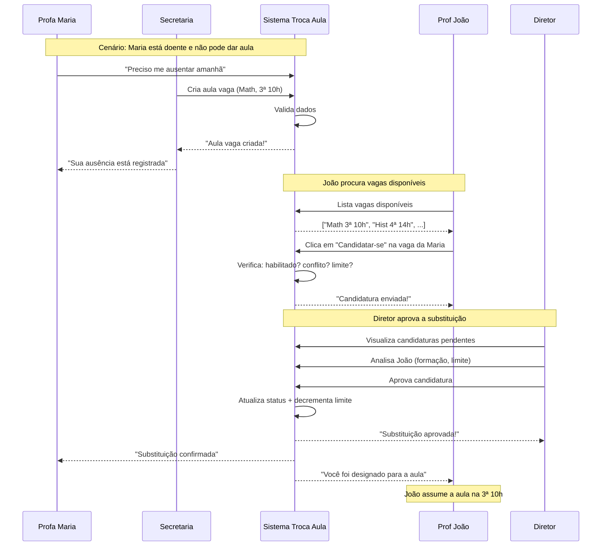

# Documentação do Produto — Sistema Troca Aula

## Visão Geral do Produto

O **Sistema Troca Aula** é uma plataforma digital desenvolvida para gerenciar a substituição de professores em instituições de ensino. O sistema resolve um problema recorrente nas escolas: quando um professor precisa faltar, as aulas ficam vagas e os alunos ficam sem aula. Antes desta plataforma, esse processo era feito manualmente, com ligações telefônicas, planilhas de papel e muita burocracia. Agora, tudo é feito de forma digital, automatizada e organizada.

O projeto foi idealizado e desenvolvido como parte do Projeto Integrador da Universidade Virtual do Estado de São Paulo (UNIVESP), polo Jaboticabal, e conta com a participação de oito estudantes que trabalharam juntos para criar uma solução tecnológica aplicada à realidade da gestão educacional brasileira.

---

## Visão Visual do Sistema

---

## Fluxo de Valor do Sistema

---

## O Que É o Sistema Troca Aula

O Sistema Troca Aula é uma aplicação web que conecta professores que precisam se ausentar com outros professores disponíveis para substituí-los. Pense nele como um "mercado de aulas vagas": quando um professor não pode dar uma aula, ele cria uma "vaga" no sistema; outros professores que estão disponíveis visual essa vaga e podem se candidatar para ocupá-la.

O sistema não é um diário de classe eletrônico, não controla frequência regular dos alunos e nem serve para lançamento de notas. Sua função específica é exclusivamente a gestão de substituições docentes, funcionando como um intermediário digital entre quem precisa de substituição e quem pode oferecê-la.

A plataforma foi construída utilizando tecnologias modernas de desenvolvimento web, como NestJS, TypeScript e PostgreSQL, e está hospedada em ambiente de nuvem para garantir que esteja disponível a qualquer momento, sem depender de servidores locais nas escolas.

---

## O Que o Sistema Faz

O Sistema Troca Aula realiza diversas funções que tornam o processo de substituição de professores muito mais simples e eficiente. A seguir, detalhamos cada uma dessas funcionalidades de forma que qualquer pessoa possa compreender.

### Criação de Aulas Vagas

Quando um professor precisa se ausentar por motivo de doença, licença, participação em evento ou qualquer outro motivo, ele ou um agente administrativo da escola pode cadastrar essa ausência no sistema. No momento do cadastro, são informadas informações como a disciplina, o dia da semana, o horário da aula e eventuais requisitos específicos para a substituição, como conhecimentos técnicos especiais ou série dos alunos.

### Busca e Candidatura de Professores

Professores que desejam fazer substituições podem acessar o sistema a qualquer momento para visualizar todas as aulas vagas disponíveis na sua instituição. O sistema permite filtrar as vagas por disciplina, dia da semana, turno ou outros critérios, facilitando a busca por oportunidades que se encaixem na disponibilidade de cada professor.

Uma vez encontrada uma vaga interessante, o professor pode se candidatar fills-a form einfachen clicar em um botão. O sistema registra automaticamente a candidatura e notifica os responsáveis pela aprovação.

### Controle de Limite de Substituições

Uma funcionalidade importante do sistema é o controle automático do teto de substituições. Cada professor tem um limite máximo de horas que pode substituir por dia, definido pelas normas da instituição. O sistema monitora automaticamente esse limite e impede que um professor se candidate a novas vagas quando já atingiu seu limite. Se um professor está próximo de atingir o limite, o sistema emite alertas preventivos para que todos fiquem cientes da situação.

### Aprovação de Candidaturas

Nem toda candidatura é automaticamente aceita. O corpo diretivo da escola tem a responsabilidade de validar cada substituição realizada. O sistema oferece um painel específico para essa aprovação, onde os diretores podem visualizar todas as candidaturas pendentes, analisar os dados dos professores candidatos e aceitar ou rejeitar cada pedido. Esse processo de aprovação garante que only profissionais devidamente habilitados substituam os colegas.

### Controle de Acesso Seguro

O sistema utiliza autenticação via Conta Gov.br, o sistema de login do governo federal brasileiro. Isso significa que cada usuário acessa a plataforma usando a mesma conta que utiliza para serviços como declaração de imposto de renda, CPF digital e outros serviços públicos. Essa integração garante segurança, pois valida que apenas pessoas autorizadas, com identidade confirmada, podem acessar o sistema.

### Registro de Histórico

Todas as substituições realizadas são registradas no sistema com detalhes completos: quem foi substituído, quem substituiu, em qual horário, em qual disciplina e qual foi o status da aprovação. Esse histórico serve para fins de transparência, auditoria e consulta futura quando necessário.

---

## Como o Sistema Funciona — Explicação para Pessoas Leigas

Para entender melhor como o sistema opera no dia a dia, imagine o seguinte cenário: a professora Maria, que ensina matemática na 5ª série, está doente e não漂亮 ir à escola amanhã. Antes do sistema, ela ou alguém da secretaria teria que ligar para vários professores para encontrar alguém que pudesse substituí-la. Era um processo demorado e muitas vezes frustrante.

### Visualização do Fluxo de Exemplo

Com o Sistema Troca Aula, o processo funciona assim: a professora Maria (ou um agente administrativo) acessa o sistema, cadastra que ela terá uma aula vaga de matemática na terça-feira às 10h e confirma o cadastro. Pronto, a aula vaga está criada no sistema.

O professor João, que também ensina matemática e está disponível para fazer substituições, acessa o sistema pelo seu computador ou celular, visualiza a lista de aulas vagas e encontra a aula da professora Maria. Ele se candidate fills-a form einfachen e o sistema registra sua candidatura.

O diretor da escola recebe uma notificação sobre a nova candidatura, acessa o sistema, verifica os dados do professor João e aprova a substituição. A partir desse momento, o professor João está oficialmente designado para substituir a professora Maria na terça-feira às 10h.

Tudo isso acontece de forma digital, sem necessidade de ligações telefônicas, sem papel e sem risco de esquecimento. O sistema faz tudo isso de forma automática, organizada e segura.

---

## Personas do Sistema

Para desenvolver um produto que atenda às reais necessidades dos usuários, é fundamental entender quem são essas pessoas e como elas interagem com o sistema. Abaixo, apresentamos as três personas principais do Sistema Troca Aula, com detalhes sobre seus perfis, objetivos, frustrações e formas de uso da plataforma.

### Persona 1: O Professor Substituto — Professor Carlos

O professor Carlos tem 34 anos, é formados em Letras pela UNESP e leciona há 8 anos em escolas públicas. Ele trabalha em duas escolas e sempre está buscando oportunidades de aumentar sua renda. Quando soube do sistema, viu nele uma forma organizada de encontrar aulas extras sem precisar ficar perguntando em várias escolas.

Carlos acessa o sistema principalmente pelo celular, durante o intervalo das aulas ou à noite em casa. Ele quer ver rapidamente quais vagas estão disponíveis, filtrar pelas disciplinas que ensina e candidatar-se com apenas alguns toques na tela. Ele gosta de acompanhar o histórico de suas substituições para saber quantas horas já fez no dia e quanto ainda pode fazer dentro do limite diário.

Suas frustrações com o sistema antigo incluíam: não saber quando havia vagas disponíveis, precisar aceitar aulas sem saber detalhes completos sobre elas e não ter um registro claro das substituições que havia feito. Com o novo sistema, ele consegue tudo isso de forma prática e organizada.

### Persona 2: A Agente Administrativa — Secretária Adriana

A secretária Adriana trabalha há 12 anos na secretaria de uma escola municipal. Ela é quem coordena toda a parte operacional das substituições, sendo responsável por cadastrar as ausências dos professores quando eles comunicam a falta, verificar quem está disponível e organizar todo o fluxo de substituições.

Adriana acessa o sistema diariamente, geralmente pelo computador na secretaria. Ela precisa de uma visão clara de todas as aulas vagas do dia e da semana, precisa cadastrar novas ausências rapidamente e precisa editar ou cancelar registros quando há mudanças. Ela também é responsável por verificar se os professores que se candidataram estão habilitados para as disciplinas.

Sua maior frustração era o tempo necessário para fazer tudo manualmente: preencher planilhas, ligars para professores, anotars em cadernos e tentar manter tudo organizado. O sistema automatizou grande parte desse trabalho, permitindo que ela se dedique a outras atividades importantes da secretaria.

### Persona 3: O Diretor — Diretor Roberto

O diretor Roberto tem 48 anos, é formado em Pedagogia e Administração Escolar e atua como diretor há 6 anos. Ele é responsável pela governança geral da escola e precisa garantir que todas as substituições estejam dentro das normas institucionais e que a qualidade do ensino não seja comprometida por ausências não planejadas.

Roberto acessa o sistema principalmente pelo computador, no início da manhã e no final do dia, para verificar as substituições pendientes e aprovar aquelas que estão dentro dos critérios. Ele precisa de relatórios claros sobre o número de substituições realizadas, quais professores estão fazendo mais substituições e se algum limite diário está sendo descumprido.

Ele também precisa garantir que apenas professores habilitados sejam aprovados para cada disciplina, verificando se possuem a formação necessária e se estão cadastrados previamente no sistema. Sua visão estratégica permite analisar dados e tomar decisões sobre a política de substituições da escola.

---

## Glossário de Termos Técnicos e de Negócio

Para facilitar o entendimento de todos os termos utilizados na documentação e no sistema, apresentamos abaixo um glossário com explicações simples e acessíveis.

### Termos de Negócio

**Aula Vaga**: Uma aula que ficou sem professor agendado porque o titular precisa se ausentar. É como uma "vaga de emprego" temporária que precisa ser preenchida por outro professor.

**Candidatura**: O ato de um professor se voluntariar para preencher uma aula vaga. É como se candidatar a um emprego, mas para uma substituição temporária de aula.

**Teto de Substituições**: O número máximo de horas que um professor pode substituir por dia, definido pelas normas da escola para evitar sobrecarga.

**Aprovação**: O ato do diretor validar e confirmar que uma substituição pode ocorrer. Sem aprovação, a substituição não é oficialmente registrada.

**Habilitação**: A condição de um professor estar qualificado para ensinar determinada disciplina, verificada pela formação acadêmica e pelo cadastro prévio na instituição.

### Termos Técnicos

**API**: Sigla para Interface de Programação de Aplicações. É o conjunto de regras que permite que o sistema converse com outros sistemas ou com o aplicativo do usuário.

**Backend**: A parte do sistema que fica "nos bastidores", processando dados, salvando informações no banco de dados e realizando toda a lógica de funcionamento.

**Frontend**: A parte do sistema que o usuário видит e interage, como botões, telas e formulários.

**Banco de Dados**: O local onde todas as informações do sistema são armazenadas de forma organizada, como uma grande planilha digital.

**Autenticação**: O processo de verificar se a pessoa que está acessando o sistema é realmente quem diz ser, garantindo segurança.

**Deploy**: O termo técnico para publicar o sistema em ambiente de produção, tornando-o disponível para uso real.

**Testes Automatizados**: Programas que verificam automaticamente se o sistema está funcionando corretamente, como robôs que testam todas as funcionalidades.

---

## Requisitos e Regras de Negócio

Para que o sistema funcione corretamente e atenda às necessidades das instituições de ensino, algumas regras de negócio foram estabelecidas e implementadas no código.

### Regra 1: Cadastro Obligatório de Professores

Para utilizar o sistema, todo professor precisa estar previamente cadastrado pela instituição. Não é possível criar uma conta por conta própria; o acesso é concedido pela escola após a devida verificação de documentos e habilitação.

### Regra 2: Validação de Habilitação por Disciplina

Um professor só pode se candidatar a aulas de disciplinas para as quais está habilitado. O sistema verifica automaticamente se o professor possui a formação necessária para a disciplina da aula vaga antes de aceitar a candidatura.

### Regra 3: Controle de Limite por Período

O sistema controla automaticamente o número de horas de substituições realizadas por cada professor por dia. Quando o professor atinge o limite definido pela instituição, novas candidaturas são bloqueadas automaticamente. Alertas são enviados quando o professor está próximo do limite.

### Regra 4: Aprovação Obrigatória do Corpo Diretivo

Nenhuma substituição é finalizada sem a aprovação de um diretor ou responsável autorizados. O sistema mantém o status "pendente" até que a aprovação seja registrada.

### Regra 5: Registro de Histórico Completo

Todas as ações realizadas no sistema são registradas com detalhes completos, incluindo data, hora, usuário responsável e natureza da ação. Esse registro serve para auditoria e transparência.

### Regra 6: Autenticação via Gov.br

O acesso ao sistema é realizado exclusivamente por meio da Conta Gov.br, garantindo identidade verificada e segurança nos dados pessoais dos usuários.

---

## Diferenciais e Benefícios do Sistema

O Sistema Troca Aula traz diversos benefícios para a comunidade escolar que o utiliza. Abaixo, detalhamos os principais diferenciais que tornam esta solução única e valiosa para a gestão educacional.

### Eliminação de Aulas Vagas

O principal benefício do sistema é a redução drástica do número de aulas que ficam sem professor. Ao conectar de forma rápida e eficiente quem precisa de substituição com quem pode substituí, o sistema garante que os alunos não fiquem sem aula.

### Transparência e Organização

Todas as informações sobre substituições ficam centralizadas no sistema, acessíveis para todos os perfis autorizados. Isso elimina a falta de informação e a desorganização que existia com processos manuais.

### Economia de Tempo

O tempo que antes era gasto com ligações telefônicas, verificação de disponibilidade e organização de planilhas agora é dedicado a atividades mais produtivas. A automação do processo representa uma economia significativa de horas de trabalho.

### Inclusão e Acessibilidade

O sistema foi desenvolvido siguiendo diretrizes internacionais de acessibilidade, permitindo que pessoas com deficiência visual ou motora possam utilizá-lo plenamente. A navegação por teclado e a compatibilidade com leitores de tela garantem que ninguém fique de fora.

### Segurança da Informação

A integração com a Conta Gov.br garante que only pessoas autorizadas acessem o sistema, protegendo dados sensíveis e garantindo a integridade das informações.

### Escalabilidade

Por estar hospedado em ambiente de nuvem, o sistema pode atender a múltiplas escolas simultaneamente, crescendo conforme a demanda sem necessidade de investimentos em infraestrutura local.

---

## Tecnologias Utilizadas

O Sistema Troca Aula foi desarrollado utilizando um conjunto de tecnologias modernas e consolidadas no mercado de desenvolvimento de software. Abaixo, apresentamos brevemente cada uma delas.

**NestJS**: Um framework de desenvolvimento para Node.js que permite criar aplicações server-side robustas e escaláveis. É a base do backend do sistema.

**TypeScript**: Uma linguagem de programação que adiciona recursos de tipagem ao JavaScript, tornando o código mais seguro e fácil de manter.

**PostgreSQL**: Um sistema de gerenciamento de banco de dados relacional, reconhecido por sua confiabilidade e capacidade de lidar com grandes volumes de dados.

**Prisma**: Uma ferramenta que facilita a comunicação entre o código e o banco de dados, abstract a complexidade das consultas SQL.

**GitHub Actions**: Uma plataforma de automação que executa testes e faz o deploy do sistema automaticamente a cada atualização.

**Render/Railway**: Plataformas de hospedagem em nuvem onde o sistema está publicado, garantindo disponibilidade 24 horas por dia.

**React**: A biblioteca utilizada para desenvolver a interface web que os usuários interagem no dia a dia.

---

## Visão de Futuro

O Sistema Troca Aula foi concebido para continuar evoluindo e incorporando novas funcionalidades que beneficiem ainda mais a comunidade educacional. Algumas das ideias planejadas para implementações futuras incluem:

**Aplicativo Mobile**: Uma versão do sistema para smartphones permitiria que os professores recebessem notificações em tempo real sobre novas vagas, facilitando ainda mais o processo de candidatura.

**Integração com IoT**: No futuro, sensores de presença nas salas de aula poderiam se comunicar com o sistema para validar automaticamente que o professor substituto efetivamente compareceu à aula.

**Relatórios Avançados**: Dashboards com estatísticas sobre padrões de ausências, professores mais ativos em substituições e análise de custos podrían ajudar na gestão estratégica das escolas.

**Integração com Calendários**: Sincronização automática com calendários pessoais e institucionales para evitar conflitos de horário.

---

## Conclusão

O Sistema Troca Aula representa uma solução tecnológica inovadora para um problema antigo e recorrente na gestão educacional brasileira. Ao automatizar o processo de substituição de professores, a plataforma garante que os alunos não fiquem sem aula, alivia a carga de trabalho das secretarias escolares e proporciona transparência a todo o processo.

Desenvolvido com tecnologias modernas, acessível para todos os perfis de usuários e seguro por meio da integração com o sistema governamental, o projeto demonstra como a tecnologia pode ser uma aliada da educação, contribuindo para a continuidade do ensino e a qualidade do aprendizado dos alunos.

Este documento visa fornecer uma compreensão completa do produto para todos os envolvidos no projeto, desde novos membros da equipe até gestores escolares e stakeholders, permitindo que todos possam compreender facilmente o propósito, o funcionamento e os benefícios do Sistema Troca Aula.