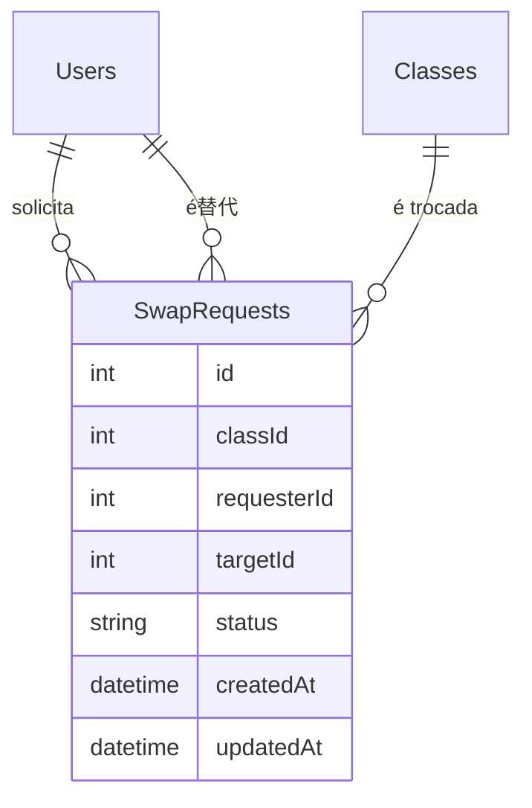

# Data Model: Sistema de Troca de Aulas

## Entidades

### SwapRequests

| Campo | Tipo | Descrição |
|-------|------|-----------|
| id | Int | PK auto-increment |
| classId | Int | FK para Classes (aula sendo trocada) |
| requesterId | Int | FK para Users (professor que solicita) |
| targetId | Int | FK para Users (professor替代) |
| status | String | PENDING, APPROVED, REJECTED, CANCELLED |
| createdAt | DateTime | Data de criação |
| updatedAt | DateTime | Data de atualização |

### Adjustes em Classes (existente)

Adicionar campos:

| Campo | Tipo | Descrição |
|-------|------|-----------|
| dayOfWeek | Int | Dia da semana (1-7, 1=segunda) |
| startTime | String | Horário inicial (HH:MM) |
| endTime | String | Horário final (HH:MM) |

## Relacionamentos

## Regras de Negócio

1. **Criação**: Apenas usuário com perfil DIRETOR ou AUXILIAR_ADMIN pode criar SwapRequest
2. **Conflito**: Mesmo dia (dayOfWeek) + horário sobreposto = conflito
3. **Aceitação**: Apenas professor da mesma matéria (subject) da class pode aceitar/rejeitar
4. **Cancelamento**: Apenas requester pode cancelar, e apenas se status = PENDING
5. **Validação**: Verificar que target leciona a mesma disciplina (class.subjectId = target.disciplina)