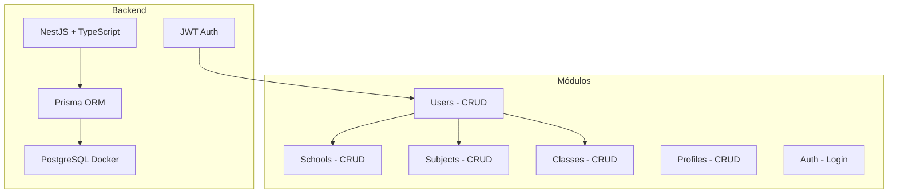
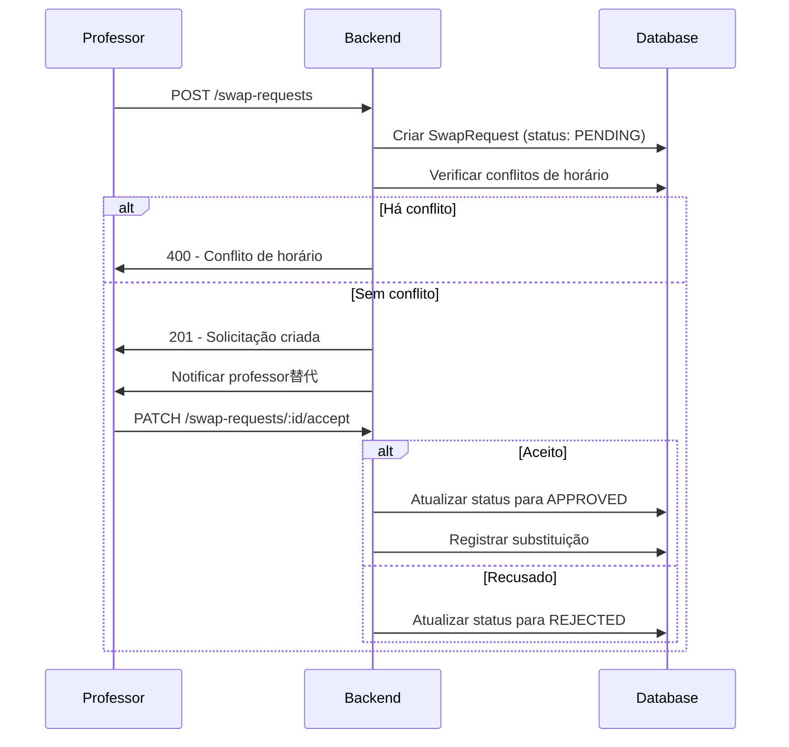

# Feature Specification: Sistema de Troca de Aulas

**Feature Branch**: `feat/swap-request`

**Created**: 2026-05-14

**Status**: Draft

**Input**: Sistema para gerenciamento e facilitação de substituição de professores, evitando aulas vagas.

---

## Análise do Projeto: Estado Atual

### ✅ Implementado



**Funcionalidades existentes**:
- Autenticação JWT com bcrypt
- Cadastro de usuários, escolas, disciplinas e turmas
- Controle de perfis (admin, professor, diretor)
- Permissão baseada em perfil (admin vê tudo, professor vê apenas sua escola)

### ❌ Faltando (Core do "Troca Aula")

1. **SwapRequest** - Módulo de solicitação de trocas
2. **Approval Workflow** - Fluxo de aprovação/reprovação
3. **Conflict Detection** - Detecção de conflitos de horário
4. **Schedule Management** - Gerenciamento de horários/aulas

---

## Fluxo de Negócio Proposto



---

## User Scenarios & Testing

### User Story 1 - Solicitação de Troca (Priority: P1)

Como professor, quero solicitar a troca de uma de minhas aulas com outro professor, para que minha aula não fique vazia na minha ausência.

**Por que esta prioridade**: Funcionalidade core do sistema - sem ela, não existe "Troca Aula"

**Teste Independente**: Criar solicitação de troca entre dois professores e verificar que aparece na listagem

**Cenários de Aceitação**:
1. **Given** professor logado com aula agendada, **When** cria solicitação de troca, **Then** solicitação criada com status PENDING
2. **Given** solicitação de troca, **When** professor替代 aceita, **Then** status muda para APPROVED e substituição é registrada

---

### User Story 2 - Aprovação de Troca (Priority: P1)

Como professor substituto, quero aceitar ou recusar uma solicitação de troca, para controlar minha disponibilidade.

**Por que esta prioridade**: Sem aprovação, a troca não se concretiza

**Teste Independente**: Aceitar uma solicitação pendente e verificar atualização de status

**Cenários de Aceitação**:
1. **Given** solicitação pendente, **When** professor substituto aceita, **Then** status = APPROVED
2. **Given** solicitação pendente, **When** professor substituto recusa, **Then** status = REJECTED

---

### User Story 3 - Listar Solicitações (Priority: P2)

Como professor, quero visualizar todas as minhas solicitações de troca (criadas e recebidas), para gerenciar minhas trocas.

**Por que esta prioridade**: Necessário para acompanhamento e gestão

**Teste Independente**: Listar solicitações e filtrar por status

**Cenários de Aceitação**:
1. **Given** professor logado, **When** acessa listagem, **Then** vê todas as suas solicitações
2. **Given** solicitações com diferentes status, **When** filtra por status, **Then** mostra apenas as correspondentes

---

### User Story 4 - Cancelamento de Solicitação (Priority: P3)

Como professor, quero cancelar uma solicitação de troca que fiz, antes que seja aceita.

**Por que esta prioridade**: Flexibilidade para o solicitante

**Cenários de Aceitação**:
1. **Given** solicitação PENDING, **When** professor cancela, **Then** status = CANCELLED
2. **Given** solicitação APPROVED, **When** professor tenta cancelar, **Then** erro - já aceita

---

## Requirements

### Functional Requirements

- **FR-001**: Sistema DEVE permitir professor criar solicitação de troca de aula
- **FR-002**: Sistema DEVE verificar conflitos de horário antes de criar solicitação
- **FR-003**: Professor substituto DEVE poder aceitar ou recusar solicitação
- **FR-004**: Sistema DEVE listar solicitações filtrando por status
- **FR-005**: Sistema DEVE permitir cancelamento de solicitações pendentes
- **FR-006**: Apenas professor associado à aula pode criar solicitação
- **FR-007**: Apenas professor替代 pode aceitar/recusar

### Non-Functional Requirements

- **NFR-001**: Respostas de API em formato JSON padronizado
- **NFR-002**: Autenticação JWT obrigatória para todas as rotas
- **NFR-003**: Validação de dados com class-validator

---

## Key Entities

- **SwapRequest**: Solicitação de troca (id, classId, requesterId, targetId, status, createdAt, updatedAt)
- **Class**: Aula existente (já existe no schema.prisma)
- **User**: Professores (já existe)

**Relacionamentos**:
```
SwapRequest 1 --> 1 Class (aula sendo trocada)
SwapRequest 1 --> 1 User (solicitante)
SwapRequest 1 --> 1 User (professor替代)
```

---

## Success Criteria

- **SC-001**: Professor consegue criar solicitação de troca em menos de 30 segundos
- **SC-002**: Conflitos de horário são detectados antes da criação
- **SC-003**: Fluxo completo de troca (criar → aceitar → aprovado) funciona sem erros

---

## Assumptions

- Professors já existem no sistema (Users com profile de professor)
- Aulas (Classes) já estão cadastradas com horários
- Sistema será usado por uma única escola inicialmente (simplicidade)
- Notificações serão simplificadas (sem push/email real - apenas registro em banco)